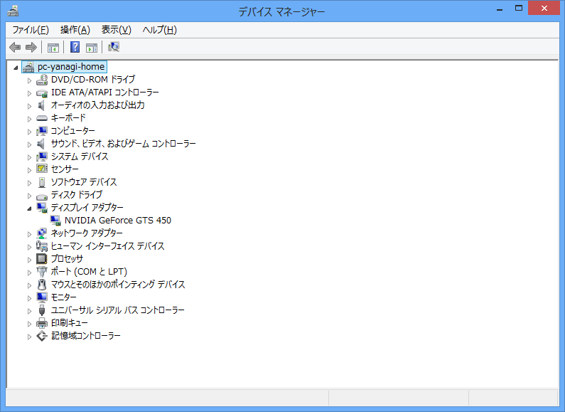
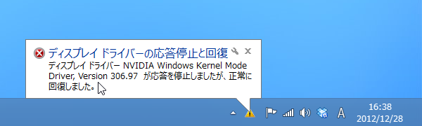
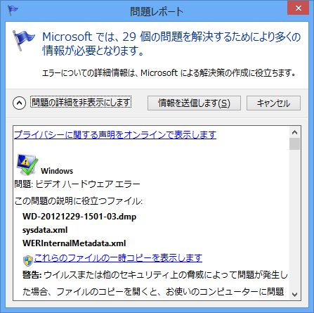

なぜかデスクトップ PC の電源が定期的にシャットダウンされてしまう事象に見舞われる。ケースを開けてみたところ、CPU クーラーがぐらぐらだった。4つある足のうち、2本しかちゃんとささっていない。これでよく今まで動いていたものだ。

ついでにケースの掃除をして、もらったまま放置していた（<a href="https://blog.daruyanagi.jp/entry/2012/09/24/215346">&#x60B2;&#x5287;&#x306F;&#x3044;&#x3064;&#x3082;&#x7A81;&#x7136;&#x306B; - &#x3060;&#x308B;&#x308D;&#x3050;</a> を参照）グラフィックボードも刺した。ところが――

結局のところ、ドライバーのインストールは関係がなくて、グラフィックボードがちゃんとささっていなかっただけみたい。根元までしっかり挿したら、ちゃんと動いた。

ちょっとだけ速くなった気がする？

<ul>
<li><a href="https://blog.daruyanagi.jp/entry/2012/05/05/060610">Windows 8 &#x3078; Ivy Bridge &#x306E;&#x30B0;&#x30E9;&#x30D5;&#x30A3;&#x30C3;&#x30AF;&#x30C9;&#x30E9;&#x30A4;&#x30D0;&#x30FC;&#x3092;&#x30A4;&#x30F3;&#x30B9;&#x30C8;&#x30FC;&#x30EB;&#x3059;&#x308B; - &#x3060;&#x308B;&#x308D;&#x3050;</a></li>
</ul>

<h3>追記</h3>

標準ドライバーはかなり不安定なので、純正のドライバーへ更新したのだけど、

どうもスリープからの復帰に失敗してドライバーが死ぬ。スリープをオフにし、モニターのみ10分使わなかったら電源を切るという運用でしのぐかな。

