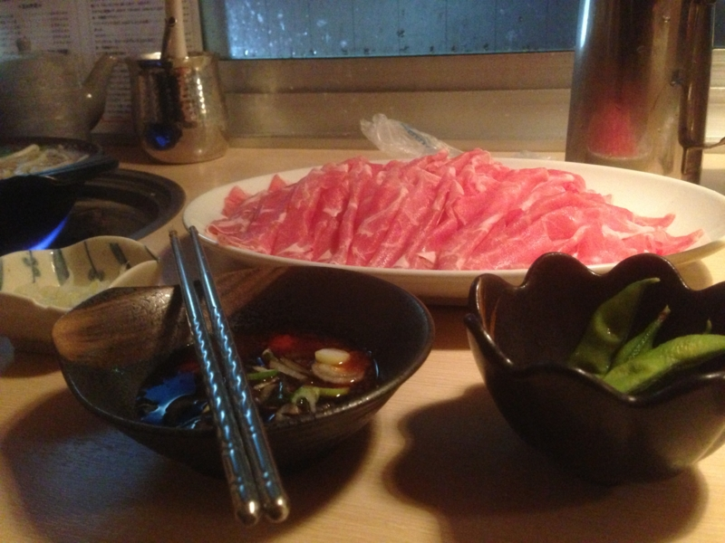
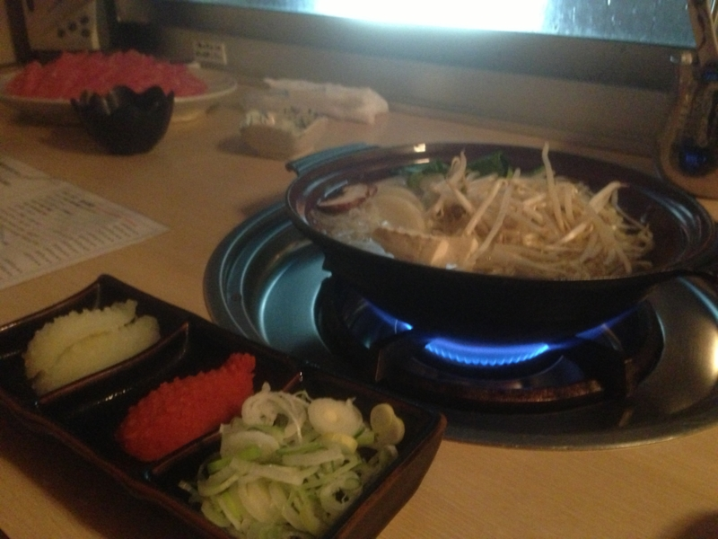

生まれて初めてラム肉のしゃぶしゃぶ（略してラムしゃぶ）食べた。

<ul>
<li><a href="http://www.kinnome.jp/">&#x6700;&#x9AD8;&#x7D1A;&#x30E9;&#x30E0;&#x3057;&#x3083;&#x3076;&#x5C02;&#x9580;&#x5E97;&#x91D1;&#x306E;&#x76EE;&#x30DB;&#x30FC;&#x30E0;&#x30DA;&#x30FC;&#x30B8;</a></li>
</ul>
そこそこ有名なお店らしい。

店に入ると、なんか独特なお肉の“香り”がする。食べ放題＋飲み放題で4,000円ちょっとみたいだけど（奢ってもらっちゃった！）、お肉二皿＋野菜を少し追加で限界。ひっきりなしにお店の人がお肉と野菜の追加を勧めてくるので、ただひたすら食べればいい。薄切りなせいか、熱を加えるとだいぶ量が減るので、どっさり箸でつかんでお湯にくぐらせるのがよい。

“秘伝のタレ”はダシ醤油なのかな。食後のラーメンによく合う。ちなみに、ポン酢を頼むと別料金なのらしい。ちょっとびっくりした。

ここはまた行ってもいいなぁ。

<iframe width="425" height="350" frameborder="0" scrolling="no" marginheight="0" marginwidth="0" src="https://maps.google.co.jp/maps?f=q&amp;source=s_q&amp;hl=ja&amp;geocode=&amp;q=%E9%87%91%E3%81%AE%E7%9B%AE+%E6%9C%AC%E5%BA%97&amp;aq=&amp;sll=34.728949,138.455511&amp;sspn=57.759114,81.386719&amp;brcurrent=3,0x605d1b87f02e57e7:0x2e01618b22571b89,0&amp;ie=UTF8&amp;hq=%E9%87%91%E3%81%AE%E7%9B%AE+%E6%9C%AC%E5%BA%97&amp;hnear=&amp;t=m&amp;cid=9099687512014795388&amp;ll=35.7192,139.769783&amp;spn=0.097559,0.145912&amp;z=12&amp;iwloc=A&amp;output=embed"></iframe> <small><a href="https://maps.google.co.jp/maps?f=q&amp;source=embed&amp;hl=ja&amp;geocode=&amp;q=%E9%87%91%E3%81%AE%E7%9B%AE+%E6%9C%AC%E5%BA%97&amp;aq=&amp;sll=34.728949,138.455511&amp;sspn=57.759114,81.386719&amp;brcurrent=3,0x605d1b87f02e57e7:0x2e01618b22571b89,0&amp;ie=UTF8&amp;hq=%E9%87%91%E3%81%AE%E7%9B%AE+%E6%9C%AC%E5%BA%97&amp;hnear=&amp;t=m&amp;cid=9099687512014795388&amp;ll=35.7192,139.769783&amp;spn=0.097559,0.145912&amp;z=12&amp;iwloc=A" style="color:#0000FF;text-align:left">大きな地図で見る</a></small>

