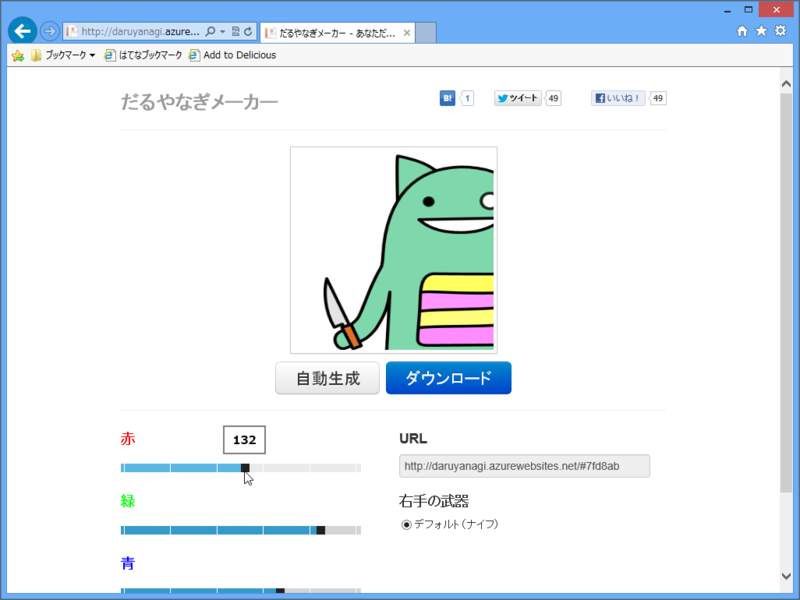
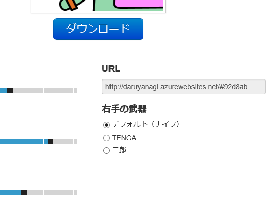
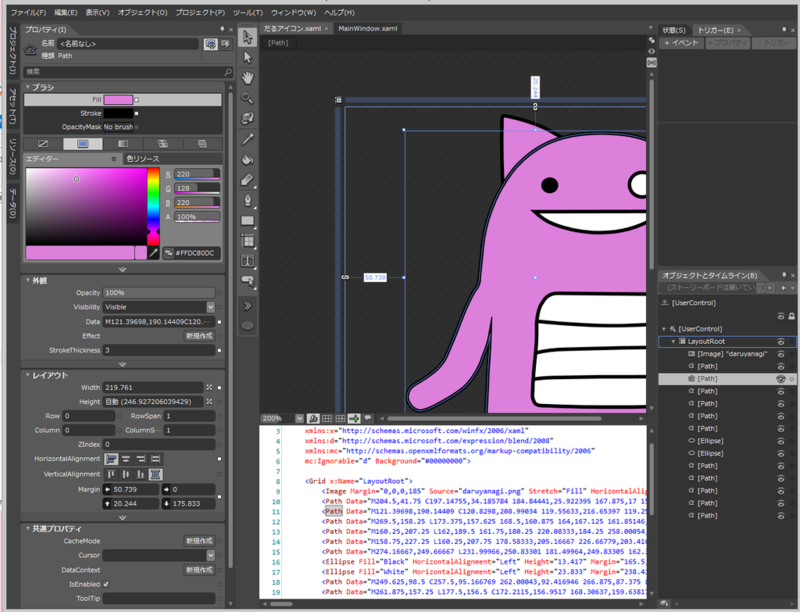

      なんか俺の色違いばっかりいて若干混乱する

<a href="http://twitter.com/daruyanagi/status/286497912966483969" class="twitter-detail-info-permalink">2013-01-03 00:43:19</a> via <a href="http://www.metrotwit.com/" rel="nofollow">MetroTwit</a>

なんか正月からわしの Twitter アイコンの色違いがたくさんいるのでなにが起こったのかと訝しんでいたのだけど、@shibayan が暇を持て余して変な Web アプリを作ったっぽい。

<ul>
<li><a href="http://daruyanagi.azurewebsites.net/">&#x3060;&#x308B;&#x3084;&#x306A;&#x304E;&#x30E1;&#x30FC;&#x30AB;&#x30FC;</a></li>
</ul>
色を指定（ランダムで指定することも）してダウンロードボタンを押せば、色違いのだるやなぎアイコンが簡単にゲットできる！　URL でパラメーターで色指定・共有できるのもいいね！

―― 誰がうれしいんや。

<h3>今後の改良予定</h3>

      こんな感じにする予定＞<a class="twitter-tweet-url" href="http://t.co/Q1U1Kx0T" target="_top">URL</a>

<a href="http://twitter.com/shibayan/status/286505529176645633" class="twitter-detail-info-permalink">2013-01-03 01:13:35</a> via <a href="http://www.s-software.net/" rel="nofollow">みについ</a>

TENGA は止めろｗ 実のところああいうのは買ったことがないのだけど、一度は体験しておくべきなのだろうか。

<h3>共犯者？</h3>

      2013 コード書き初めが "だるアイコン.xaml" になるとは一体誰が予測できたのか… <a class="twitter-tweet-url" href="http://t.co/cLSDLOEg" target="_top">URL</a>

<a href="http://twitter.com/Grabacr07/status/286498438844129281" class="twitter-detail-info-permalink">2013-01-03 00:45:26</a> via web

<blockquote>

このスクリーンショットを入手、解析した情報セキュリティー会社「ダック」（東京都千代田区）の柳英俊専務理事によると、アイコンは「Ｂｌｅｎｄ」というユーザーインターフェイス開発ツールを使って作成されていた。数万円はする専門的なソフトで、素人が購入することは考えにくいという。

</blockquote>

<h3>追記</h3>

      来週の窓の杜で取り上げられることは間違いないやろ

<a href="http://twitter.com/shibayan/status/286484467915321344" class="twitter-detail-info-permalink">2013-01-02 23:49:54</a> via <a href="http://www.s-software.net/" rel="nofollow">みについ</a>

あそこはバイナリのアプリしかやらないらしいから、間違っても紹介されることはなさそう。

