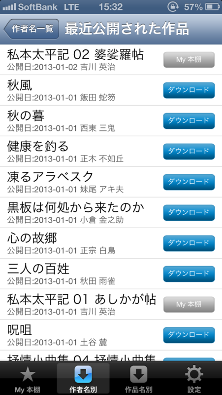
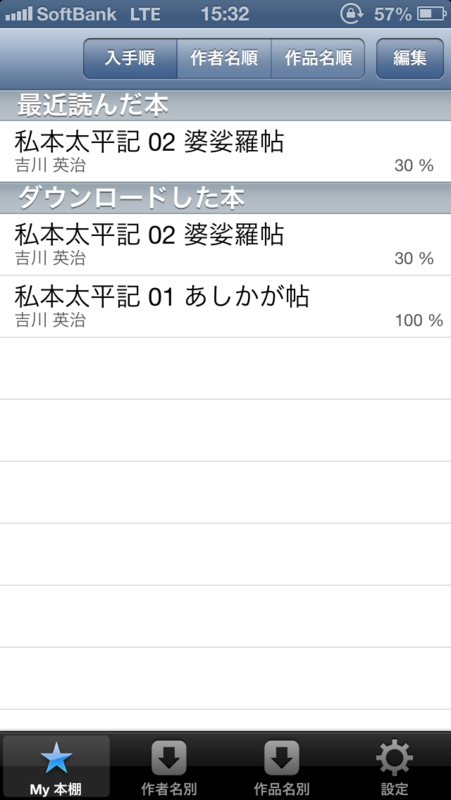
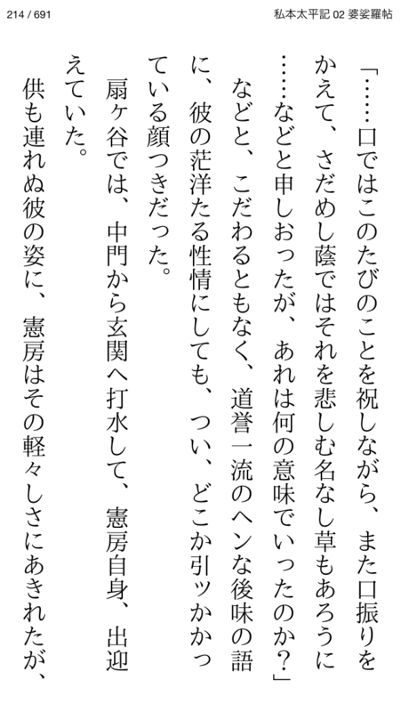
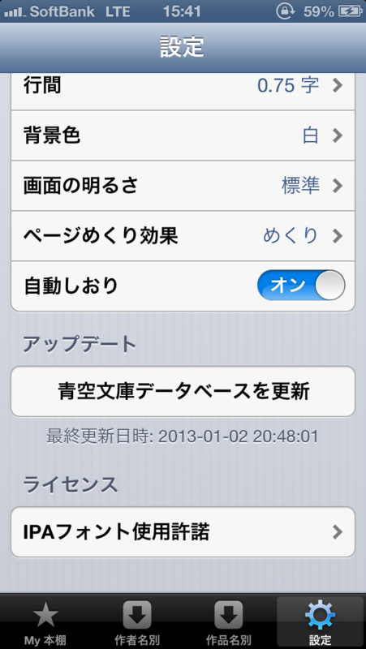

　

2013年でひとつ楽しみにしていたのが、“著作権切れ”。

<blockquote cite="http://topics.jp.msn.com/digital/general/article.aspx?articleid=1597146">

　著作権が切れた文学作品などを無償公開する「青空文庫」に1月1日、同日で著作権保護期間が終了した柳田国男や吉川英治、室生犀星ら12人の作品が公開された。

　元日に公開されたのは秋田雨雀「三人の百姓」、飯田蛇笏「秋風」、小倉金之助「黒板は何処から来たのか」、西東三鬼「秋の暮」、妹尾アキ夫「凍るアラベスク」、土谷麓「呪咀」、中谷宇吉郎「雪」、正木不如丘「健康を釣る」、正宗白鳥「心の故郷」、室生犀星「抒情小曲集　04 抒情小曲集」、柳田国男「遠野物語」、吉川英治「私本太平記　01 あしかが帖」。各作家の他作品も公開に向けた作業リストに登場している。

　著作権が保護される期間は著作者の死後50年。期間の計算を簡便にするため死亡の翌年の1月1日から起算されることから、保護期間が終了するのも元日となる。

　青空文庫は、著作者の死後の著作権保護期間を70年に延長しようという動きに反対し、2005年から、パブリックドメインとなった作品を元日に公開している。

<cite><a href="http://topics.jp.msn.com/digital/general/article.aspx?articleid=1597146">&#x9752;&#x7A7A;&#x6587;&#x5EAB;&#x306B;&#x67F3;&#x7530;&#x56FD;&#x7537;&#x300C;&#x9060;&#x91CE;&#x7269;&#x8A9E;&#x300D;&#x3001;&#x5409;&#x5DDD;&#x82F1;&#x6CBB;&#x300C;&#x79C1;&#x672C;&#x592A;&#x5E73;&#x8A18;&#x300D;&#x306A;&#x3069;&#x767B;&#x5834; - &#x6700;&#x65B0;&#x30CB;&#x30E5;&#x30FC;&#x30B9;&#xFF5C;MSN &#x30C8;&#x30D4;&#x30C3;&#x30AF;&#x30B9;</a></cite>
</blockquote>

吉川英治はほとんど全部読んでたけど、『私本太平記』だけは読んだことがなかったので渡りに船。布団の中、ゴロゴロと楽しませていただいた。

これまでも電子書籍ストアで小説の類を買ったことはあるのだけど、実は読了したためしがない。やれ、ページめくりが遅いだの、なんだか集中できないだの、目が疲れるだの。けれど、『私本太平記』の1巻はあっさり読み切った。所詮タダだし、投げ出しても勿体ないということもないのに。

結局、内容次第なのかもしれない。

<h3>無料閲覧アプリ：i読書 - 青空文庫リーダー</h3>

ちなみに、閲覧アプリもタダで手に入る。たとえば、iPhone の場合はこれなんかいかがでしょう。

　

<ul>
<li><a href="https://itunes.apple.com/us/app/i-du-shu-qing-kong-wen-kurida/id534970999?mt=8">i&#x8AAD;&#x66F8; - &#x9752;&#x7A7A;&#x6587;&#x5EAB;&#x30EA;&#x30FC;&#x30C0;&#x30FC; for iPhone 3GS, iPhone 4, iPhone 4S, iPhone 5, iPod touch (3rd generation), iPod touch (4th generation), iPod touch (5th generation) and iPad on the iTunes App Store</a></li>
</ul>
おカネを出せばこれよりいいのもありそうだけど、シンプルで迷わず使えるので、これでよいと思った。設定画面で青空文庫のデータベースを更新するのを忘れずにね。

Windows Phone は……スクリーンショット撮るのめんどいから、省略。ストアを検索でもして適当に探してネ。

