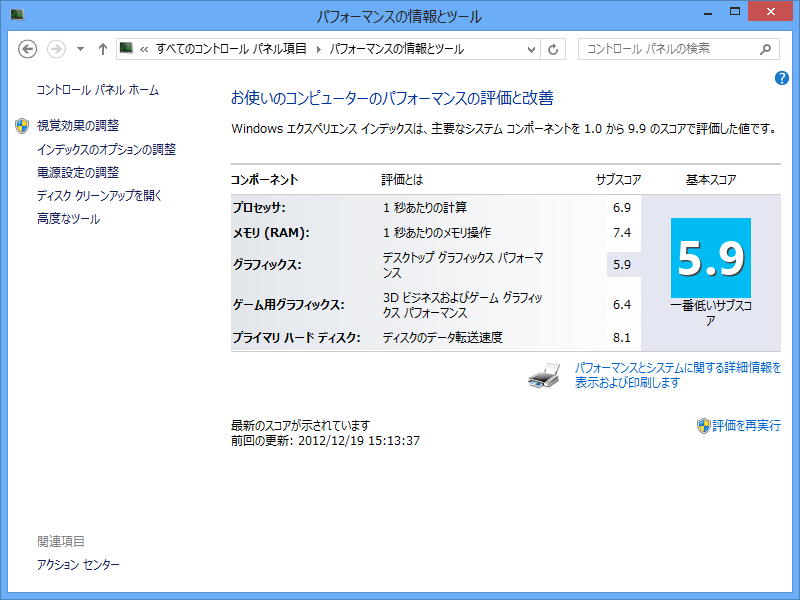

<h3>リカバリーディスクが働いてくれない</h3>

お正月なので、VAIO Duo 11 の再インストールでもしようかなぁと思ったいたのだけど<a href="#f-44ef874b" name="fn-44ef874b" title="色々実験していて環境が汚れてしまったけど、そろそろ平常運用しようと思うので">*1</a>、事前に作成しておいたリカバリディスク（Blu-ray）がうんともすんとも言わない。SSD 上のリカバリ領域は削除してしまっている。

これはこまった／(＾o＾)＼

どうやら僕だけじゃないみたいなので、フィードバックでも送ってみようと思う。

<h3>欠けたドライバーのインストール</h3>

VAIO Duo 11 に普通の Windows 8 Pro をインストールした状態では、GPS や NFC などが動作しない。とりあえずこれだけでも何とかしたい。リカバリディスクが動けばこんな苦労はせずに済むのだが……

リカバリディスクはブートしないものの、VAIO Care の実行はとりあえずできるみたい。これを利用して欠けたドライバーをインストールすることにした。

いくつかのドライバーはインストールできたものの、多くはインストール処理中にエラーが発生してインストールできず。とことん使えない子だな。

しょうがないので、<a href="http://vcl.vaio.sony.co.jp/product/sv/svd11219cjb.html#main_contents_section_download">SVD11219CJB | &#x88FD;&#x54C1;&#x5225;&#x30B5;&#x30DD;&#x30FC;&#x30C8; | &#x30D1;&#x30FC;&#x30BD;&#x30CA;&#x30EB;&#x30B3;&#x30F3;&#x30D4;&#x30E5;&#x30FC;&#x30BF;&#x30FC; VAIO&reg; | &#x30B5;&#x30DD;&#x30FC;&#x30C8;&#x30FB;&#x304A;&#x554F;&#x3044;&#x5408;&#x308F;&#x305B; | &#x30BD;&#x30CB;&#x30FC;</a> にあるドライバーを片っ端からインストール。GPS/NFC といったデバイスも動作するようになり、実用上は問題がなさそう。

ちなみに、すべてが動作した状態のデバイスマネージャーの画面は以下のページで公開されている。

<ul>
<li><a href="http://qa.support.sony.jp/solution/S1210160042888/">http://qa.support.sony.jp/solution/S1210160042888/</a></li>
</ul>

<h3>Windows Phone SDK の修復</h3>

<a href="https://blog.daruyanagi.jp/entry/2012/12/11/044809">WindowsPhoneArch &#x306B;&#x53C2;&#x52A0;&#x3057;&#x3066;&#x304D;&#x307E;&#x3057;&#x305F;&#xFF01; - &#x3060;&#x308B;&#x308D;&#x3050;</a> をよーく見るとわかるかのしれないけど、うちの VAIO Duo 11 にインストールされている Windows Phone SDK 8.0 はなぜか英語版。まぁ、これでも実用上問題はないのだけど、大文字のメニューが気に入らないので、日本語版にしておきたくなった。ついでに Hyper-V が無効で、エミュレーターが動作しなかった問題も解決。BIOS で 仮想化支援機能を Enabled にしておく。

いろいろ試行錯誤してみたのだけど、「Windows Phone SDK 8.0」（Visual Studio 2012 Express for Windows Phone）を一度アンインストールし、「Visual Studio 2012 Express for Windows 8」の日本語版をインストール（どうせいつか使うし）、そのあとに「Windows Phone SDK 8.0」の日本語版をインストールするという手順を踏んで、無事、Windows Phone SDK 8.0 が日本語化された。

単に再インストールするだけでは日本語版になってくれなかったんだよね……。

<h3>Windows Experience Index</h3>

なぜか購入時（<a href="https://blog.daruyanagi.jp/entry/2012/11/02/155646">VAIO Duo 11 &#x30D5;&#x30A1;&#x30FC;&#x30B9;&#x30C8;&#x30A4;&#x30F3;&#x30D7;&#x30EC;&#x30C3;&#x30B7;&#x30E7;&#x30F3; - &#x3060;&#x308B;&#x308D;&#x3050;</a>）よりも WEI のスコアが上がってた……

<a href="#fn-44ef874b" name="f-44ef874b" class="footnote-number">*1</a>:色々実験していて環境が汚れてしまったけど、そろそろ平常運用しようと思うので

