
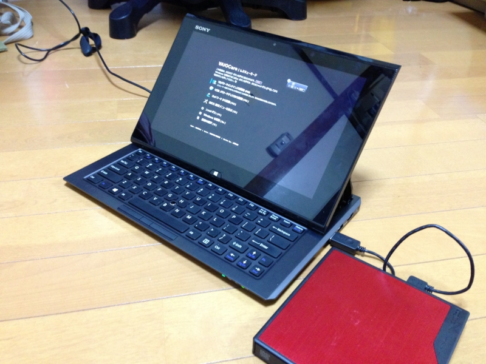

<a href="https://blog.daruyanagi.jp/entry/2013/01/04/001315">VAIO Duo 11 &#x306E;&#x304A;&#x624B;&#x5165;&#x308C; - &#x3060;&#x308B;&#x308D;&#x3050;</a> のあと、Facebook でいろいろ教えてもらった。勘違いしていた部分もあったので、もう一回 VAIO Duo 11 のリカバリ方法をまとめておこうかと思う。

<h3>ASSIST ボタンを押したまま電源を入れる</h3>

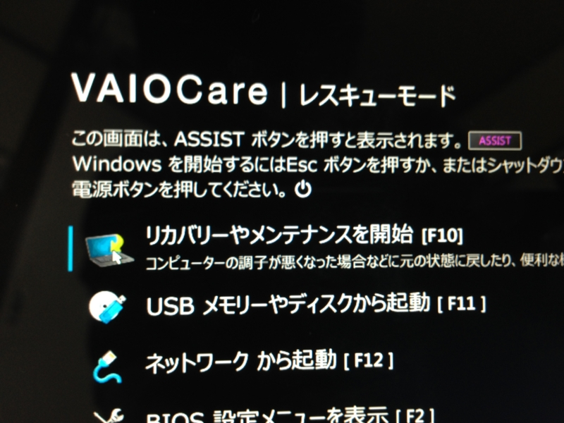

筐体下部裏側にある［ASSIST］ボタンを押したまま電源を入れる。すると、「VAIO Care（レスキューモード）」という画面になる。

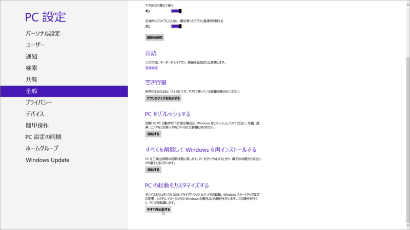

WIndow 8 が起動する状態ならば、［PC 設定］-［全般］-［PC の起動をカスタマイズする］からでもたどり着けるはずだけど、［ASSIST］ボタンを押した方が早い。

この画面では［USB メモリーやディスクから起動］を選択。もしかしたら、一番上のメニューでもいいのかもしれない。その時は次の章を読み飛ばしていいのかも。

<h3>起動</h3>

リカバリディスクから起動。

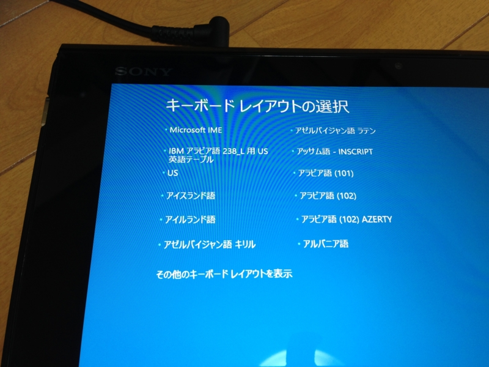

キーボードレイアウトは素直に［Microsoft IME］を選択してよい。汎用入力デバイス扱いであるためか、タッチ操作でも OK なんだな。

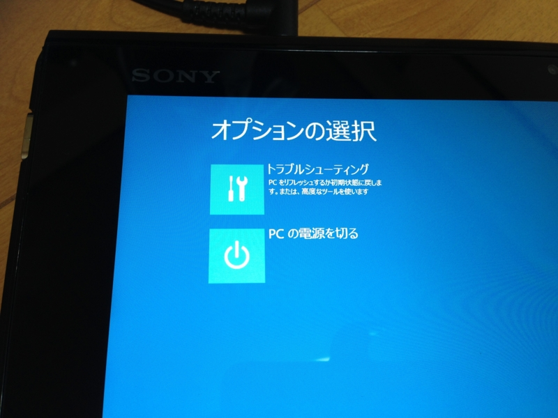

［トラブルシューティング］を選択。

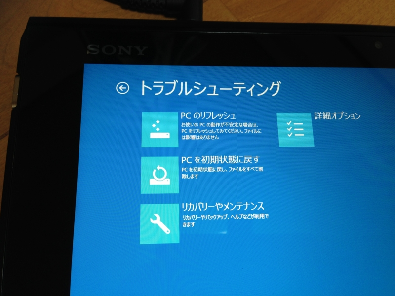

［リカバリーやメンテナンス］を選択。自分はここで［PC を初期状態に戻す］を選んでいたので、先に進めなかった ／(＾o＾)＼

<h3>リカバリーツールの起動</h3>

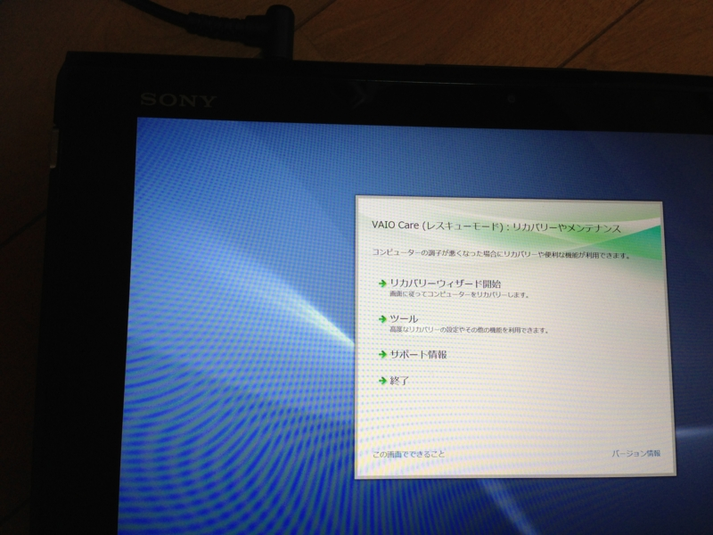

［リカバリーウィザードの開始］を選択。

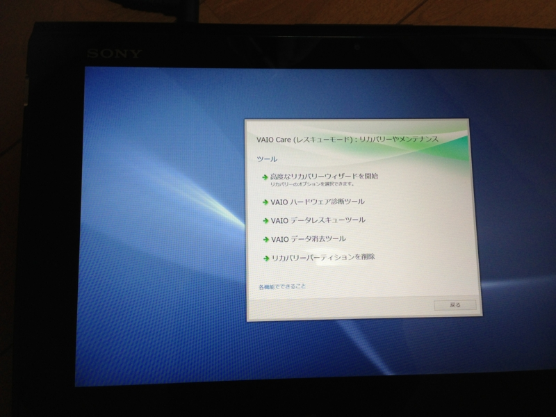

ちなみに、［ツール］の内容はこんな感じ。リカバリ領域の削除なんかが行える。

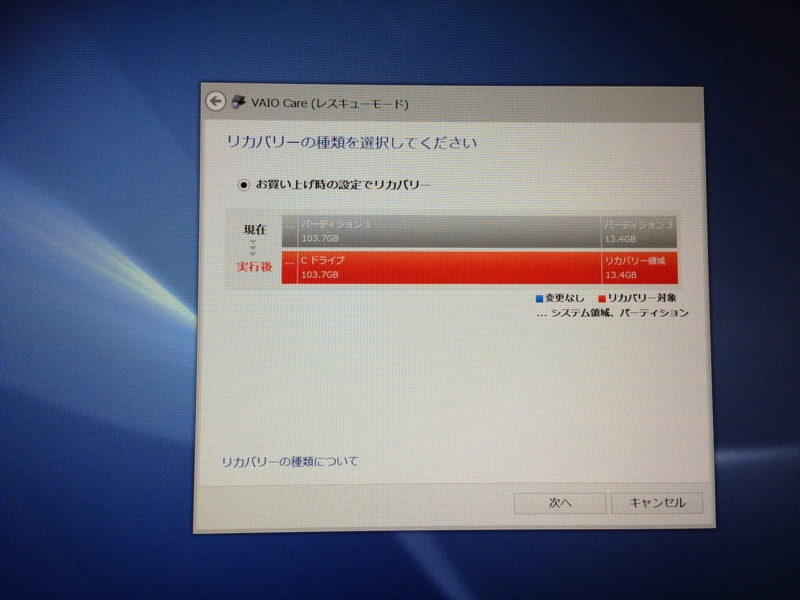

高度なリカバリーウィザードは、パーティションの切り方を選べるのが“高度”。だけど、ラジオボタンの選択肢が一つしかないので選んでも意味がない！

<h3>リカバリー処理の実行</h3>

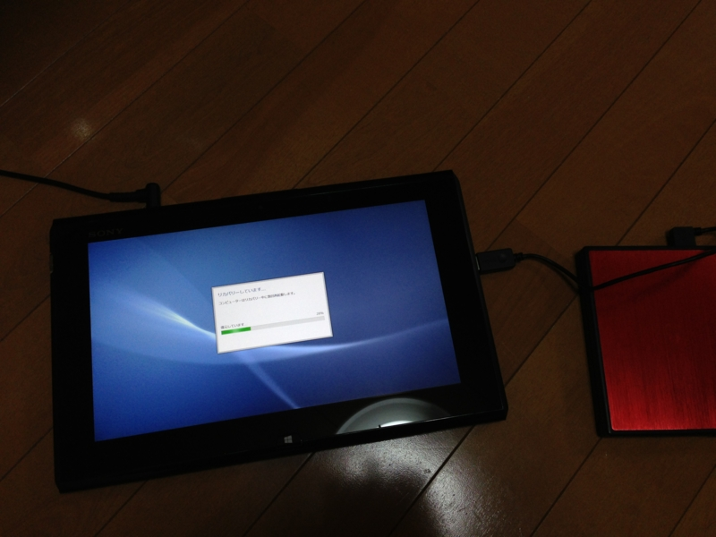

あとは神に踊りをささげながらリカバリーがうまくいくようにお祈りをしましょう ＼(＾o＾)／

<h3>おまけ</h3>

前回触れた、なぜか Windows Phone SDK 8.0 の英語版がインストールされていたという話。これも解決された。

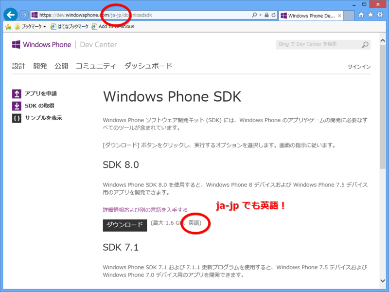

日本語サイトを経由しても、ダウンロードされるのは英語版なんだね！　ちゃんと“別の言語を入手する”というリンクから日本語版をダウンロードしましょう (*´з`)

