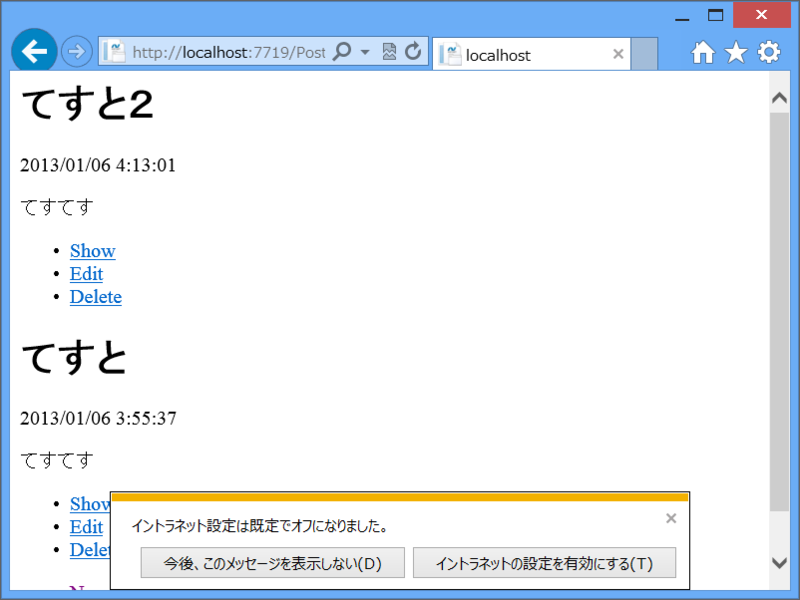

たとえば、

<ul>
<li>~/Posts/ …… ページリストの表示</li>
<li>~/Posts/:id …… 個別ページの表示</li>
</ul>
というのをやってみたいとき。

<ul>
<li>~/Posts/Default.cshtml</li>
</ul>
を作成して、

<ul>
<li>UrlData.Count() == 0 ……ページリストの表示</li>
<li>UrlData.Count() == 1 ……個別ページの表示</li>
</ul>
という処理を書けばいいよね（<a href="https://blog.daruyanagi.jp/entry/2012/07/06/174414">WebMatrix &#x306E;&#x30EB;&#x30FC;&#x30C6;&#x30A3;&#x30F3;&#x30B0; - &#x3060;&#x308B;&#x308D;&#x3050;</a>）。

こういう処理は if で分岐してもいいのだけど、将来的に UrlData.Count() >= 2 の処理を書くことも考えて switch にするのが個人的には好み。いかにも「処理を切り替えています！」みたいな感じで。

でも、そういえば Razor で switch って書いたことないな。どうやって書くんだろう。

<pre class="code lang-cs" data-lang="cs" data-unlink>@{
var db = Database.Open(&quot;db&quot;);
var query = &quot;SELECT * FROM Post ORDER BY CreatedAt DESC&quot;;
var posts = db.Query(query);
}

@switch (UrlData.Count)
{
case 0:
foreach (var post in posts)
{
@RenderPage(&quot;_Single.cshtml&quot;, post)
}
break;
default:
@RenderPage(&quot;_Single.cshtml&quot;, posts.First())
break;
}
</pre>
……と思ったけど普通に書いて動いた。

リストの時は _Single.cshtml のレンダリングを foreach で回して、個別ページの時は一度だけ出力する。_Single.cshtml は何度も使う単一 Post の表示を切り出したもので、<b>部分ビュー</b>と呼んだりもするのだけど、内容はこんな適当な感じ。

<pre class="code lang-cs" data-lang="cs" data-unlink>@{
var post = PageData.First().Value;
}

&lt;div&gt;
&lt;header&gt;
&lt;h1&gt;@post.Title&lt;/h1&gt;
&lt;p&gt;@post.CreatedAt&lt;/p&gt;
&lt;/header&gt;
&lt;article&gt;
@post.Body
&lt;/article&gt;
&lt;footer&gt;
&lt;ul&gt;
&lt;li&gt;&lt;a href=&quot;@post.Id&quot;&gt;Show&lt;/a&gt;&lt;/li&gt;
&lt;li&gt;&lt;a href=&quot;Edit/@post.Id&quot;&gt;Edit&lt;/a&gt;&lt;/li&gt;
&lt;li&gt;&lt;a href=&quot;Delete/@post.Id&quot;&gt;Delete&lt;/a&gt;&lt;/li&gt;
&lt;/ul&gt;
&lt;/footer&gt;
&lt;/div&gt;
</pre>
RenderPage() を使ったデータの受け渡しがいまいちよくわからなかったのだけど、PostData を介しているみたいで、PageData.First() と書いたらなんとなく動いた。

とはいえ、PageData / Page はいろんなところで便利に使っちゃったりする。上書きなどの汚染がちょっと怖いかもしれない。念のため Visual Studio でなかをのぞいてみた。

RenderPage(…, post, 1, 2) と渡してみたのだけど、params の key は順に 0、1、2 とふられるみたい。なので、Page.Title = "hoge"; といった感じで使う分には問題がなさそう。PageData[0] で post がとれるはず。まぁ、わざわざ上書きしたらこの限りではないと思うけれど。

<h3>注意</h3>
<pre class="code lang-cs" data-lang="cs" data-unlink>@switch (UrlData.Count)
{
case 0:
foreach (var post in posts)
{
RenderPage(&quot;_Single.cshtml&quot;, post);
}
break;
default:
RenderPage(&quot;_Single.cshtml&quot;, posts.First());
break;
}
</pre>
一応これでもコンパイルは通るのだけど、RenderPage() は動かない。@RenderPage() って書かなきゃいけないんだね<a href="#f-4e69f321" name="fn-4e69f321" title="文末の ; は不要になる">*1</a>。ここら辺はまだわかるようでよくわかっていないところ。

<a href="#fn-4e69f321" name="f-4e69f321" class="footnote-number">*1</a>:文末の ; は不要になる

