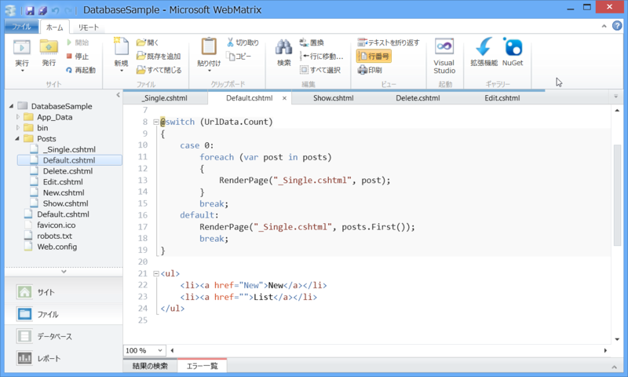

 

<blockquote cite="https://blog.daruyanagi.jp/entry/2013/01/06/051815">

たとえば、

<ul>
<li>~/Posts/ …… ページリストの表示</li>
<li>~/Posts/:id …… 個別ページの表示</li>
</ul>
というのをやってみたいとき。

<ul>
<li>~/Posts/Default.cshtml</li>
</ul>
を作成して、

<ul>
<li>UrlData.Count() == 0 ……ページリストの表示</li>
<li>UrlData.Count() == 1 ……個別ページの表示</li>
</ul>
という処理を書けばいいよね（<a href="https://blog.daruyanagi.jp/entry/2012/07/06/174414">WebMatrix &#x306E;&#x30EB;&#x30FC;&#x30C6;&#x30A3;&#x30F3;&#x30B0; - &#x3060;&#x308B;&#x308D;&#x3050;</a>）。

<cite><a href="https://blog.daruyanagi.jp/entry/2013/01/06/051815">WebMatrix 2 / Razor&#xFF1A;switch &#x3068; RenderPage() - &#x3060;&#x308B;&#x308D;&#x3050;</a></cite>
</blockquote>

<i>これはウソだ。</i>申し訳ない。まぁ、別に正しいことを書いているブログではないので、いいと言えばいいんだけど。正しくは、

<ul>
<li>~/Posts.cshtml</li>
</ul>
を作成するだね。ほかにもウソがあるのだけど、それはまた別のエントリーでフォローするから！

――なにはともあれ。

この ~/Posts.cshtml をガリガリ書いていけば、いわゆる RESTful な Web アプリケーションが書けるのではないかと思いついた。RESTful の厳密な定義は知らないけど、だいたい

<ul>
<li>Lists：GET /Posts</li>
<li>Show：GET /Posts/:id</li>
<li>New： POST /Posts</li>
<li>Edit：PUT /Posts/:id</li>
<li>Remove：DELETE /Posts/:id</li>
</ul>
みたいな感じだよね。だったら、下のような感じで書けばいいんじゃないか（本質に関係ない部分は削ってる）。

<pre class="code lang-cs" data-lang="cs" data-unlink>@try{
switch (Request.HttpMethod.ToUpper())
{
case &quot;GET&quot;:
switch (UrlData.Count)
{
case 0: // GET Posts/ 
@List()
break;
case 1:
switch (UrlData[0].ToUpper())
{
case &quot;NEW&quot;: // GET Posts/New
@New()
break;
                        default:    // GET Posts/1, Posts/Title
@Show(UrlData[0])
break;
}
break;
case 2:
switch (UrlData[0].ToUpper())
{
case &quot;EDIT&quot;:    // GET Posts/Edit/1
@Edit(UrlData[1])
break;
case &quot;REMOVE&quot;:  // GET Posts/Delete/1
@Remove(UrlData[1])
break;
}
break;
}
break;
case &quot;POST&quot;:
Create();
break;
case &quot;PUT&quot;:
Update(UrlData[0].AsInt());
break;
case &quot;DELETE&quot;:
Delete(UrlData[0].AsInt());
break;
}
}
catch (Exception e)
{
&lt;p&gt;&lt;span class=&quot;badge error&quot;&gt;Error&lt;/span&gt; @e.Message&lt;/p&gt;
}
</pre>
@List() や @New() の部分は、@functions で定義してる。

<pre class="code lang-cs" data-lang="cs" data-unlink>@functions
{
HelperResult List()
{
var query = &quot;SELECT * FROM Post ORDER BY CreatedAt DESC&quot;;

using (var db = Database.Open(&quot;db&quot;))
{
var posts = db.Query(query);
return RenderPage(&quot;~/Views/Posts/_ListPosts.cshtml&quot;, posts);
}
}
}
</pre>
HelperResult を返す関数にして @ をつけて呼べば、ちゃんと部分ビューがレンダリングされる。POST/PUT/DELETE のところで使う関数は、どうせ Response.Redirect() するから void でいいし、@Delete() なんて書く必要もない。

で。

Create() は動くのだけど、なぜか Update() と Delete() だけが動かない。ちゃんとビューで method も指定したのになぁ……

<pre class="code lang-cs" data-lang="cs" data-unlink>#Delete() → RenderPage()  ~/Views/Posts/_RemovePost.cshtml&quot;

@{
var model = PageData.First().Value;
}

&lt;form method=&quot;delete&quot; action=&quot;~/Posts/@model.Id&quot;&gt;
&lt;div&gt;
&lt;label&gt;Title&lt;/label&gt;
&lt;input type=&quot;text&quot; name=&quot;Title&quot; value=&quot;@model.Title&quot; disabled /&gt;
&lt;/div&gt;
&lt;div&gt;
&lt;label&gt;Body&lt;/label&gt;
&lt;textarea name=&quot;Body&quot; disabled&gt;@model.Body&lt;/textarea&gt;
&lt;/div&gt;
&lt;div&gt;
&lt;input type=&quot;submit&quot; /&gt;
&lt;/div&gt;
&lt;/form&gt;
</pre>
なぜかこれを Submit すると GET での呼び出しになってしまう。よく知らんけど、ブラウザーは GET と POST しかサポートしていないらしい<a href="#f-df2a93f7" name="fn-df2a93f7" title="そういえば、Rails でも _method="delete" みたいな感じにして、ここら辺の問題を回避していた気がする">*1</a>。あと、サーバー側にも設定がいるのかな。

とりあえず、GET と POST しか使えない。道理で、IsPost() なんていうのがお役に立つ訳だわ。なんで IsGet()、IsPut()、IsDelete() しかないのかなって思ってた。こういうのって、たぶん Web 開発者にとっては基本的な知識なんだろうな。やっぱりなにごとも経験しないとだめだねぇ。

というわけで、GET と POST だけ使っていろいろ書き直したのだけど、それはまた今度。一足先に感想を言えば、こういうのは「ASP.NET MVC」使った方が賢い（ぉ

<a href="#fn-df2a93f7" name="f-df2a93f7" class="footnote-number">*1</a>:そういえば、Rails でも _method="delete" みたいな感じにして、ここら辺の問題を回避していた気がする

