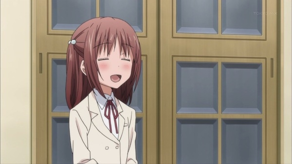

かなり久しぶりだと思う。『狼と香辛料』以来になるだろうか、放映前に TV の前で正座して待つだなんて。

で、それは無駄ではなかった。これなんだよ、おれが観たかった「みなみけ」は！

合いの手がやかましいオープニングから、お約束を押さえたゆるゆるな雰囲気。瞬く間に30分が過ぎていった。もう一度観たかったけど、TV 環境が2000年当時からまったく進化していない<a href="#f-dd113153" name="fn-dd113153" title="これはマジな話で、いまだにアナログだ">*1</a>ウチの環境では録画もできない。

ただ、多少インパクトに欠ける印象も受けた。正直、あんまり話の内容を覚えていない（ぉ

保坂を筆頭とする“濃いキャラ”が未登場なためだろうか。アニメ初登場の新キャラ・ミユキちゃんの活躍にも期待だな。

ちなみに、個人的はなハイライトはココだった。第一話はサービスシーン（？）がてんこ盛りだったけど、「みなみけ」にはそんなものなくても大丈夫。

<ul>
<li><a href="http://www.starchild.co.jp/special/minami-ke/">&#x307F;&#x306A;&#x307F;&#x3051;</a></li>
<li><a href="http://subcultureblog.blog114.fc2.com/blog-entry-9847.html">http://subcultureblog.blog114.fc2.com/blog-entry-9847.html</a></li>
<li><a href="https://blog.daruyanagi.jp/entry/2012/05/18/102103">&#x300C;&#x79C1;&#x306F;&#x983C;&#x3089;&#x308C;&#x308B;&#x306E;&#x306F;&#x597D;&#x304D;&#x3060;&#x304C;&#x3001;&#x3042;&#x3066;&#x306B;&#x3055;&#x308C;&#x308B;&#x306E;&#x306F;&#x5ACC;&#x3044;&#x306A;&#x3093;&#x3060;&#x300D; - &#x3060;&#x308B;&#x308D;&#x3050;</a></li>
</ul>

<a href="#fn-dd113153" name="f-dd113153" class="footnote-number">*1</a>:これはマジな話で、いまだにアナログだ

