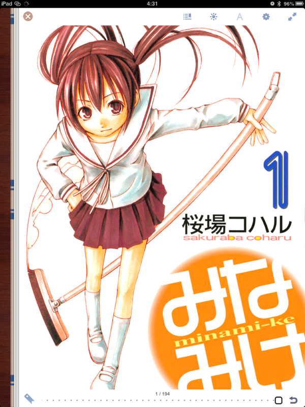
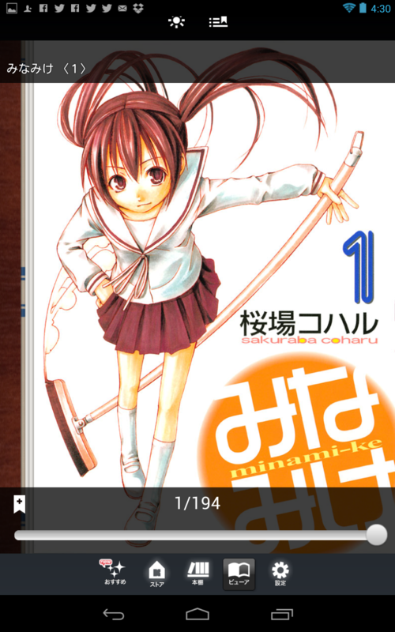
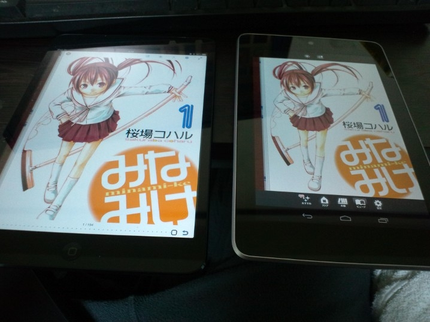
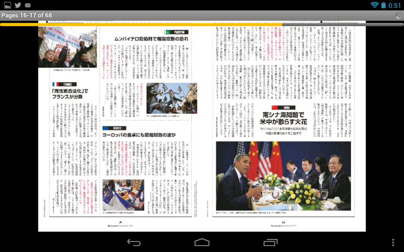
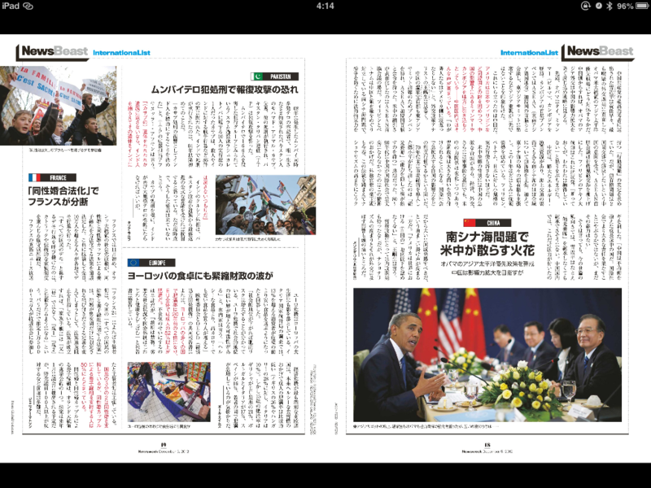
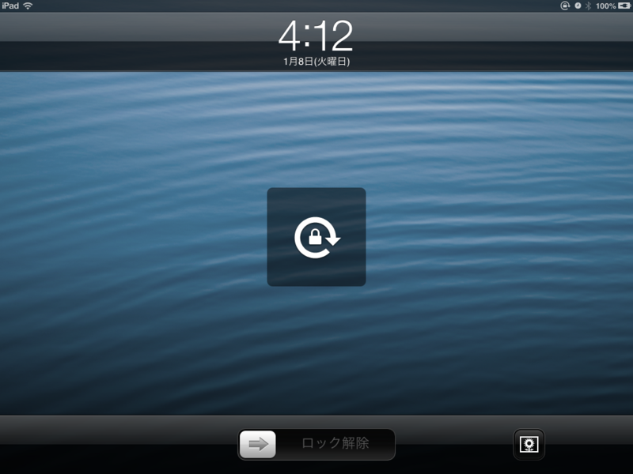
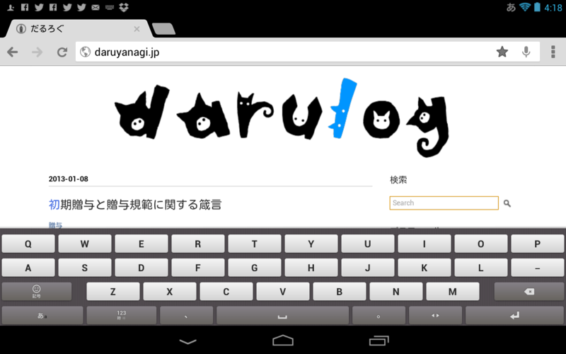
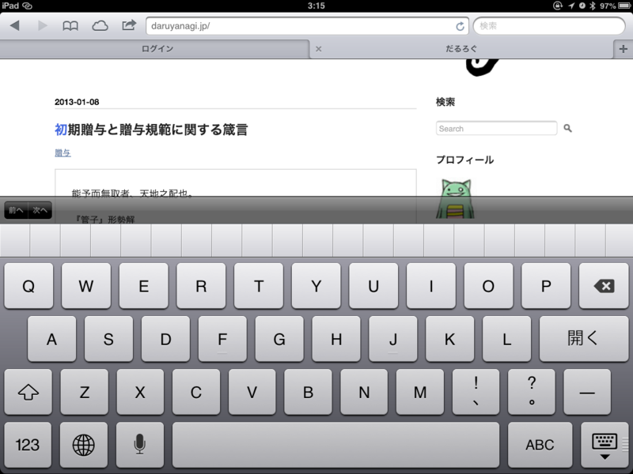

<a href="https://blog.daruyanagi.jp/entry/2012/11/23/210344">Nexus 7 &#x3092;&#x8CFC;&#x5165;&#x3001;&#x7B2C;4&#x6B21;&#x8A08;&#x7B97;&#x6A5F;&#x74B0;&#x5883;&#x6539;&#x5584;&#x8A08;&#x753B;&#x306F;&#x3053;&#x308C;&#x306B;&#x3066;&#x7D42;&#x4E86;&#x3002; - &#x3060;&#x308B;&#x308D;&#x3050;</a> から2ヶ月もたたずして。Nexus 7 は「7インチタブレットがほしい！」と思ったのと、「価格・ハードウェアスペックで iOS 端末を圧倒している」と感じたので飛びついたのだけど、実際に使ってみると結構いけていない部分が少なくなかった。

以下、そのイケていない部分を上げていくが、あくまでも個人的な感想であることはあらかじめご了承いただきたく。

<h3>ハードウェア</h3>

値段が倍ぐらい違うので比べるのが間違っているのは重々承知の上で言うけれど、やっぱり iPad mini の方がもっていてうれしい。

Nexus 7 だってけっして悪くないけど……この前、満充電なのになぜか復帰しなくなった(;´Д｀)

<h4>実質的な画面サイズ</h4>

解像度は、

<ul>
<li>Nexus 7：1280 * 800</li>
<li>iPad mini：1024 * 768</li>
</ul>
と、Nexus 7 に軍配が上がるのだけど、ホームボタンなどを配置したナビゲーションバー（高さ 48px ぐらい？）がソフトウェアで実現されているのでその分の画面領域を差し引くと、とても画面が狭く感じられる。 とくに横持ちにした場合はそれが顕著に感じられる。ボタンがスカスカなナビゲーションバーが横いっぱいに表示されるので。

一方、iPad mini は液晶のサイズ自体が端末の大きさの割に大きい。フットプリントはほとんど変わらないのに、Nexus 7 の7インチに対して、iPad mini は7.9インチ。解像度も大事だけど、やっぱり液晶の大きさやでｄ。しかも、少し薄くて軽い。

　

スクリーンショットをならべると Nexus 7 のほうがいい気がするのだけど、

実際は iPad mini のほうがデカくて見やすい。

あと、これは自分だけかもしれないが、16:10 より 4:3 のほうが本を楽しむには向いていると思う。映像なら 16:10、16:9 が適しているかもしれないが……7インチクラスだとやっぱりメインは本を楽しむのがメインかな。

これは今後リリースが増えるであろう Windows タブレットに対しても言っておきたいけれど、基本的にワイド画面を意識して横方向へのスクロールを基本としたデザインになっているので、ここまでの違和感は感じないかもしれない。

<h4>画面の回転ロック</h4>

「タブレットはごろ寝で使ってこそ真価を発揮する」

ごろ寝で使うと、体勢を微妙に変えるだけで画面の回転機構が働いてしまうことがある。それを抑止するために、“画面の回転ロック”は非常に重要。これがさくっと ON/OFF できないのは個人的に我慢できないな。

Nexus 7 は画面の回転ロック機構がソフトウェアで実装されているうえ、アプリによっては全画面表示の際に“呼び出せなくなる”。たとえばマンガの場合、基本的に縦持ちで読むけれど、見開きページだけは横持ちで見たい。これができなくなるのは痛い。

iPad mini ならばこれがハードウェアボタンで切り替えられる（ただし、要設定。標準ではミュートに割り当てられている）。

<h4>戻るボタン</h4>

ただ、Nexus 7 にもよいところはあった。ひとつは［戻る］ボタンを備えること。Windows Phone で慣れた操作でもあるので、あるとうれしい。なんで Windows 8/RT にはないんだろう……デスクトップアプリを［戻る］に対応させるのが困難だからかなぁ。

<h3>ソフトウェア</h3>

アプリの品質も iOS の方が総じて高い。デザインも Android アプリはちょっとモサモサしてるし、なんだか統一感に欠ける。

<h4>キーボード入力</h4>

「Google 日本語入力」を使ってみたけれど、タブレットには最適化されていないため、気に入らなかった。変換精度や語彙以前に、横持ちの場合にキーが狭すぎる。

「ATOK」なら大丈夫という話も聞いたけれど、すでに Nexus 7 をあきらめる方向に気持ちが傾いていたので購入どころか試す気にもならなかった。

iOS の日本語入力はおバカだけど、正直なところ、それほどムカついたことはない。最近はユーザー辞書に単語を登録しやすくなったし（Windows にもこの機能は必須かと！）、むかしよりはずいぶん使い勝手がよくなったと思っている。

<h3>まとめ</h3>

Windows タブレット頑張れ。iOS のホーム画面だったら、Metro デスクトップで勝てる！

