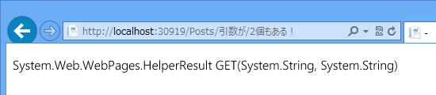
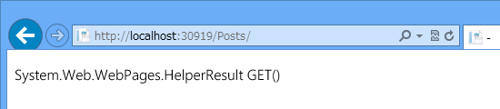
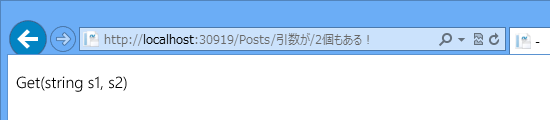
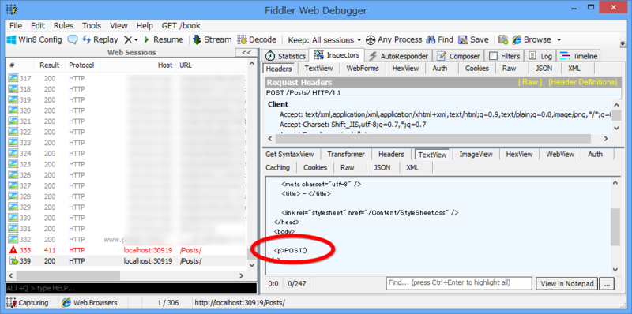

<a href="https://blog.daruyanagi.jp/entry/2013/01/11/041856">WebMatrix 2&#xFF1A;RESTful&#xFF1F;&#x306A; Web &#x30A2;&#x30D7;&#x30EA;&#x30B1;&#x30FC;&#x30B7;&#x30E7;&#x30F3; &#xFF08;2&#xFF09; - &#x3060;&#x308B;&#x308D;&#x3050;</a> の続き。日中戦争、ベトナム戦争並みに泥沼化してきたけど、突き進んでいこう！

<h3>PUT/DELETE メソッドを扱えるようにする</h3>

とりあえず、前回の宿題をさっさと終わらせる。

<pre class="code lang-cs" data-lang="cs" data-unlink>@{
Layout = &quot;_SiteLayout.cshtml&quot;;

// POST で PUT/DELETE を代用
string method = Request.HttpMethod.ToUpper();
if (IsPost &amp;&amp; Request[&quot;_method&quot;] != null)
{
method = Request[&quot;_method&quot;].ToUpper();
}
}
</pre>
こんなのでいいのかな。あとはこれを switch すればよさそうだけど……

<pre class="code lang-cs" data-lang="cs" data-unlink>@switch (method)
{
case &quot;GET&quot;:
// いろいろ
break;
case &quot;POST&quot;:
// さまざま
break;
case &quot;PUT&quot;:
// ほげほげ
break;
case &quot;DELETE&quot;:
// ふがふが
break;
default:
throw new Exception(&quot;なにいってんだおまえ&quot;);
}
</pre>
――ダサいな！

たまたま今日、北陸の女神様のブログ（<a href="http://d.hatena.ne.jp/miso_soup3/20130110/1357822008">ASP.NET WEB API &#x30EB;&#x30FC;&#x30C6;&#x30A3;&#x30F3;&#x30B0;&#x306B;&#x3064;&#x3044;&#x3066;&#x3044;&#x308D;&#x3044;&#x308D; - miso_soup3 Blog</a>）を読んでいたのだけど、ASP.NET Web API みたいに

<pre class="code lang-cs" data-lang="cs" data-unlink>// GET ~/api/values/
public void Get() { }

// GET ~/api/values/:id
public void Get(int id) { }

// POST ~/api/values/
public void Post() { }

// PUT ~/api/values/
public void Put() { }
</pre>
こういうのを勝手にバインディング（っていうのかな？）して呼び出してくれたら、カッコいいのかもしれない。

<h3>メソッドのバインディング</h3>

というわけで、こういうのを考えてみた。

<pre class="code lang-cs" data-lang="cs" data-unlink>@using System.Reflection

@{
Layout = &quot;_SiteLayout.cshtml&quot;;

// POST で PUT/DELETE を代用
string method = Request.HttpMethod.ToUpper();
if (IsPost &amp;&amp; Request[&quot;_method&quot;] != null)
{
method = Request[&quot;_method&quot;].ToUpper();
}

Type type = this.GetType();
MethodInfo method_info = type.GetMethod(
method,
UrlData.Select(_ =&gt; _.GetType()).ToArray()
);

// みつからなかったら method_info == null っぽい

&lt;p&gt;@method_info&lt;/p&gt;
}
</pre>
んでんで、

<pre class="code lang-cs" data-lang="cs" data-unlink>@functions
{
public HelperResult GET()
{
return new HelperResult(_ =&gt; _.WriteLine(&quot;GET()&quot;));
}

public HelperResult GET(int id)
{
return new HelperResult(_ =&gt; _.WriteLine(&quot;Get(int id)&quot;));
}

public HelperResult GET(string title)
{
return new HelperResult(_ =&gt; _.WriteLine(&quot;Get(string title)&quot;));
}

public HelperResult GET(string s1, string s2)
{
return new HelperResult(_ =&gt; _.WriteLine(&quot;Get(string s1, s2)&quot;));
}

public HelperResult POST()
{
return new HelperResult(_ =&gt; _.WriteLine(&quot;POST()&quot;));
}
}
</pre>
こうやって適当に引数の異なるメソッドを用意しておく。

<h4>結果</h4>

なんかいい感じだ。出力を

<pre class="code lang-cs" data-lang="cs" data-unlink>&lt;p&gt;@method_info.Invoke(this, UrlData.Select(_ =&gt; _ as object).ToArray())&lt;/p&gt;
</pre>
に変えてみてもうまくいった（なんか不細工だなーもっといい書き方ある気がする）。

POST も投げてみたけどイケてるみたい（わかりにくくてごめん、まだあんまり使い方がよくわかっていない！）。

あとは、MethodInfo を取得するとき、単に UrlData の type[] を問い合わせるのではなくて

<pre class="code lang-cs" data-lang="cs" data-unlink>MethodInfo method_info = type.GetMethod(
method,
UrlData.Select(_ =&gt; _.なるべくintに変換する().GetType()).ToArray()
);
</pre>
みたいなにすれば、GET(int id) でも呼べるはずだよね！　……今日はもう疲れたからやらないけど。ASP.NET MVC/Web API はこういうのをもっとエレガントにやっているんだろうなって思うと、だいぶ尊敬しちゃう。

