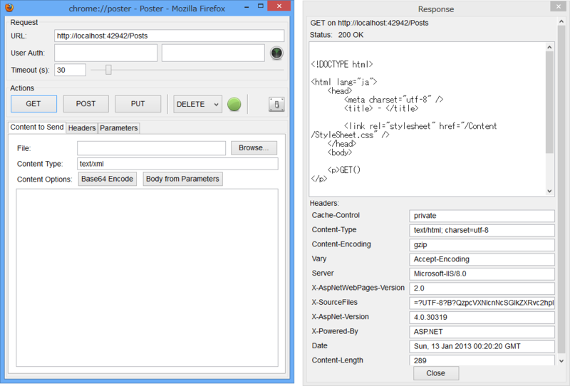
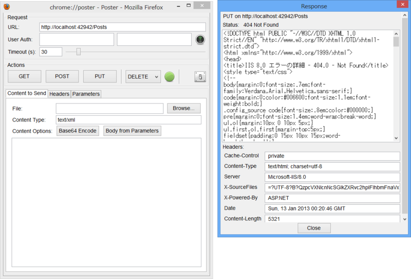
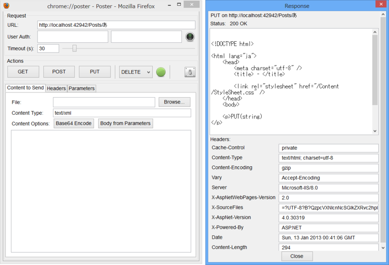

<a href="https://blog.daruyanagi.jp/entry/2013/01/11/060424">WebMatrix 2&#xFF1A;RESTful&#xFF1F;&#x306A; Web &#x30A2;&#x30D7;&#x30EA;&#x30B1;&#x30FC;&#x30B7;&#x30E7;&#x30F3; &#xFF08;3&#xFF09; - &#x3060;&#x308B;&#x308D;&#x3050;</a> の続き。サーバーへ手軽に PUT/DELETE できる方法はないかなぁ、と思って探していたのだけど、

<ul>
<li><a href="https://addons.mozilla.org/ja/firefox/addon/poster/">https://addons.mozilla.org/ja/firefox/addon/poster/</a></li>
</ul>
という Firefox 拡張機能が簡単でよかった。ただ、最近はあんまりメンテナンスされていないようで

わざわざアドオンバーを表示して、このクソちっちゃいボタンをポチッとしなきゃいけないのだけど。

それはともかく。

IIS（Express）は標準で PUT や DELETE を認識してくれないみたいで、リクエストを投げても 404 が返ってきてしまう。Web.config を書き換えて、PUT や DELETE をハンドリングできるようにする必要があるみたい。

<pre class="code lang-xml" data-lang="xml" data-unlink>&lt;?xml version=&quot;1.0&quot; encoding=&quot;utf-8&quot;?&gt;

&lt;configuration&gt;
&lt;system.web&gt;
&lt;compilation debug=&quot;true&quot; targetFramework=&quot;4.0&quot; /&gt;
&lt;/system.web&gt;

&lt;system.webServer&gt;
&lt;handlers&gt;
&lt;remove name=&quot;WebDAV&quot; /&gt;
&lt;remove name=&quot;ExtensionlessUrlHandler-ISAPI-4.0_32bit&quot; /&gt;
&lt;remove name=&quot;ExtensionlessUrlHandler-ISAPI-4.0_64bit&quot; /&gt;
&lt;remove name=&quot;ExtensionlessUrlHandler-Integrated-4.0&quot; /&gt;
&lt;add name=&quot;ExtensionlessUrlHandler-ISAPI-4.0_32bit&quot; path=&quot;*.&quot; verb=&quot;GET,HEAD,POST,DEBUG,PUT,DELETE,PATCH,OPTIONS&quot; modules=&quot;IsapiModule&quot; scriptProcessor=&quot;%windir%\Microsoft.NET\Framework\v4.0.30319\aspnet_isapi.dll&quot; preCondition=&quot;classicMode,runtimeVersionv4.0,bitness32&quot; responseBufferLimit=&quot;0&quot; /&gt;
&lt;add name=&quot;ExtensionlessUrlHandler-ISAPI-4.0_64bit&quot; path=&quot;*.&quot; verb=&quot;GET,HEAD,POST,DEBUG,PUT,DELETE,PATCH,OPTIONS&quot; modules=&quot;IsapiModule&quot; scriptProcessor=&quot;%windir%\Microsoft.NET\Framework64\v4.0.30319\aspnet_isapi.dll&quot; preCondition=&quot;classicMode,runtimeVersionv4.0,bitness64&quot; responseBufferLimit=&quot;0&quot; /&gt;
&lt;add name=&quot;ExtensionlessUrlHandler-Integrated-4.0&quot; path=&quot;*.&quot; verb=&quot;GET,HEAD,POST,DEBUG,PUT,DELETE,PATCH,OPTIONS&quot; type=&quot;System.Web.Handlers.TransferRequestHandler&quot; preCondition=&quot;integratedMode,runtimeVersionv4.0&quot; /&gt;
&lt;/handlers&gt;
&lt;modules&gt;
&lt;remove name=&quot;WebDAVModule&quot; /&gt;
&lt;/modules&gt;
&lt;/system.webServer&gt;
&lt;/configuration&gt;
</pre>
さっぱりわかんないけど、WebDAV モジュールを切っておくのがコツみたい。

<ul>
<li><a href="http://bradkingsley.com/putpostdelete-verb-errors-on-site/">PUT/POST/DELETE Verb Errors On Site | ASPNetFAQ.com: What is ASP.NET?</a></li>
</ul>

手元の環境では、ちゃんと動いたっぽい。

