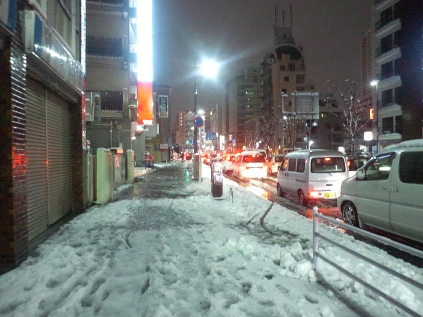

久しぶりの大雪。コンビニまで買い物に行くとき、思わず走ってしまった。下手にそろそろと歩くより、どしんどしんと走る方が、あんがいコケずに済むような気がする。

大雪といえば今でも思い出すのが、まだ小学生のころ、大阪から伊賀に引っ越した次の年の大雪。数10cmは積もったんじゃないかな。生まれて初めて雪下ろしをしたし、雪かきのご褒美に母が近所のホームセンターで雪ぞりを買ってくれて、兄弟で近所の坂を滑りまくったのでよく覚えている。当時は秋田犬を飼っていて、放し飼いにしたらスゴい勢いで爆走しだして笑った。あと、そいつに雪ぞりを牽かせようと画策したのだけど、それはさすがに全力で犬に拒否された。

あれから二度と、そのとき買った雪ぞりが役に立つことがなかったのが残念。

<a href="http://www.amazon.co.jp/exec/obidos/ASIN/B00131T66Y/bestylesnet-22/">キャプテンスタッグ(CAPTAIN STAG) スノーボート ブルー M-1523</a>
<ul><li>出版社/メーカー: キャプテンスタッグ(CAPTAIN STAG)</li><li>メディア: スポーツ用品</li><li><a href="http://d.hatena.ne.jp/asin/B00131T66Y/bestylesnet-22" target="_blank">この商品を含むブログを見る</a></li></ul>

そういえば、受験のときもたいてい大雪だったな。

中学受験の時は、合格発表を見に行ったおかんが雪の山道でスピンして車を全損させたし、大学受験の頃もうっすら雪が積もるぐらいに降っていて、出町柳の交差点で横断歩道の白い部分を踏んづけて盛大に転んで頭を打った。幸い入試の結果はよかったのだけど、縁起が悪いせいか、みんなわしを避けて歩いて、だれも手を差し伸べてくれなかったのが少し悲しかった。

明日には止むんだろうか。もうおっさんだし、雪は少し億劫だ。

