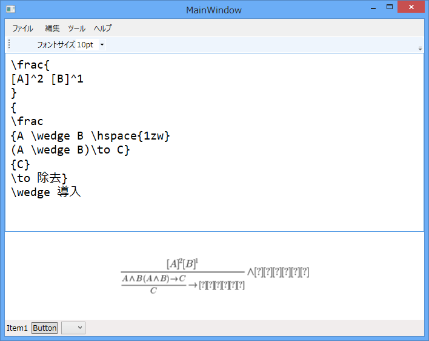

晩御飯食べた後にさくっと作ってみた（参考：<a href="https://blog.daruyanagi.jp/entry/2012/11/16/042840">WebMatrix &#x3067;&#x6570;&#x5F0F;&#x3092;&#x8868;&#x73FE;&#x3059;&#x308B;&#xFF08;&#xFF11;&#xFF09; - &#x3060;&#x308B;&#x308D;&#x3050;</a>）。自然演繹のブログの続きを書こうと思ったのだけど、プレビューできないと数式が書けない人なので……。

でも、これ、ネットワークがつながっていないとだめなのはともかく、日本語が化けてしまうんだよなぁ。まぁ、英語使えばいい。

<ul>
<li>仮定 "Assumption" (A)</li>
<li>モーダスポネンス "Modus Ponendo Ponens" (MPP)</li>
<li>二重否定 "Double Negation" (DN)</li>
<li>条件付き証明 "Conditional Proof" (CP)</li>
<li>∧-導入 "∧-introduction" (∧I)</li>
<li>∧-除去 "∧-elimination" (∧E)</li>
<li>∨-導入 "∨-introduction" (∨I)</li>
<li>∨-除去 "∨-elimination" (∨E)</li>
<li>背理法 "Ad Absurdum" (RAA)</li>
</ul>
これぐらいしかないんだから覚えられるはず (;´Д｀)

<pre class="code lang-cs" data-lang="cs" data-unlink>private void FormulaText_TextChanged_1(object sender, TextChangedEventArgs e)
{
const string API = &quot;http://chart.apis.google.com/chart?cht={0}&amp;chl={1}&quot;;
var cht = &quot;tx&quot;;
var chl = HttpUtility.UrlEncode(FormulaText.Text);
var uri = new Uri(string.Format(API, cht, chl));

FormulaImage.Source = new BitmapImage(uri);
}
</pre>
あと、なんでか知らんけど、ViewModel がバインディングされないのでコードビハインドで書いたけど<a href="#f-2b762d13" name="fn-2b762d13" title="たぶん、久しぶりに書いたのでどこか間違ってるんだろう">*1</a>、まぁ、これぐらいだとそっちの方が早かったり。

<a href="#fn-2b762d13" name="f-2b762d13" class="footnote-number">*1</a>:たぶん、久しぶりに書いたのでどこか間違ってるんだろう

