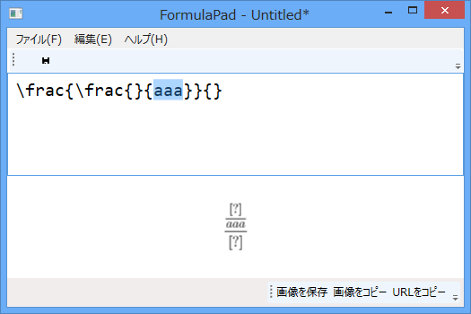

<a href="https://blog.daruyanagi.jp/entry/2013/01/14/221302">Google Chart &#x3092;&#x4F7F;&#x3063;&#x305F;&#x6570;&#x5F0F;&#x30C4;&#x30FC;&#x30EB;&#x3092;&#x4F5C;&#x3063;&#x3066;&#x307F;&#x305F; - &#x3060;&#x308B;&#x308D;&#x3050;</a> の続き。さすがにもう少し完成度を上げようと思って、

<ul>
<li>数式テキストの新規作成・開く・保存</li>
<li>編集機能（切り取り・コピー・貼り付けなど）</li>
<li>数式イメージのファイル保存・クリップボードへコピー</li>
</ul>
なんかを、ちびちびと実装。そのうち欲が出てきて、［Tab］キーでブラケット移動なんかもしたいなぁ、と思い始めた。で、とりあえず考えたのかこんなの。

<pre class="code lang-cs" data-lang="cs" data-unlink>private void FormulaText_PreviewKeyDown(object sender, KeyEventArgs e)
{
if (e.Key == Key.Tab)
{
e.Handled = true; // 握りつぶす！

var text = FormulaText.Text;
int start = FormulaText.SelectionStart;
int end = -1;
FormulaText.SelectionLength = 0;

if ((Keyboard.Modifiers &amp; ModifierKeys.Shift) != ModifierKeys.Shift)
{
start = text.IndexOf('{', start);
if (start &lt; 0) return;
FormulaText.SelectionStart = start + 1;

end = text.IndexOf('}', FormulaText.SelectionStart);
if (end &lt; 0) return;
FormulaText.SelectionLength = end - start - 1;
}
else // Shift + Tab キー
{

}
}
}
</pre>

適当に書いたのだけど、これでも案外使える感じになった。ただ、

ネスト（入れ子）が認識できない。あと、［Shift］+［Tab］キーで逆向きに移動したいけれど、これがなかなかめんどくさい。{} だけじゃなくて () にも対応させたい、なんて考えだすと破たんするのが目に見えてるし。

というわけで、解決策は正規表現か、構文解析かって感じなんだけど。正規表現も大変だし、しかも限界が見えているので、ここは頑張って簡単な構文解析をするべきかと思っている。

