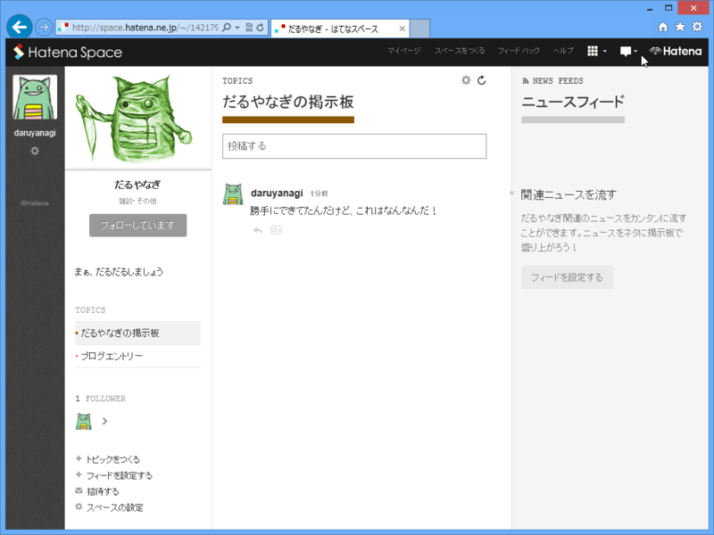
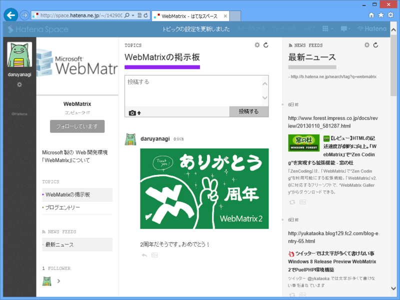

よくわからないけど、トピックごとの掲示板のようなものなのかな。ログインしたら勝手に自分の掲示板ができていた。

<ul>
<li><a href="http://space.hatena.ne.jp/~/14217943783080774236#14217943783080774238">&#x3060;&#x308B;&#x3084;&#x306A;&#x304E; - &#x306F;&#x3066;&#x306A;&#x30B9;&#x30DA;&#x30FC;&#x30B9;</a></li>
</ul>
これ、流行るのかなぁ……。

試しに WebMatrix の掲示板を作ってみた。はてな ID をもっていれば、簡便な情報交換の場になるのかもしれない。

<ul>
<li><a href="http://space.hatena.ne.jp/~/14290001378108560140#14290001378108560142">WebMatrix - &#x306F;&#x3066;&#x306A;&#x30B9;&#x30DA;&#x30FC;&#x30B9;</a></li>
</ul>