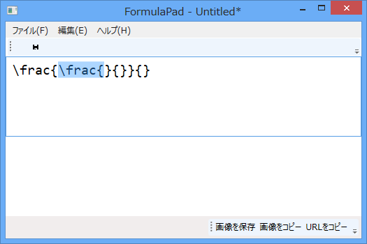

 

<blockquote cite="https://blog.daruyanagi.jp/entry/2013/01/15/210406">

ネスト（入れ子）が認識できない。あと、［Shift］+［Tab］キーで逆向きに移動したいけれど、これがなかなかめんどくさい。{} だけじゃなくて () にも対応させたい、なんて考えだすと破たんするのが目に見えてるし。

というわけで、解決策は正規表現か、構文解析かって感じなんだけど。正規表現も大変だし、しかも限界が見えているので、ここは頑張って簡単な構文解析をするべきかと思っている。

<cite><a href="https://blog.daruyanagi.jp/entry/2013/01/15/210406">Google Chart &#x3092;&#x4F7F;&#x3063;&#x305F;&#x6570;&#x5F0F;&#x30C4;&#x30FC;&#x30EB;&#x3092;&#x4F5C;&#x3063;&#x3066;&#x307F;&#x305F;&#xFF08;2&#xFF09; - &#x3060;&#x308B;&#x308D;&#x3050;</a></cite>
</blockquote>

構文解析というか、対応する { と } をペアにして、その出現位置をメモる方向で考えてみた。括弧の種類が増えていけば破たんするけれど、とりあえず最初は動けばいいや。アルゴリズムは、

<ul>
<li>テキストを先頭から一文字ずつ取り出して、</li>
<li>{ だったら [i, ?] をリストに保存。（i は { の出現位置、? は } の位置を保存するプレースホルダ）</li>
<li>} だったら最後の ? へ出現位置を保存。</li>
<li>これを文末まで繰り返す。</li>
</ul>
みたいな感じ。大雑把に言えば、{ は前から詰めて、} は後ろから詰める、と。

たとえば、

<table>
<tr>
<td>0</td>
<td>1</td>
<td>2</td>
<td>3</td>
<td>4</td>
<td>5</td>
<td>6</td>
<td>7</td>
<td>8</td>
<td>9</td>
<td>10</td>
<td>11</td>
<td>12</td>
<td>13</td>
<td>14</td>
<td>15</td>
</tr>
<tr>
<td>\</td>
<td>f</td>
<td>r</td>
<td>a</td>
<td>c</td>
<td>{</td>
<td>\</td>
<td>f</td>
<td>r</td>
<td>a</td>
<td>c</td>
<td>{</td>
<td>}</td>
<td>{</td>
<td>}</td>
<td>}</td>
</tr>
</table>
だったら、

<table>
<tr>
<td>{ の出現位置</td>
<td>（対応する）} の出現位置</td>
</tr>
<tr>
<td>5</td>
<td>15</td>
</tr>
<tr>
<td>11</td>
<td>12</td>
</tr>
<tr>
<td>13</td>
<td>14</td>
</tr>
</table>
こういうリストを得るのがゴールになるかな。もしかしたら再帰でイケるのかな？　と思ったけど、よくわかんなかったので素直に for を使って書くことにした。あと、? には text.Length - 1 を突っ込んでおいた。int? にして null をプレースホルダにしてもよかったのだけれど、ちょっとめんどくさいかな、と思って。

<pre class="code lang-cs" data-lang="cs" data-unlink>private Dictionary&lt;int, int&gt; BuidBracketIndo(string text)
{
var result = new Dictionary&lt;int, int&gt;();
var last_index = text.Length - 1;

for (int i = 0; i &lt;= last_index; i++)
{
switch (text[i])
{
case '{':
result.Add(i, last_index);
break;
case '}':
try
{
var item = result.Last(_ =&gt; _.Value == last_index);
result[item.Key] = i;
}
catch { }
break;
}
}

return result;
}
</pre>
これを TextChanged イベントで呼んで括弧の対応位置情報を毎回リフレッシュし、［Tab］キーの入力時に利用する。

<pre class="code lang-cs" data-lang="cs" data-unlink>// 「\frac{}{}」（分数の TeX 表現）を挿入する。
// 挿入後は［Tab］キーの押し下げを一度行い、
// 最初の {} の間にキャレットを移動させる
private void Button_Click_4(object sender, RoutedEventArgs e)
{
// 途中でFormulaText.SelectionStart == 0 になってしまう（？）ので
// キャレット位置を保存しておく
var start = FormulaText.SelectionStart;
FormulaText.Text = FormulaText.Text
.Remove(start, FormulaText.SelectionLength)
.Insert(start, @&quot;\frac{}{}&quot;);
FormulaText.Focus();
FormulaText.SelectionStart = start;

// ［Tab］キーの押し下げをエミュレート
var tab_key_down_event_args = new KeyEventArgs(
Keyboard.PrimaryDevice,
PresentationSource.FromVisual(FormulaText),
(int)DateTime.Now.Ticks,
Key.Tab
);
tab_key_down_event_args.RoutedEvent = Keyboard.PreviewKeyDownEvent;
FormulaText_PreviewKeyDown(sender, tab_key_down_event_args);
}

// 括弧の位置情報： TextChanged イベントでリフレッシュされる
private Dictionary&lt;int, int&gt; brackets = null;

// キーの押し下げイベントを処理
private void FormulaText_PreviewKeyDown(object sender, KeyEventArgs e)
{
switch (e.Key)
{
case Key.Tab:
try
{
/* ［Tab］キーで次のブラケット内へ進む */
if ((Keyboard.Modifiers &amp; ModifierKeys.Shift) != ModifierKeys.Shift)
{
var b = brackets.First(_ =&gt; FormulaText.SelectionStart &lt; _.Key);
FormulaText.SelectionStart = b.Key + 1;
FormulaText.SelectionLength = b.Value - b.Key - 1;
}
/* ［Shift］＋［Tab］キーで前のブラケット内へ戻る */
else
{
var b = brackets.Last(_ =&gt; _.Key &lt; FormulaText.SelectionStart - 1);
FormulaText.SelectionStart = b.Key + 1;
FormulaText.SelectionLength = b.Value - b.Key - 1;
}
}
catch
{
/* 不正な操作を行ったらビープ音を鳴らす */
System.Media.SystemSounds.Beep.Play();
}
finally
{
e.Handled = true; // イベントを握りつぶす！
}
break;

case Key.Escape:
/* 選択状態を解除する */
FormulaText.SelectionLength = 0;
break;
}
}
</pre>
ついでに［Esc］キーで選択を解除できるようにしておいた。手元ではちゃんと動いている気がするけど、もう少し様子を見てから、アイコンなんかをつけて公開しようかと思う。

<h3>追記</h3>

ご指摘感謝！　ブログの方はそのままにしておくので適当に読み直してください。List&lt;KeyValuePair&lt;int,int&gt;&gt; に書き換えればいいんですよね？

