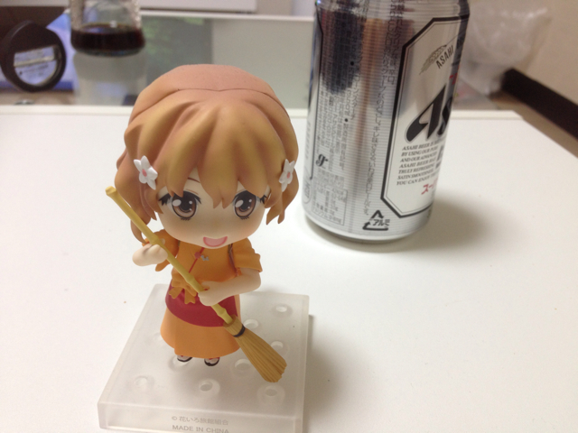
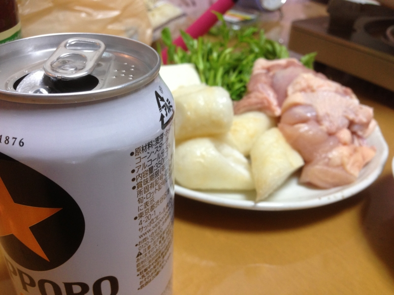
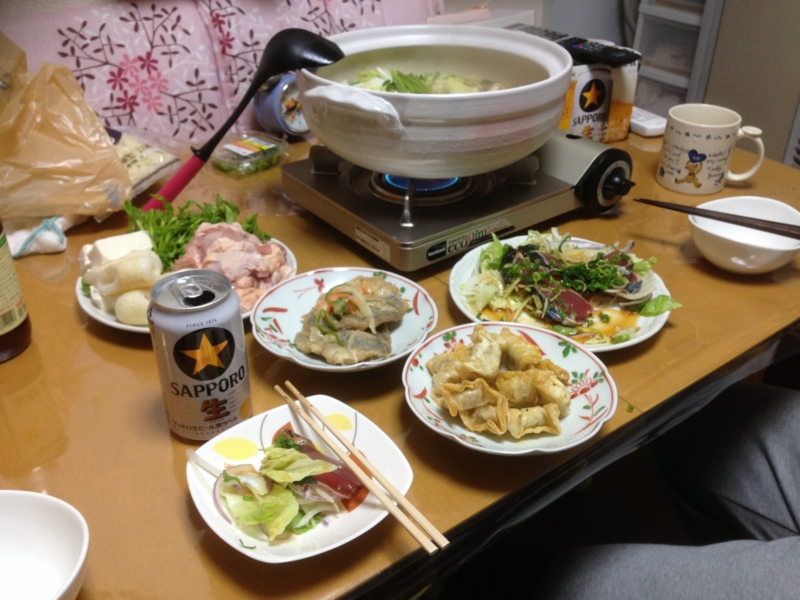

木曜日は @shibayan 家で「花咲くいろは」を12話ぐらいまで観た。

なかなか素晴らしいアニメで、とても気に入った。これはぜひ“聖地巡礼”に行ってみたい。

<blockquote cite="http://www.hokkoku.co.jp/subpage/HT20130112401.htm">

<h4>花いろに憧れ「仲居男子」　湯涌の旅館</h4>

　金沢育ちの新鞍さんは高校中退後、職を転々とした。通信工事のほか、片町のバーで働 いていたこともあったが、長続きしなかった。アニメにのめり込むようになったのはその ころだ。「主人公の松前緒花は、何に対しても一生懸命で決して信念を曲げないんです」 と「花咲くいろは」の虜（とりこ）になった。

　「大好きなアニメの舞台で働きたい。生き方を変えられるかもしれない」と一念発起。 ただ仲居は一般に女性の仕事であり、新鞍さんは「男の自分には無理」と考え、板前の面 接を受けた。女将（おかみ）の山下眞咲美さん（６４）は「あまりにも熱心だったんで、 ちょうど仲居も足りていなかったし、仲居さんとして雇いました。女性ばかりなんで、力 仕事や機械にも詳しく大助かりやね」とべた褒めだ。

<cite><a href="http://www.hokkoku.co.jp/subpage/HT20130112401.htm">&#x5317;&#x570B;&#x65B0;&#x805E;&#x30DB;&#x30FC;&#x30E0;&#x30DA;&#x30FC;&#x30B8; - &#x30DB;&#x30C3;&#x3068;&#x30CB;&#x30E5;&#x30FC;&#x30B9;</a></cite>
</blockquote>

こうしたくなる気持ちもわかる気がする。まぁ、わしはようやらんけど。

とにかく、続きを見るのが待ち遠しい。

続いて、金曜日・土曜日・日曜日は @subsfn 家でごろごろと「十二国記」をみた。これは言わずと知れた、200X年代を代表する名作の一つ。

最初の晩は、鶏肉ときりたんぽの鍋を製造。これはかなりおいしくできた。次の晩はブリしゃぶと、ブリのアラ鍋の二段構え。ブリしゃぶはかなり旨かったけど、アラはちょっとくさかった。次にやるときは、もっとキッチリあらってからぶち込まねばならん。

一応独り暮らしは長いので、必要最低限のサバイバル料理は作れるけれど、身の程をわきまえた・失敗のない料理ばかり作る成果、まったく成長がない。休日ぐらいは真面目に料理に取り組んでみるか……？　むかしはピーマンの肉詰めをよく作ってたのだけど、最近はご無沙汰だ。

