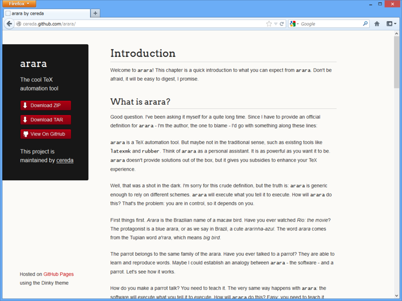

ちょっと調べ物をしていて、<a href="http://cereda.github.com/arara/">http://cereda.github.com/arara/</a> というサイトを見つけたのだけど、このデザインがシンプルながら結構いけているな、と思った。

トリッキーなマークアップが少なくて、ちゃんとセマンティック。印刷時の見栄えも素直だ。

なにより素晴らしいのはレスポンシブなところ。ブラウザーの横幅に応じて、デザインが適したものに変わる。

多少気になるところもないとは言えないけれど、これはぜひ<del>パクらせて</del>参考にさせていただきたい。

<h3>まずはダウンロード</h3>

なにはともあれ、まずはダウンロードやな。“Web ページ、完全”で HTML とそのほかのリソース（CSS/JavaScriptや画像ファイルなど）をゲット。

次に作業用のフォルダを作って、ダウンロードした HTML ファイルを移動させる。リソースが保存されたフォルダ（今回の場合“arara by cereda_files”フォルダ）は、NTFS の“代替データストリーム”という仕組みで関連付けられているので、HTML ファイルを移動させればそれについてくる。

作業フォルダの中身はこんな感じになっているはず。

<h3>作業フォルダを Web サイトとして開く</h3>

続いて、これを WebMatrix で開く。フォルダのコンテクストメニューから［Open as a Web Site with Microsoft WebMatrix］を選択しよう。

これでやりたい放題だな！

<ul>
<li><a href="https://blog.daruyanagi.jp/entry/2012/12/07/125835">WebMatrix 2&#xFF1A;&#x30D5;&#x30A9;&#x30EB;&#x30C0;&#x30FC;&#x304B;&#x3089; Web &#x30B5;&#x30A4;&#x30C8;&#x3092;&#x4F5C;&#x3063;&#x3066;&#x307F;&#x308B; - &#x3060;&#x308B;&#x308D;&#x3050;</a></li>
<li><a href="https://blog.daruyanagi.jp/entry/2012/12/24/185100">WebMatrix 2&#xFF1A;&#x30D5;&#x30A9;&#x30EB;&#x30C0;&#x30FC;&#x304B;&#x3089; Web &#x30B5;&#x30A4;&#x30C8;&#x3092;&#x4F5C;&#x6210;&#x3059;&#x308B;&#x5834;&#x5408;&#x306E;&#x6CE8;&#x610F;&#x70B9; - &#x3060;&#x308B;&#x308D;&#x3050;</a></li>
</ul>

<h3>少し手を入れる</h3>

さすがにこのままホスティングサービスへアップロードして使うのはダサいので、少しだけ手を入れよう。

ASP.NET では、

<ul>
<li>Scripts：JavaScript ファイルなどを格納</li>
<li>Content：CSS ファイルなどを格納</li>
</ul>
するのが慣例となっているようなので、それにあわせてファイルの移動とリンクの書き換えを行う。テキストの検索・置換機能を活用するとよいよ。

<h3>ただの HTML ページから ASP.NET Web ページへ</h3>

ここからは個人的なおすすめなのだけど、ASP.NET Web ページのテンプレートにしてしまえば、Web サイト全体のデザインを共通化できていいと思う。

このテーマの場合、<section> で囲まれた部分が“本文”なので、それを切り取って“Default.cshtml”へ保存し、冒頭に以下のようなコードを追加してお行く。

<pre class="code lang-cs" data-lang="cs" data-unlink>@{
Layout = &quot;_SiteLayout.cshtml&quot;;
}
</pre>
残った“arara by cereda.htm”は“_SiteLayout.cshtml”へリネームし、切り取った <section> の中身を

<pre class="code lang-cs" data-lang="cs" data-unlink>&lt;section&gt;
@RenderBody()
&lt;/section&gt;
</pre>
と書き換えておく。これでレイアウトと内容の分離が完成した。

ためしに Test.cshtml をこんな感じに作って、<a href="http://***/Test">http://***/Test</a> を表示させれば、

こんな感じになる。 

ちなみに、なぜ“_SiteLayout.cshtml”などとファイル名の先頭に“_”を入れているのかについては、以下のリンクを参考にされたい。

<ul>
<li><a href="https://blog.daruyanagi.jp/entry/2012/07/06/174414">WebMatrix &#x306E;&#x30EB;&#x30FC;&#x30C6;&#x30A3;&#x30F3;&#x30B0; - &#x3060;&#x308B;&#x308D;&#x3050;</a></li>
</ul>

<h4>ASP.NET Web Pages v2 へアップデート</h4>

話は前後するけど、サイトの設定で ASP.NET Web Pages を v2 にアップデートしておくと少し幸せになれる。たとえば、

<pre class="code lang-html" data-lang="html" data-unlink>&lt;link rel=&quot;stylesheet&quot; href=&quot;~/Content/styles.css&quot;&gt;
&lt;link rel=&quot;stylesheet&quot; href=&quot;~/Content/pygment_trac.css&quot;&gt;
&lt;script src=&quot;~/Scripts/scale.js&quot;&gt;&lt;/script&gt;
</pre>
という記法が使えるようになる。v1 のころは“href="Url.Content("~/Content/styles.css")"”と書いていたと思うのだけど、v2 では“Url.Content()”が省略できるようになっているんだね。

“~（チルダ）”は Web サイトのルートを表す。たとえば、ルートが <a href="http://sample.com/sample/">http://sample.com/sample/</a> だったら、~/Content/styles.css は <a href="http://sample.com/sample/Content/styles.css">http://sample.com/sample/Content/styles.css</a> になる。

<h3>魔改造の結果</h3>

自分の場合は、ちょっとメトロ（死）風の色使いにしてみた。そんなに大きな改修はしていないのだけど、オリジナルとはまったく雰囲気が違うでしょ？

<h3>オチ。</h3>

ちなみに、わざわざこんなことしないでも <a href="https://github.com/sodabrew/theme-dinky">GitHub - sodabrew/theme-dinky: The Dinky theme for GitHub pages, ported to Jekyll Bootstrap.</a> でテーマファイルは配布されている。使わせてもらう場合は、クレジットぐらい掲載するといいんじゃないかな。

