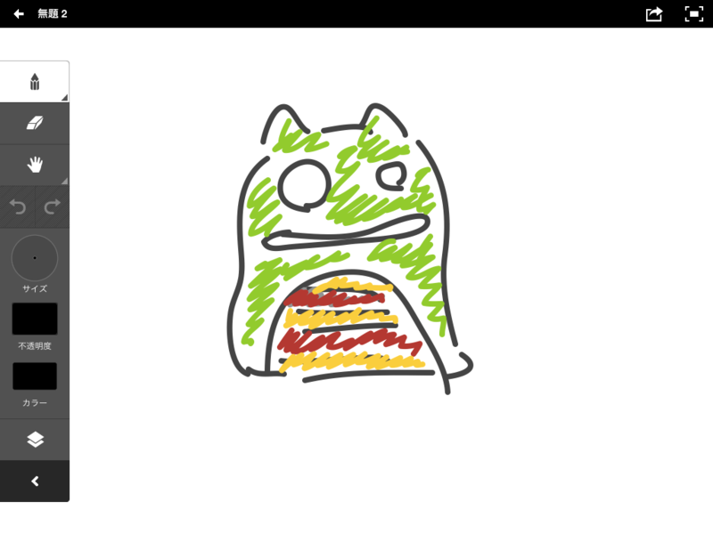
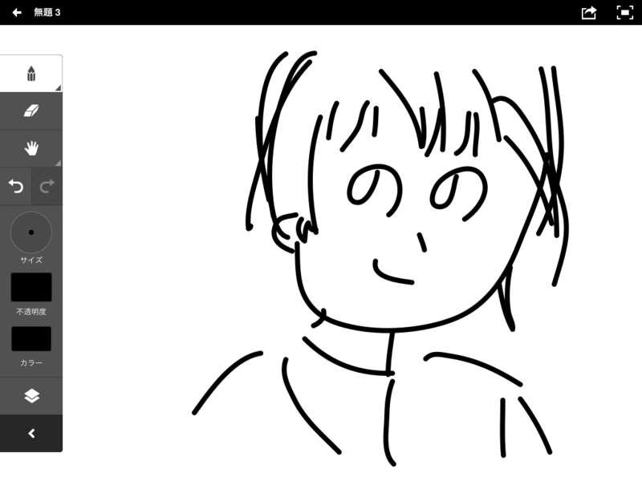
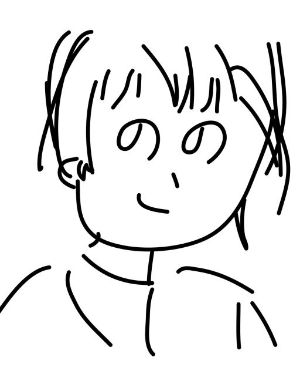
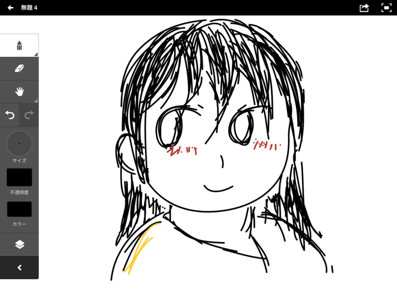

<a href="http://blog.livedoor.jp/kinisoku/archives/3674791.html">&#x30A2;&#x30DB;&#x3067;&#x3082;&#x5973;&#x306E;&#x5B50;&#x63CF;&#x3051;&#x308B;&#x65B9;&#x6CD5;&#x601D;&#x3044;&#x3064;&#x3044;&#x305F;&#x3063;&#x305F;&#xFF57;&#xFF57;&#xFF57;&#xFF57;&#xFF57;&#xFF57;&#xFF57;&#xFF57;&#xFF57;&#xFF57;&#xFF57;&#xFF57;&#xFF57;&#xFF1A;&#x30AD;&#x30CB;&#x901F;</a> という記事が面白かったので、おれも挑戦してみた。要は“えかきうた”みたいな感じで描けばいいんだな。

<h3>現状</h3>

とりあえず、自分の今の実力を確認しておく意味で、適当に描いてみた。

<h4>理想</h4>

※絵のうまい人に僕の Twitter のアイコンを描いてもらいました。

<h4>現実</h4>

……お、おぅ……。

ちなみに、アプリは <a href="http://www.adobe.com/jp/joc/design/guides/ideas/index.html">Adobe Ideas 1.1 - ADOBE DESIGN MAGAZINE</a> という iOS アプリを使っている。

<h3>手順を守ってとりあえず描いてみた</h3>

つぎに、“アホでも女の子描ける方法”を試してみた。

(;^ω^)

　

これが俗にいう“才能の差”というやつか。世の中というのは残酷やな。残酷やな。

<h3>さすがに悔しかったのでもう一回チャレンジした</h3>

近所に住んでるおばちゃんみたいになった。まぁ、おれには無理だってわかっただけでも収穫としよう。

