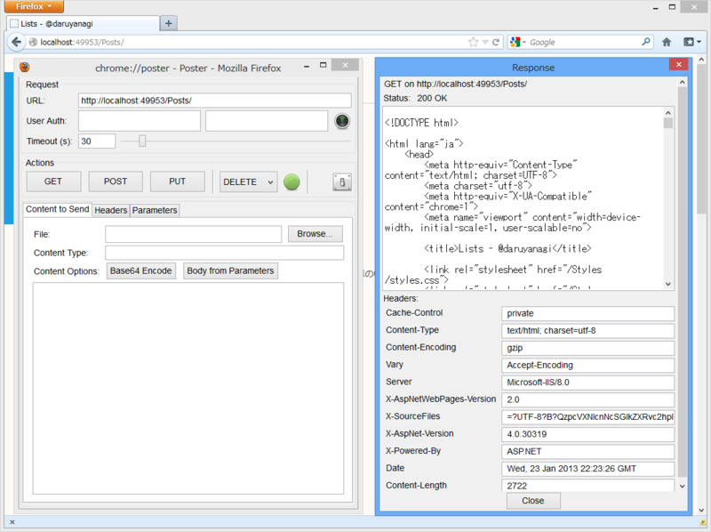
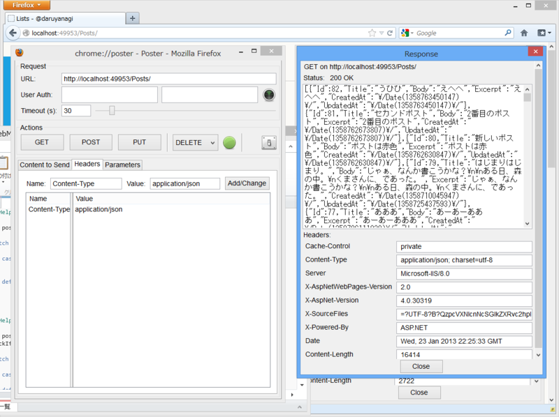

<a href="https://blog.daruyanagi.jp/entry/2013/01/13/094453">WebMatrix 2&#xFF1A;RESTful&#xFF1F;&#x306A; Web &#x30A2;&#x30D7;&#x30EA;&#x30B1;&#x30FC;&#x30B7;&#x30E7;&#x30F3; &#xFF08;4&#xFF09; - &#x3060;&#x308B;&#x308D;&#x3050;</a> の続き。結局こんな感じになったというのを書くのを忘れていた。実際に動作するサンプルは、Windows Azure に置いておいた。

<ul>
<li><a href="http://daruyanagi-sample1.azurewebsites.net/Posts">http://daruyanagi-sample1.azurewebsites.net/Posts</a></li>
</ul>
モーダルダイアログの表示に pointer-events というのを使ったのだけど、実はこれ、IE/Opera では使えないらしい。興味のある人は Mozilla Firefox か Google Chrome で試してほしいかな。デザインの過程は <a href="https://blog.daruyanagi.jp/entry/2013/01/23/053227">WebMatrix &#x3067;&#x307B;&#x304B;&#x306E; Web &#x30B5;&#x30A4;&#x30C8;&#x306E;&#x30C7;&#x30B6;&#x30A4;&#x30F3;&#x3092;&#x30D1;&#x30AF;&hellip;&hellip;&#x3058;&#x3083;&#x306A;&#x304F;&#x3066;&#x3001;&#x53C2;&#x8003;&#x306B;&#x3055;&#x305B;&#x3066;&#x3044;&#x305F;&#x3060;&#x304F; - &#x3060;&#x308B;&#x308D;&#x3050;</a> を参照。

<h3>データベースとのやり取り</h3>

~/App_Code/Post.cs に書いておいた。一つのファイルにごちゃっと書いておけるのが ASP.NET Web Pages のお手軽なところだと思うけれど、まぁ、わけておいた方があとあとメンテナンスしやすそう。

<pre class="code lang-cs" data-lang="cs" data-unlink>using System;
using System.Collections.Generic;
using System.Linq;
using System.Web.WebPages;
using WebMatrix.Data;

public class Post
{
// ここら辺はテーブルの構造をそのまま定義
public long Id { get; set; }
public string Title { get; set; }
public string Body { get; set; }
public DateTime CreatedAt { get; set; }
public DateTime UpdatedAt { get; set; }

public string Excerpt // 本文の一部だけを取得
{
get
{
return Body.IsEmpty()
? string.Empty
: string.Join(&quot;&quot;, Body.Take(40));
}
}

// クエリで受け取ったデータ（dynamic）から
// Post オブジェクトを生成
public Post(dynamic record)
{
Id = record.Id;
Title = record.Title;
Body = record.Body;
CreatedAt = record.CreatedAt;
UpdatedAt = record.UpdatedAt;
}
}

public static class PostRepository
{
public static IEnumerable&lt;Post&gt; List()
{
const string query = &quot;SELECT * FROM Post ORDER BY CreatedAt DESC&quot;;

using (var db = Database.Open(&quot;db&quot;))
{
return db.Query(query).Select(_ =&gt; new Post(_));
}
}

public static Post Find(long id)
{
const string query = &quot;SELECT * FROM Post WHERE Id=@0&quot;;

using (var db = Database.Open(&quot;db&quot;))
{
return new Post(db.QuerySingle(query, id));
}
}

// タイトルでも検索できるように
public static Post Find(string title)
{
const string query = &quot;SELECT * FROM Post WHERE Title=@0&quot;;

using (var db = Database.Open(&quot;db&quot;))
{
return new Post(db.QuerySingle(query, title));
}
}

public static long Create(string title, string body)
{
const string query = &quot;INSERT INTO Post (Title, Body, CreatedAt, UpdatedAt)&quot;
+ &quot;VALUES(@0, @1, @2, @3)&quot;;
var now = DateTime.Now;

using (var db = Database.Open(&quot;db&quot;))
{
db.Query(query, title, body, now, now);
// INSERT した列の Id を取得するのってこうやればいいらしい
var result = db.QueryValue(&quot;SELECT @@IDENTITY&quot;);
return Convert.ToInt64(result);
}
}

public static void Update(long id, string title, string body)
{
var query = &quot;UPDATE Post SET Title=@0, Body=@1, UpdatedAt=@2 WHERE Id=@3&quot;;
var now = DateTime.Now;

using (var db = Database.Open(&quot;db&quot;))
{
db.Query(query, title, body, now, id);
}
}

public static void Delete(long id)
{
var query = &quot;DELETE FROM Post WHERE Id=@0&quot;;

using (var db = Database.Open(&quot;db&quot;))
{
db.Query(query, id);
}
}
}
</pre>
これで List()、Find()、Create()、Update()、Delete() が使えるようになった。

<h3>メソッドに応じて異なるビューを呼び出す</h3>

~/Posts.cshtml の中身。IIS はデフォルトで PUT/DELETE が使えないみたい。Web.config を書き換えてもいいのだけど、ここは _method = "PUT" がリクエストに含まれていたら PUT として処理することにした。

<pre class="code lang-cs" data-lang="cs" data-unlink>@using System.Reflection

@try
{
// POST で PUT/DELETE を代用
string method = Request.HttpMethod.ToUpper();
if (IsPost &amp;&amp; Request[&quot;_method&quot;] != null)
{
method = Request[&quot;_method&quot;].ToUpper(); // Camelize() とか作っておくといいのかも
}

// パラメーターの型を解釈（なるべく long に、無理なものは string のまま）
var args = UrlData.Select&lt;string, object&gt;(_ =&gt;
{
try { return long.Parse(_); } catch { return _; }
}).ToArray();

// メソッドの検索
MethodInfo method_info = this.GetType().GetMethod(
method,
args.Select(_ =&gt; _.GetType()).ToArray()
);

// 検索したメソッドを呼び出してビューをレンダリング
@method_info.Invoke(this, args);
}
catch (Exception e)
{
throw new ApplicationException();
}

@functions // HelperResult を返せば、@... で呼び出してビューがレンダリングされる
{
private const string VIEW_POST_DETAIL = &quot;~/Views/Posts/_ShowPost.cshtml&quot;;
private const string VIEW_POST_ARCHIVE = &quot;~/Views/Posts/_ListPosts.cshtml&quot;;

public HelperResult GET() // Camelize() すれば Get() で呼び出せるケド
{
var posts = PostRepository.List();

switch (Request.ContentType) // JSON でも返せるように！
{
case &quot;application/json&quot;:
RenderJason(posts);
return null;
default:
return RenderPage(VIEW_POST_ARCHIVE, posts);
}
}

public HelperResult GET(long id)
{
var post = PostRepository.Find(id);
CheckIfPostIsNull(post);

switch (Request.ContentType)
{
case &quot;application/json&quot;:
return RenderJason(post);
default:
return RenderPage(VIEW_POST_DETAIL, post);
}
}

public HelperResult GET(string title)
{
var post = PostRepository.Find(title);
CheckIfPostIsNull(post);

switch (Request.ContentType)
{
case &quot;application/json&quot;:
return RenderJason(post);
default:
return RenderPage(VIEW_POST_DETAIL, post);
}
}

public void POST()
{
var title = Request[&quot;Title&quot;];
var body = Request[&quot;Body&quot;];
var id = PostRepository.Create(title, body);

switch (Request.ContentType)
{
case &quot;application/json&quot;:
default:
RenderJason(id);
break;
}
}

public void PUT(long id)
{
var title = Request[&quot;Title&quot;];
var body = Request[&quot;Body&quot;];
PostRepository.Update(id, title, body);

switch (Request.ContentType)
{
case &quot;application/json&quot;:
default:
RenderJason(id);
break;
}
}

public void PUT(string title)
{
var post = PostRepository.Find(title);
CheckIfPostIsNull(post);

var new_title = Request[&quot;Title&quot;];
var body = Request[&quot;Body&quot;];
PostRepository.Update(post.Id, new_title, body);

switch (Request.ContentType)
{
case &quot;application/json&quot;:
default:
RenderJason(post.Id);
break;
}
}

public void DELETE(long id)
{
PostRepository.Delete(id);

switch (Request.ContentType)
{
case &quot;application/json&quot;:
default:
RenderJason(id);
break;
}
}

public void DELETE(string title)
{
var post = PostRepository.Find(title);
CheckIfPostIsNull(post);

PostRepository.Delete(post.Id);

switch (Request.ContentType)
{
case &quot;application/json&quot;:
default:
RenderJason(post.Id);
break;
}
}
}

@functions
{
private HelperResult RenderJason(long id) // Id だけを JSON で返す
{
Response.Clear();
Response.ContentType = &quot;application/json&quot;;
Response.Write(string.Format(@&quot;{{ &quot;&quot;Id&quot;&quot;: &quot;&quot;{0}&quot;&quot; }}&quot;, id));
Response.End();
return null; // null を返すなら HelperResult 型にしなくてもいい気はする
}

private HelperResult RenderJason(object post) // Post だの Posts だのを JSON で返す
{
Response.Clear();
Response.ContentType = &quot;application/json&quot;;
Response.Write(Json.Encode(post));
Response.End();
return null;
}

private void CheckIfPostIsNull(Post post)
{
if (post == null)
throw new HttpException(404, &quot;Post is not found.&quot;);
}
}
</pre>

Content-Type によって応答が切り替わるようにしてみた。

<h3>ビュー</h3>

全部のっけても仕方ないので、~/Views/Posts/_ShowPost.cshtml" だけを。

<pre class="code lang-html" data-lang="html" data-unlink>@{
var model = PageData.First().Value as Post; // もはやイディオムかな……
Page.Title = model.Title;
Page.PostId = model.Id;
Layout = &quot;~/_SiteLayout.cshtml&quot;;
}

&lt;h1&gt;@Page.Title&lt;/h1&gt;

@model.Body

@section Dialog // 編集作業はモーダルダイアログで処理することにした
{
&lt;aside id=&quot;EditDocument&quot; class=&quot;modal&quot;&gt;
&lt;script type=&quot;text/javascript&quot;&gt;
        $(function () {
            $('#edit-document').click(function () {
                $.ajax({
                    url: &quot;@Request.Url.AbsolutePath&quot;,
                    type: 'POST',
                    data: {
                        '_method': &quot;PUT&quot;,
                        'Title': $('#Edit-Title').val(),
                        'Body': $('#Edit-Body').val(),
                    },
                    success: function (data) {
                        var uri = '@Request.Url.GetRoot()/Posts/' + data.Id;
                        window.location.replace(uri); // リダイレクト
                    },
                    error: function (data) {
                        alert('failure');
                    },
                });
            })
        });
        &lt;/script&gt;
&lt;div class=&quot;modal-wrapper&quot;&gt;
&lt;header class=&quot;modal-header&quot;&gt;
&lt;h1&gt;&lt;input type=&quot;text&quot; id=&quot;Edit-Title&quot; value=&quot;@model.Title&quot; /&gt;&lt;/h1&gt;
&lt;/header&gt;
&lt;div class=&quot;modal-content&quot;&gt;
&lt;textarea id=&quot;Edit-Body&quot; placeholder=&quot;なんか書いてもええんやでぇ&quot;&gt;@model.Body&lt;/textarea&gt;
&lt;/div&gt;
&lt;footer class=&quot;modal-footer&quot;&gt;
&lt;a href=&quot;javascript: void(0)&quot; id=&quot;edit-document&quot; class=&quot;button&quot;&gt;OK&lt;/a&gt;
&lt;a href=&quot;#close&quot; title=&quot;Close&quot; class=&quot;button&quot;&gt;キャンセル&lt;/a&gt;
&lt;/footer&gt;
&lt;/div&gt;
&lt;/aside&gt;

&lt;aside id=&quot;RemoveDocument&quot; class=&quot;modal&quot;&gt;
&lt;script type=&quot;text/javascript&quot;&gt;
        $(function () {
            $('#remove-document').click( function () {
                $.ajax({
                    url: &quot;@Request.Url.AbsolutePath&quot;,
                    type: 'POST',
                    data: {
                        '_method': &quot;DELETE&quot;,
                    },
                    success: function (data) {
                        var uri = '@Request.Url.GetRoot()/Posts/';
                        window.location.replace(uri);
                    },
                    error: function (data) {
                        alert('failure');
                    },
                });
            })
        });
        &lt;/script&gt;
&lt;div class=&quot;modal-wrapper&quot;&gt;
&lt;header class=&quot;modal-header&quot;&gt;
&lt;h1&gt;&lt;span id=&quot;Delete-Title&quot; &gt;@model.Title&lt;/span&gt; を削除しようとしています……&lt;/h1&gt;
&lt;/header&gt;
&lt;div class=&quot;modal-content&quot;&gt;
&lt;p&gt;本当に削除しますか？&lt;/p&gt;
&lt;/div&gt;
&lt;footer class=&quot;modal-footer&quot;&gt;
&lt;a href=&quot;javascript: void(0)&quot; id=&quot;remove-document&quot; class=&quot;button&quot;&gt;OK&lt;/a&gt;
&lt;a href=&quot;#close&quot; title=&quot;Close&quot; class=&quot;button&quot;&gt;キャンセル&lt;/a&gt;
&lt;/footer&gt;
&lt;/div&gt;
&lt;/aside&gt;
}
</pre>
普通の MVC フレームワークだと

<ul>
<li>GET /Posts/Edit/:Id</li>
</ul>
なんかで編集画面に遷移すると思うのだけど、今回は

<ul>
<li>GET /Posts/:Id#Edit</li>
</ul>
で編集ダイアログを表示するようにしてる（今は開発中の可読性のために #EditDocument としているけど）。ルーティング処理を手抜きしたかったのもあるし、こうした方がかっこよくないか？　ってところもあって。そんなわけで、リダイレクト処理もサーバー側が処理するのではなくて、ビューの JavaScript が担当するようになっている。

積み残した部分もあるけど、とりあえずはこれで終わり。つぎは予定通り Twitter/Facebook 認証を使ってみようかと思う。

