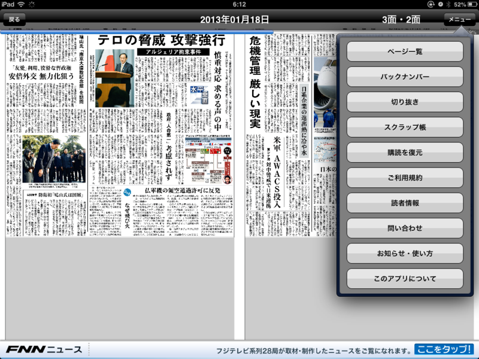
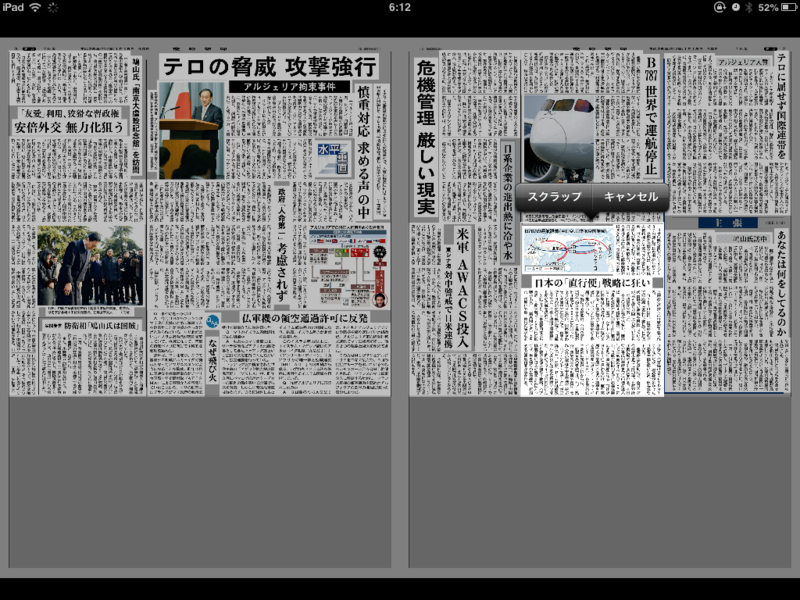
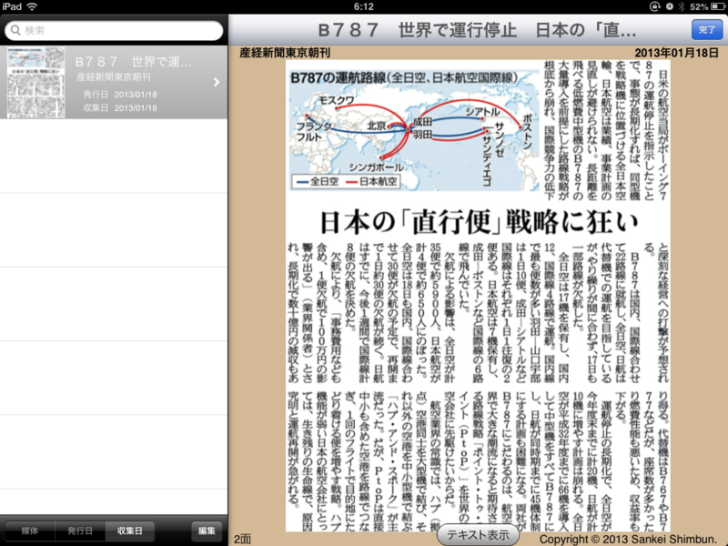
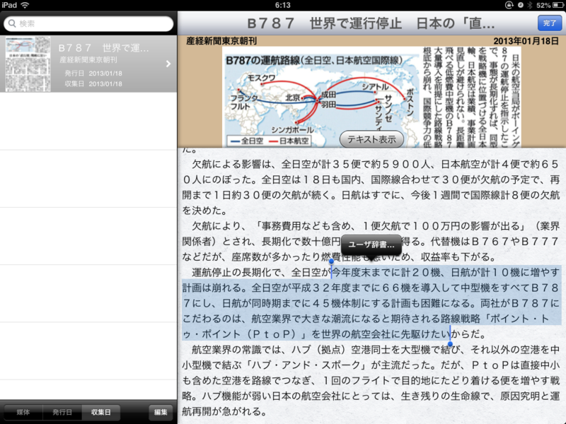
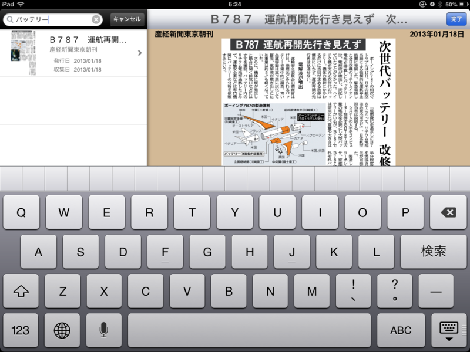

iPad mini を買ってから、アプリ版の「産経新聞」を購読するようになった。iPhone 4 のときはたまに読む（タダで！）程度だったけれど、iPad mini ではお金を払っているということもあって、毎日ちゃんと読んでいる。タブレットの方が読みやすいし、iPad ほど外に持ち出すのが億劫でないというのも理由として大きいと思う。

それはともかく。

最近の「産経新聞」には“スクラップ”機能というものがあるらしい。これがなかなか便利。これまでは OS のスクリーンショット機能で保存していたけれど、これからはこっちを使おうかなって思う。

使い方は、画面右上のメニューから［切り抜き］を選択し、

記事を選ぶだけ。新聞だとキレイに四角く収まっていない記事は少なくないけれど、さすが専門アプリ、その記事の領域だけがウマく切り取られる。

切り取った記事は、メニューの［スクラップ帳］から閲覧。

一番気に入ったのは、テキストをコピーできるところ！

検索できるのもいいな。

欲を言えば、Evernote にでもエクスポートできればいいのだけど、さすがにそれは大人の事情で無理なのかな。せっかくスクラップした記事画像をブログで使えないのは残念。要するに、それはやめて、ってことなんだろけど。でも、せめてほかのデバイスと同期できるようにしてほしい。新しいデバイスを買ったときに、データを移すのがめんどくさそう。

