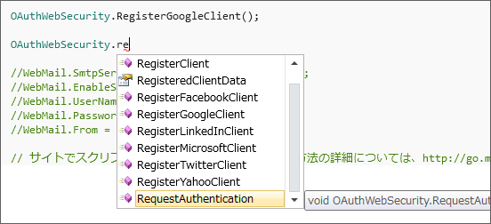
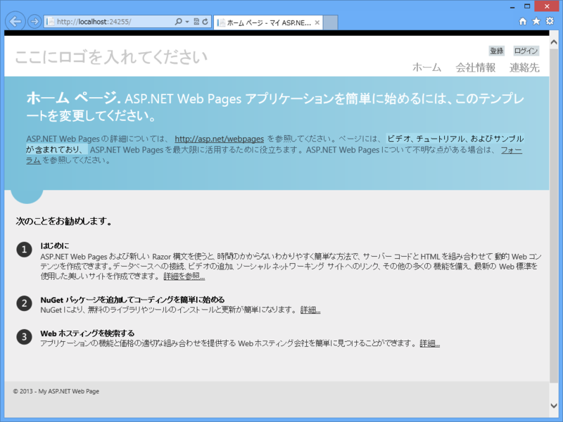
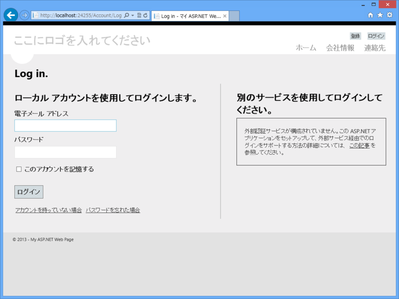
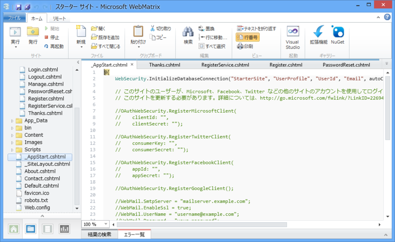
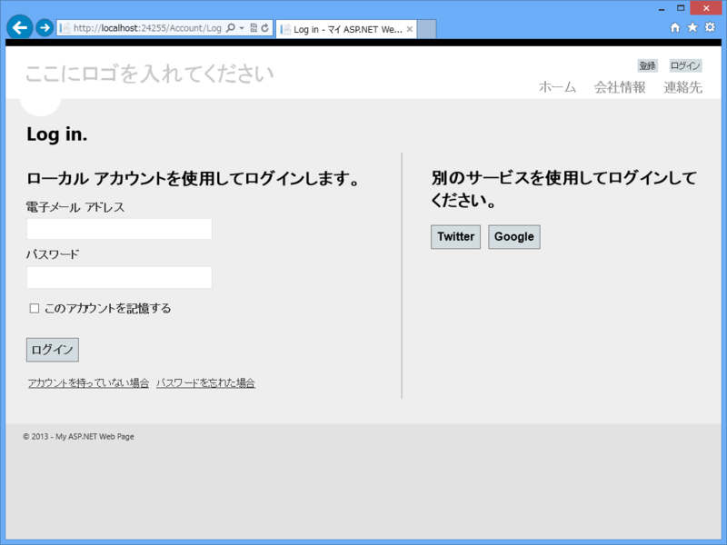
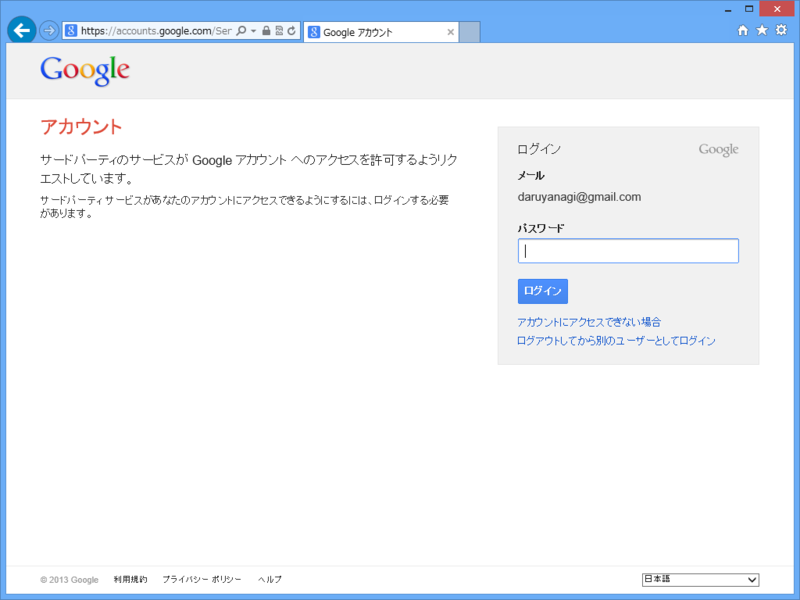
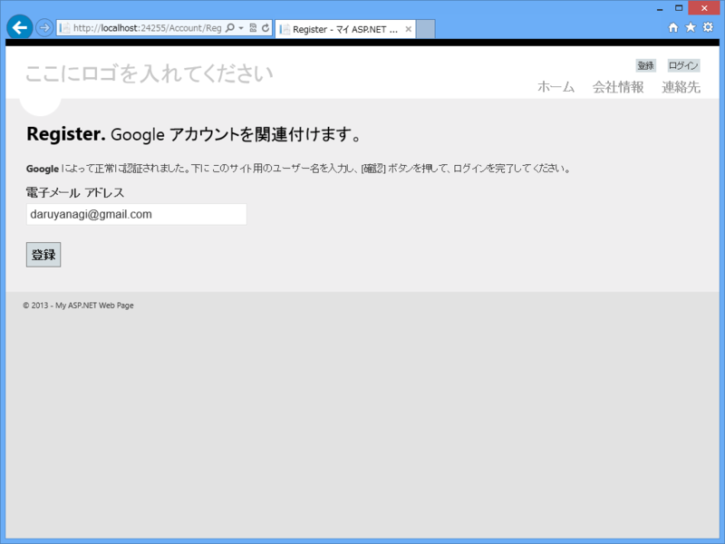
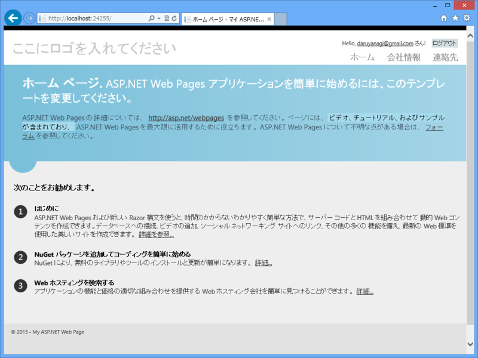
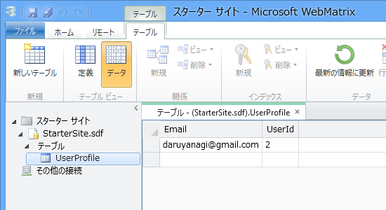

「WebMatrix 2」と「ASP.NET Web Pages」を組み合わせれば、Web サイトへ OAuth 認証の機能を簡単に追加できる。標準で対応するプロバイダは以下の通り。

<ul>
<li>Twitter</li>
<li>Facebook</li>
<li>Microsoft（旧 Windows Live）</li>
<li>Yahoo</li>
<li>Google</li>
<li>LinkedIn</li>
</ul>
そのほかにも、カスタムプロバイダを自作して追加したりもできるみたいだけど、今回は、まぁ、いいや。

<h3>スターターテンプレート</h3>

で、問題はどうやって使うのか、だけど、「WebMatrix 2」の“スターター”テンプレートが格好の例となっているので、まずはこれを敵情視察したい。

さっそく、画面右上の［ログイン］を押すが……Twitter も Facebook も使えないじゃないか。

どうやら、“_AppStart.cshtml”<a href="#f1" name="fn1" title="アプリケーションの起動時に実行される">*1</a>でプロバイダを有効化する必要があるらしい（知ってた）。有効化したいプロバイダをコメントアウトしてリロードすれば、ちゃんと使えるようになる。

とりあえず Twitter の API キーを取得して試したのだけど、うまくいかない<a href="#f2" name="fn2" title="わしが何かミスってるんだろう">*2</a>。今回は原因を突き止めるのも面倒なので、API キーの要らない Google で試してみたが……

いともあっさり動いた（右上に注目！）。

データベースにもちゃんと登録されている<a href="#f3" name="fn3" title="UserId が 2 になっているのは、Twitter で試して失敗したためかな">*3</a>。Google に認証を委譲したので、こちら側にはパスワードが保存されていない。

さて、“スターター”テンプレートから不要なものを削り、必要なものを足してアプリを作ってもいいのだけど、それも面倒そうだし、一から勉強する意味でも、次回は“空のサイト”テンプレートで Google 認証によるログインまでを実装しようかな、と思う<a href="#f4" name="fn4" title="実はもうだいたいできてるんだけど！">*4</a>。

<a href="#fn1" name="f1" class="footnote-number">*1</a>:アプリケーションの起動時に実行される

<a href="#fn2" name="f2" class="footnote-number">*2</a>:わしが何かミスってるんだろう

<a href="#fn3" name="f3" class="footnote-number">*3</a>:UserId が 2 になっているのは、Twitter で試して失敗したためかな

<a href="#fn4" name="f4" class="footnote-number">*4</a>:実はもうだいたいできてるんだけど！

