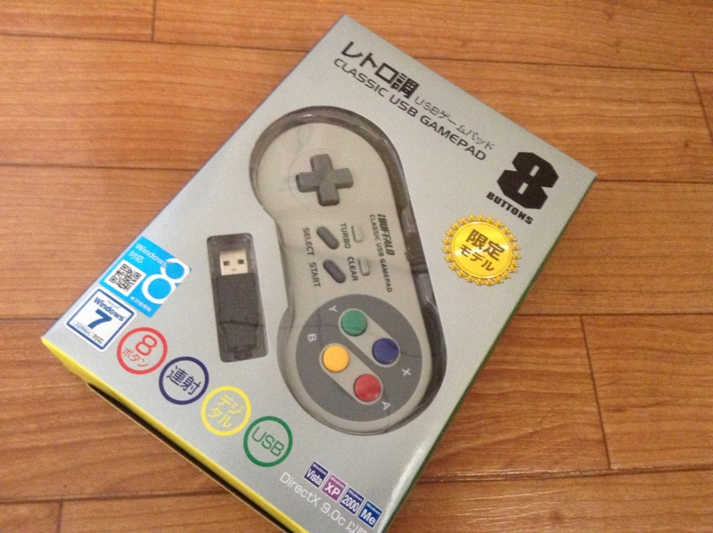
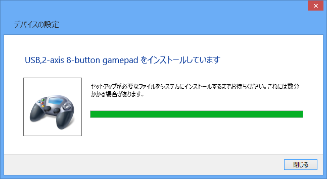

USB 接続のゲームパッドを買おうと、密林の奥深くへ。すると、こんなのを発見。

<a href="http://www.amazon.co.jp/exec/obidos/ASIN/B002B9XB0E/bestylesnet-22/">iBUFFALO USBゲームパッド 8ボタン スーパーファミコン風 グレー BSGP801GY</a>
<ul><li>出版社/メーカー: バッファロー</li><li>発売日: 2009/05/27</li><li>メディア: Personal Computers</li><li>購入: 183人 クリック: 1,464回</li><li><a href="http://d.hatena.ne.jp/asin/B002B9XB0E/bestylesnet-22" target="_blank">この商品を含むブログ (10件) を見る</a></li></ul>

うわぁー……まんま、スー○ァミのコントローラーやん。訴えられないのかな？　懐かしいので、思わずその場でポチってしまったのだけど。700円弱というお値段も魅力的。

Windows 8 でも、刺すだけでドライバーがインストールされて使えるようになった。

初めて触った感想を正直に言わせてもらえば、ちょっと軽すぎて、ボタンもベコベコする気がする。まぁ、スー○ァミなんかもう20年近くやってないわけで、コントローラーの感触なんかほとんど忘れてしまったのだけど、本物の方が感触はよかったかもしれない。

とはいえ、値段を考えればこんなものかな、とも思う。わしはシミュレーションゲームや RPG が好きなので、あんまり困らない。ただ、格ゲーなんかをやる人には不満かもしれない。

<h3>追記</h3>

ニンテンドーさん、Windows ストアアプリでスーファミのエミュレーターをタダで出してくれないかなぁ。ROM を有料にしてさ。

まぁ、アングラで探せばタダで手に入るのだけど、わざわざそんなことに手を出さなくてもお金で解決できるならしたいと思っている人は少なくないと思う。僕みたいな人間は、もう新しいゲームなんか買わないし……疲れるから。でも、古いゲームはたまにやりたいんだよね。

