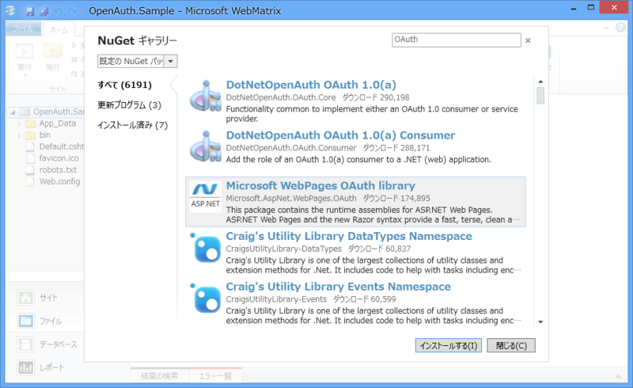
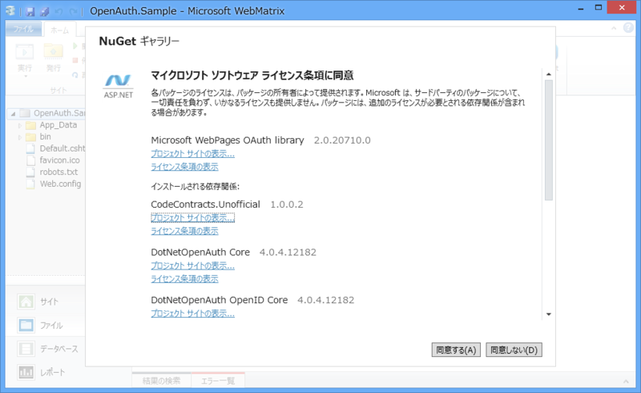
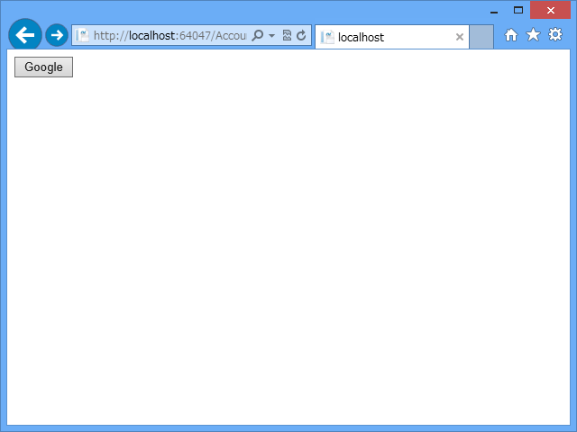
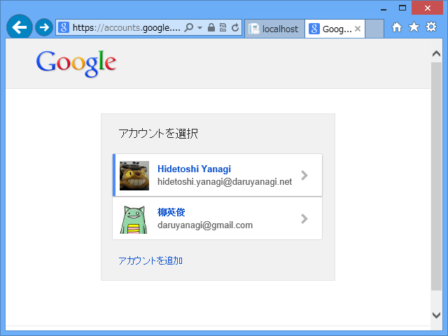
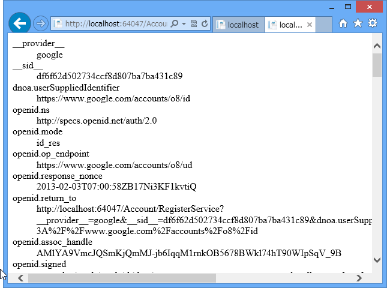

<a href="https://blog.daruyanagi.jp/entry/2013/01/27/102043">WebMatrix 2&#xFF1A;OAuth &#x3067;&#x30ED;&#x30B0;&#x30A4;&#x30F3;&#x3059;&#x308B; - &#x3060;&#x308B;&#x308D;&#x3050;</a> の続き。今回は“空のサイト”テンプレートから、OAuth によるログイン処理を書いていくことにする。まぁ、“スターターサイト”テンプレートのコードを読めば分かる人もいると思うけど、こういうのは一度自分で書いてみるに限ると思う。

<h3>NuGet で必要なものをインストール</h3>

MuGet で <a href="http://nuget.org/packages/Microsoft.AspNet.WebPages.OAuth">NuGet Gallery | Microsoft.AspNet.WebPages.OAuth 3.2.7</a> をインストール。

まえにやったとき（<a href="https://blog.daruyanagi.jp/entry/2012/09/04/023414">&#x3055;&#x3066;&#x3001;WebMatrix &#x3067; OAuth &#x8A8D;&#x8A3C;&#x3092;&hellip;&hellip;&Sigma;(&#xFF9F;&#x434;&#xFF9F;lll)&#xFF76;&#xFF9E;&#xFF70;&#xFF9D; - &#x3060;&#x308B;&#x308D;&#x3050;</a>）はインストールできなかったのだけど、今はできるようになってる。何が悪かったのかな？　ま、直ってるならいいや。

これをインストールすると、 DotNetOpenAuth を初めとする必要なライブラリも同時にインストールされる。DotNetOpenAuth 系はいろいろあってどれを入れていいのかよくわからないけれど、Microsoft WebPages OAuth library をいれておけばおっけーなのかな。

<h3>~/_AppStart.cshtml</h3>

Web サイトを初めて実行するときにロードされる ~/_AppStart.cshtml で、初期設定を行う。

<pre class="code lang-cs" data-lang="cs" data-unlink>@{
// いろんなところで使うので、グローバルにアクセスできるようにしとくか
App.Database = &quot;Database&quot;;

// ユーザー管理用のテーブルを初期化・作成
WebSecurity.InitializeDatabaseConnection(
App.Database,
&quot;UserProfile&quot;, &quot;UserId&quot;, &quot;UserName&quot;,
        autoCreateTables: true);

// Google の OAuth を使います！
OAuthWebSecurity.RegisterGoogleClient();
}
</pre>
WebSecurity.InitializeDatabaseConnection は以前（<a href="https://blog.daruyanagi.jp/entry/2012/08/24/095023">WebMatrix &#x3067;&#x30E6;&#x30FC;&#x30B6;&#x30FC;&#x8A8D;&#x8A3C;&#x6A5F;&#x80FD; &#x2015;&#x2015; &#x6E96;&#x5099;&#x7DE8; - &#x3060;&#x308B;&#x308D;&#x3050;</a>）も使った。OAuth のときもこれを使うみたいだね。

<h3>~/Account/Login.cshtml</h3>

お次はログインフォーム。

<pre class="code lang-cs" data-lang="cs" data-unlink>@{
Page.Title = &quot;ログイン&quot;;

var provider = Request.Form[&quot;provider&quot;];
}

@{  // POST のときは外部サイトの認証ページへ飛ばす

if (!provider.IsEmpty() &amp;&amp; IsPost)
{
AntiForgery.Validate(); // CSRF 対策

// 外部認証サービスでの認証を行う
// 成功したら ~/Account/RegisterService.cshtml を開く
OAuthWebSecurity.RequestAuthentication(
provider,
Href(&quot;~/Account/RegisterService&quot;)
);

return;
}
}

@{  // GET のとき（だけじゃないけど）は、
// 外部認証サービスを選択するフォームを表示する

if (OAuthWebSecurity.RegisteredClientData.Count == 0)
{
&lt;p&gt;外部認証サービスが構成されていません。&lt;/p&gt;
}
else
{
&lt;form method=&quot;post&quot;&gt;
@AntiForgery.GetHtml()
&lt;p&gt;
@foreach (var client in OAuthWebSecurity.RegisteredClientData)
{
&lt;button type=&quot;submit&quot; name=&quot;provider&quot;
value=&quot;@client.AuthenticationClient.ProviderName&quot;
title=&quot;@client.DisplayName アカウントを使用してログイン&quot;&gt;
@client.DisplayName
&lt;/button&gt;
}
&lt;/p&gt;
&lt;/form&gt;
}
}
</pre>

このボタンを押すと、

Google の認証ページに飛ぶはず。

<h3>~/Account/RegisterService.cshtml</h3>

Google での認証が成功すると、このページに着地する。まぁ、名前は好きにすればいいと思う。

<pre class="code lang-cs" data-lang="cs" data-unlink>@{
Page.Title = &quot;登録&quot;;
}

&lt;dl&gt;
@foreach (var key in Request.Params.Keys)
{
&lt;dt&gt;@key&lt;/dt&gt;
&lt;dd&gt;@Request.Params[key.ToString()]&lt;/dd&gt;
}
&lt;/dl&gt;
</pre>

今回はパラメーターを列挙するだけにしておいた。ほんとはここから

<ul>
<li>認証がうまくいったか</li>
<li>認証データの取り出し</li>
<li>このサイトでの認証とデータベースへの登録</li>
</ul>
などを行わないといけない。外部認証サービスによって返ってくるデータは微妙に違うけれど、

<ul>
<li><a href="http://msdn.microsoft.com/ja-jp/library/jj158354(v=vs.111).aspx">OAuthWebSecurity.VerifyAuthentication Method (Microsoft.Web.WebPages.OAuth) | Microsoft Docs</a></li>
<li><a href="http://msdn.microsoft.com/ja-jp/library/microsoft.web.webpages.oauth.oauthwebsecurity.trydeserializeprovideruserid(v=vs.111).aspx">OAuthWebSecurity.TryDeserializeProviderUserId(String, String, String) Method (Microsoft.Web.WebPages.OAuth) | Microsoft Docs</a></li>
<li><a href="http://msdn.microsoft.com/ja-jp/library/microsoft.web.webpages.oauth.oauthwebsecurity.trygetoauthclientdata(v=vs.111).aspx">OAuthWebSecurity.TryGetOAuthClientData(String, AuthenticationClientData) Method (Microsoft.Web.WebPages.OAuth) | Microsoft Docs</a></li>
</ul>
などを使うことによって、統一的に扱えるようなので安心……という感じのようだ。知らんけど。

今日のところは、ここまで。

