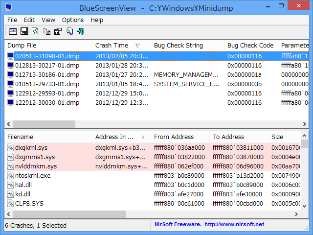
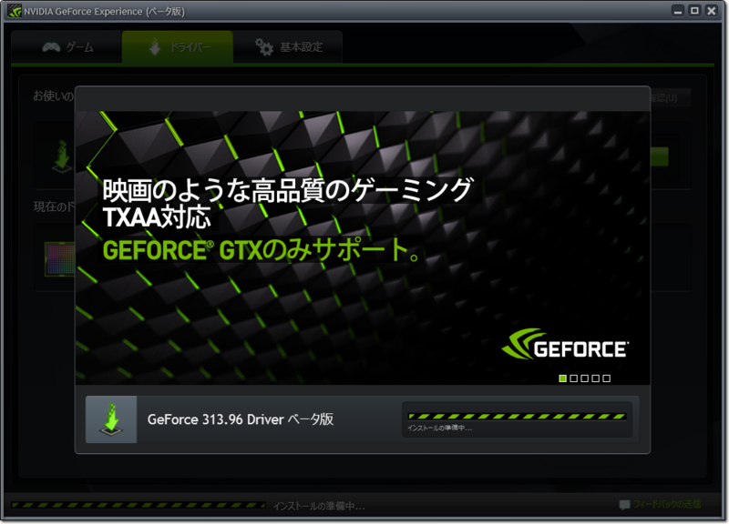
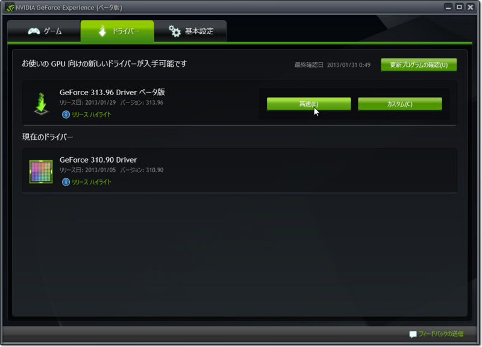
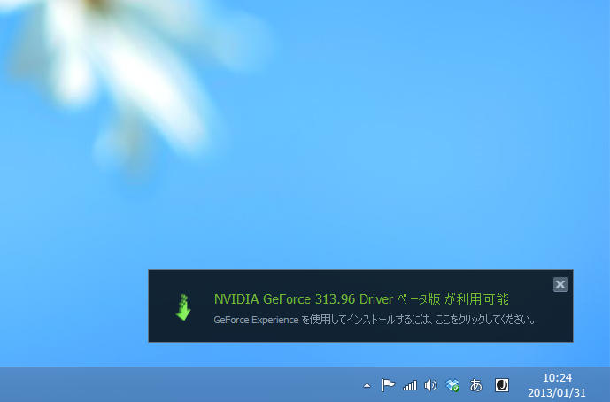

<a href="http://www.forest.impress.co.jp/docs/review/20090825_310504.html">&#x7A93;&#x306E;&#x675C; - &#x3010;REVIEW&#x3011;&#x30D6;&#x30EB;&#x30FC;&#x30B9;&#x30AF;&#x30EA;&#x30FC;&#x30F3;&#x6642;&#x306E;&#x30A8;&#x30E9;&#x30FC;&#x60C5;&#x5831;&#x3092;&#x53CE;&#x96C6;&#x30FB;&#x95B2;&#x89A7;&#x3067;&#x304D;&#x308B;&#x30BD;&#x30D5;&#x30C8;&#x300C;BlueScreenView&#x300D;</a> でみた様子。SYSTEM_SERVICE_EXCEPTION 以外は全部 nvlddmkm.sys （NVIDIAのグラフィックスドライバー）がらみで困った。ハードウェアの故障が原因だったらお手上げだけど、なんとかドライバーのアップデートで直ってくれないかなぁと思い、

<ul>
<li><a href="http://www.nvidia.co.jp/geforce-experience/">&#x30C9;&#x30E9;&#x30A4;&#x30D0;&#x3068;&#x6700;&#x9069;&#x6700;&#x5584;&#x306A;&#x8A2D;&#x5B9A;&#x3092;&#x81EA;&#x52D5;&#x7684;&#x306B;&#x6700;&#x9069;&#x5316;&#x3059;&#x308B;| GeForce Experience</a></li>
</ul>
を入れている。

本来はゲームに合わせて最適な設定をロードしてくれるソフトらしいのだけど、ドライバーのアップデート通知が見やすいのでそこを重宝している。

<ul>
<li><a href="http://www.4gamer.net/games/022/G002210/20130126001/">4Gamer.net &#x2015; &#x300C;GeForce Experience&#x300D;&#x304C;&#x30AA;&#x30FC;&#x30D7;&#x30F3;&beta;&#x306B;&#x79FB;&#x884C;&#x3002;&#x8AB0;&#x3067;&#x3082;&#x30C0;&#x30A6;&#x30F3;&#x30ED;&#x30FC;&#x30C9;&#x53EF;&#x80FD;&#x306B;</a></li>
</ul>