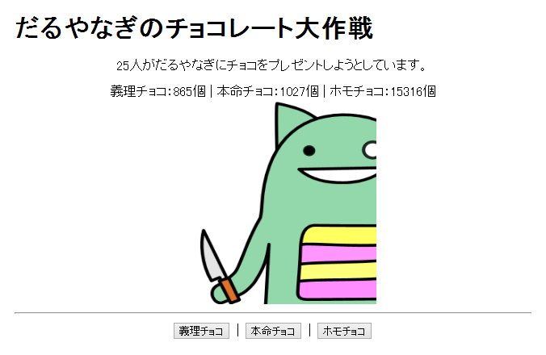
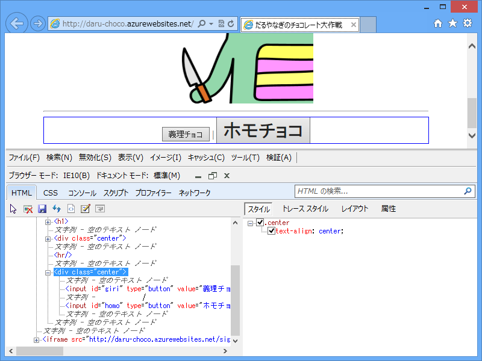
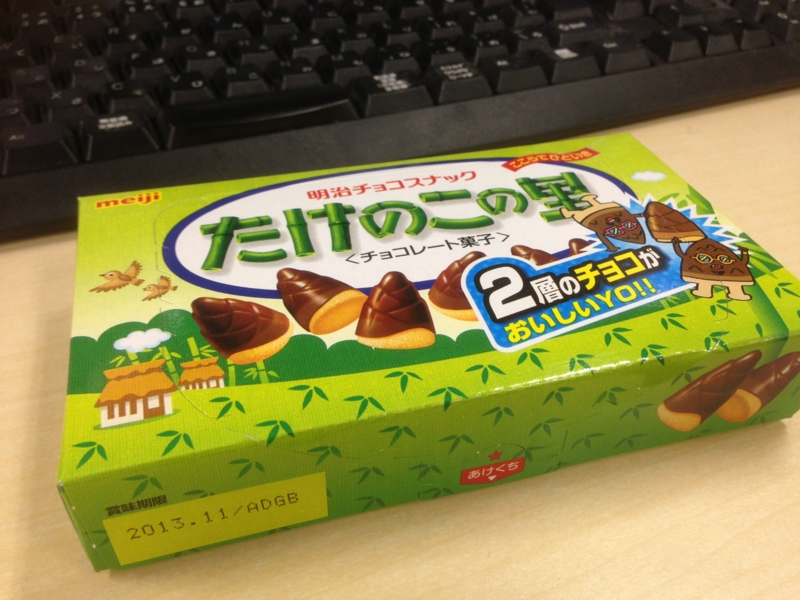
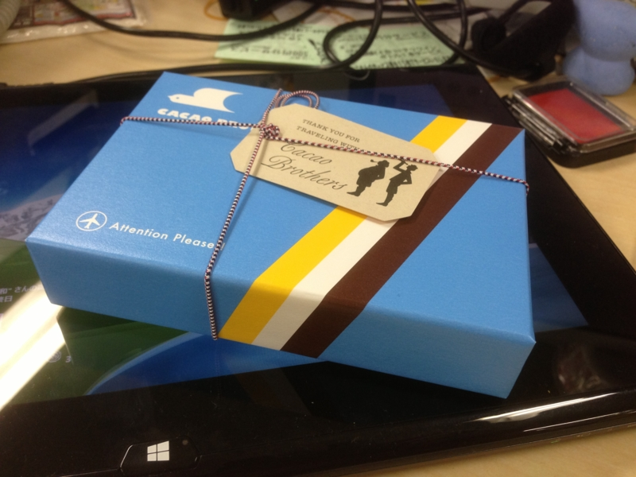

朝起きたら、謎な Web サービスができてた。

<ul>
<li><a href="http://daru-choco.azurewebsites.net/">&#x3060;&#x308B;&#x3084;&#x306A;&#x304E;&#x306E;&#x30C1;&#x30E7;&#x30B3;&#x30EC;&#x30FC;&#x30C8;&#x5927;&#x4F5C;&#x6226;</a></li>
</ul>
また @shibayan が SignalR で作ったらしい。制作にかかった所要時間は約 5 分とのこと。仕事なくて暇なのかな……。ってか、「ホモチョコ」ってなんだよ。

まぁ、それは別にいいんだけど、途中で「本気チョコ」のボタンを削除するのはヒドいと思う。

最初は CSS で非表示にしたのかなと思ったけど、DOM からばっさり削られていて涙目（今は「ホモチョコ」ボタンしかない！）。

そんなこんなで、サイバー空間では4ケタの本命チョコをゲットしたのだけど、リアルではそんなはずもなく。「たぶん今年ももらえないだろうな」とスッキリサッパリ諦めきっていたので、お昼ご飯は自分で自分に“たけのこの里”を買った。

思うに、“たけのこの里”は“きのこの山”よりも数段美味しい。つまんだ時のどっしりとした重量感。かじった時の充実感。チョコとスナックのハーモニー。どれをとっても“きのこの山”に勝る。ただ、チョコだけ舐め取ってスナックだけにする遊びができないのは玉に瑕。あれは“きのこの山”の特権だな。

――などと、思っていたのですが。

なんと。

今年はひとつだけチョコをいただきました！　……ほんと何年振りだろう。久しぶりチョコを食べまくったせいか、今日はちょっと鼻がムズムズする。鼻血出るかもしれない。

えらい美味しかったです。

