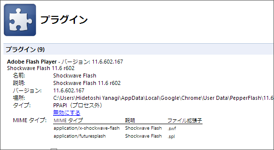
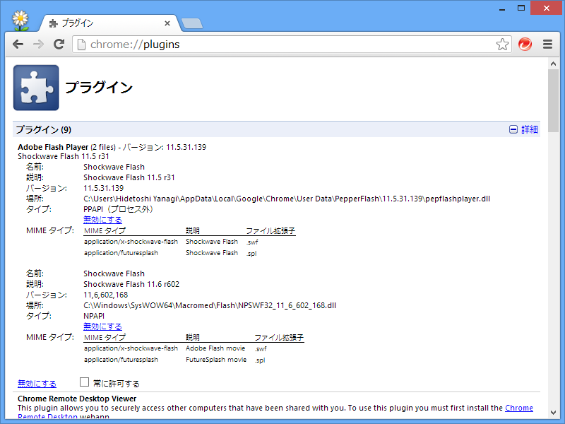

<blockquote cite="http://www.forest.impress.co.jp/docs/news/20130213_587503.html">

自動アップデート機能が有効になっている場合、24時間以内に最新版が自動的に配布されるため、ユーザーによるアップデート作業は必要ない。また、「Google Chrome」向けプラグインには「Google Chrome」のコンポーネントアップデーター経由で、Windows 8の「Internet Explorer 10」向けプラグインには“Windows Update”経由で更新プログラムが提供される。

<cite><a href="http://www.forest.impress.co.jp/docs/news/20130213_587503.html">Adobe&#x3001;&#x300C;Adobe Flash Player 11.6&#x300D;&#x300C;Adobe AIR 3.6&#x300D;&#x3092;&#x6B63;&#x5F0F;&#x516C;&#x958B;&#x3002;&#x8106;&#x5F31;&#x6027;&#x3092;17&#x4EF6;&#x4FEE;&#x6B63; - &#x7A93;&#x306E;&#x675C;</a></cite>
</blockquote>

<b>コンポーネントアップデーター</b>。いつの間にこんな機能がついていたのだろう。確かに放置していたらいつの間にか Flash だけアップデートされたのだけど。

こういう機能が搭載されることは歓迎なのだけど、疑問がないわけではない。

たとえば、「Firefox」「Opera」向けのプラグイン（NPAPI）をアップデートすると、一時的に PPAPI（Pepper）よりもバージョンが新しくなるのだけど、その場合は一時的に NPAPI のみを利用するようするのが正解なのだろうか。

まぁ、そこまで神経質にならなくてもいいと思うのだけど。

