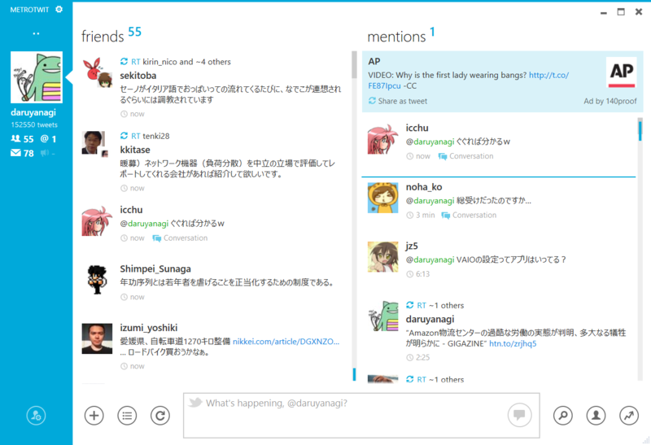
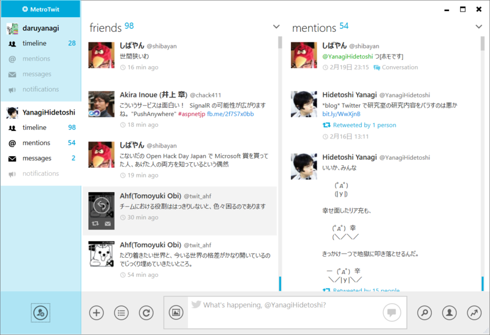

久しぶりに「MetroTwit Loop」（<a href="http://www.forest.impress.co.jp/docs/news/20111216_499465.html">&#x7A93;&#x306E;&#x675C; - &#x3010;NEWS&#x3011;Twitter&#x30AF;&#x30E9;&#x30A4;&#x30A2;&#x30F3;&#x30C8;&#x300C;MetroTwit&#x300D;&#x306E;&#x30CA;&#x30A4;&#x30C8;&#x30EA;&#x30FC;&#x30D3;&#x30EB;&#x30C9;&#x7248;&#x300C;MetroTwit Loop&#x300D;&#x304C;&#x516C;&#x958B;</a>）をインストールしてみたら、だいぶユーザーインターフェイスデザインが変わっていた。

<h3>MetroTwit</h3>

<h3>MetroTwit Loop</h3>

だいぶかっこいいと思う。画面左端のバーが細くならないのが、個人的には少し残念だけど。

Twitter API 1.1 への切り替えが間近なので、Loop に盛り込まれた機能も、そろそろ MetroTwit へポーティングされるはず。

