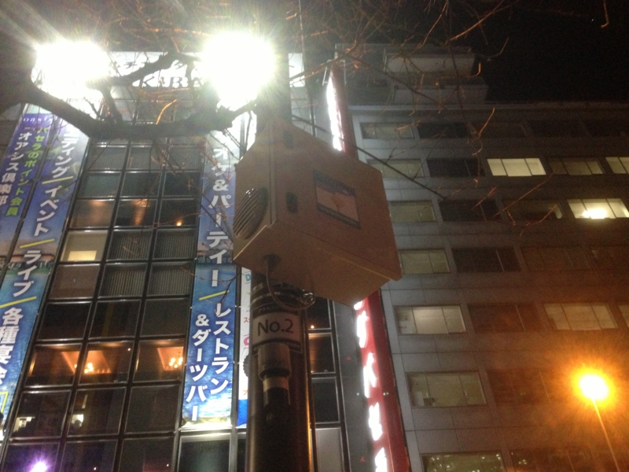
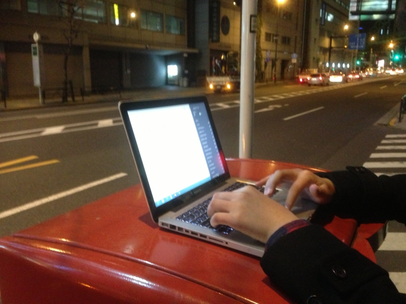
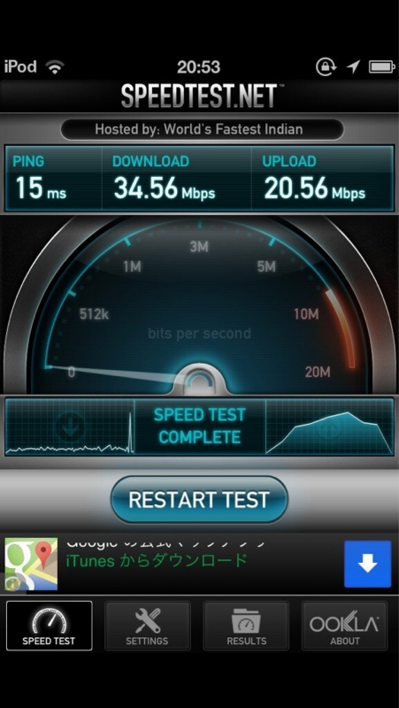

<blockquote cite="http://akiba-pc.watch.impress.co.jp/docs/news/news/20130219_588093.html">

　道路設備を利用して、屋外で無線LANを構築するという社会実験がアキバの一部道路で始まった。実験期間は2月18日（月）～3月18日（月）。期間中は公衆用SSIDも設けられ、誰でも利用可能だ。

<cite><a href="http://akiba-pc.watch.impress.co.jp/docs/news/news/20130219_588093.html">&#x9053;&#x8DEF;&#x8A2D;&#x5099;&#x306B;&#x3088;&#x308B;&#x5C4B;&#x5916;&#x7121;&#x7DDA;LAN&#x306E;&#x793E;&#x4F1A;&#x5B9F;&#x9A13;&#x958B;&#x59CB;&#x3001;&#x7121;&#x511F;&#x5229;&#x7528;&#x53EF;</a></cite>
</blockquote>

@shibayan とアキバに寿司食いに行ったとき、たまたまこれを見つけた。よくわかんないけど、縦割り行政でこういうことを実現するのは本来難しいのだけれど、実現したったで！　ということなんだろう。

その日（2月20日だっけかな？）はむちゃくちゃ寒かったのだけれど、@shibayan はさっそくノートパソコンを出して試してた。自分も iPhone 5 でスピードテストをしてみる。

 

左がうちの iPhone 5 で、右が @shibayan の <s>Android</s> iPod touch。なんでこんなに差があるんだろう……。

<ul>
<li><a href="http://www.ktr.mlit.go.jp/ktr_content/content/000074298.pdf">http://www.ktr.mlit.go.jp/ktr_content/content/000074298.pdf</a></li>
</ul>