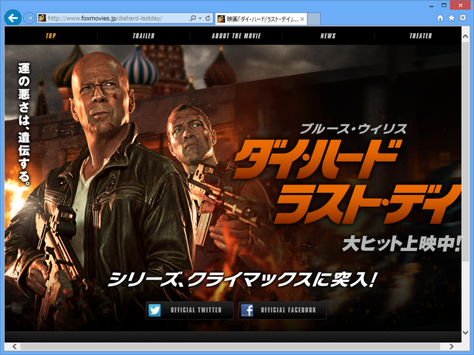
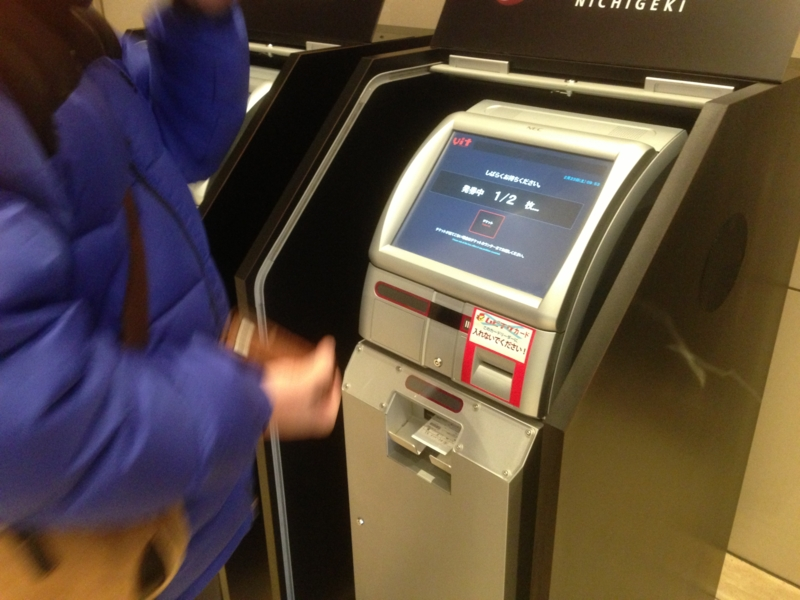
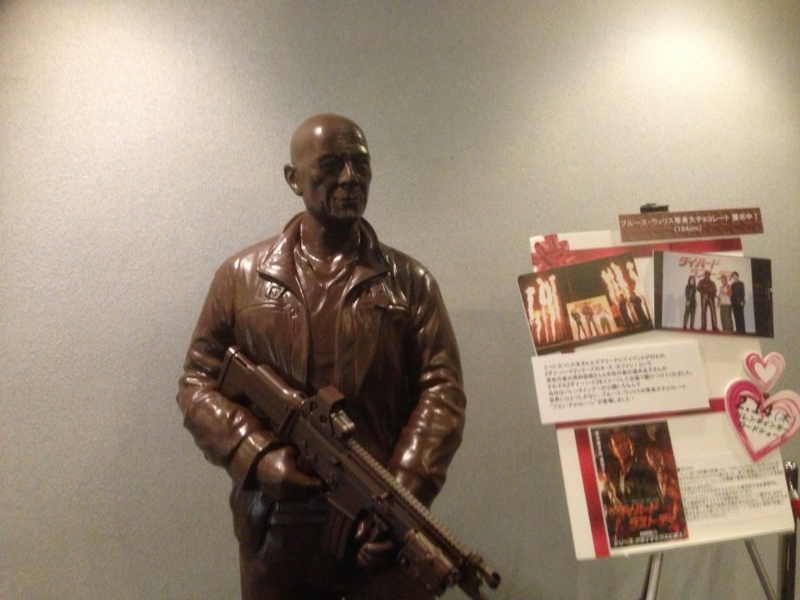

<ul>
<li><a href="http://www.foxmovies.jp/diehard-lastday/">&#x6620;&#x753B;&#x300C;&#x30C0;&#x30A4;&#x30FB;&#x30CF;&#x30FC;&#x30C9;/&#x30E9;&#x30B9;&#x30C8;&#x30FB;&#x30C7;&#x30A4;&#x300D;&#x30AA;&#x30D5;&#x30A3;&#x30B7;&#x30E3;&#x30EB;&#x30B5;&#x30A4;&#x30C8;</a></li>
</ul>
@subsfn と有楽町へ映画を観にでかけた――のだけど。<i>システムエラーで当日券の販売がまったく進まない！　</i>10時過ぎからの枠で映画を観て、そのあとアキバへ移動してお昼ご飯を食べるという予定が大幅に狂ってしまう。

けれど、@subsfn が機転をきかして iPhone でインターネット予約してくれた。もつべきモノはマメな友人やな。

で、肝心の内容は……。

アクションはまぁまぁ面白かった。あれはハインドDなのかな？　戦闘ヘリがめちゃくちゃカッコいい。いつかああいうのを自家用にほしいものだ。

ただ、ストーリーは眠かったし、実際少し寝た。なんつうか、あんまり驚きのないストーリーだったかな？

バレンタインデーに封切されたらしく、それを記念したブルース・ウィリスの等身大チョコレートが置いてあった。これ、ちょっと食ってみたい。

