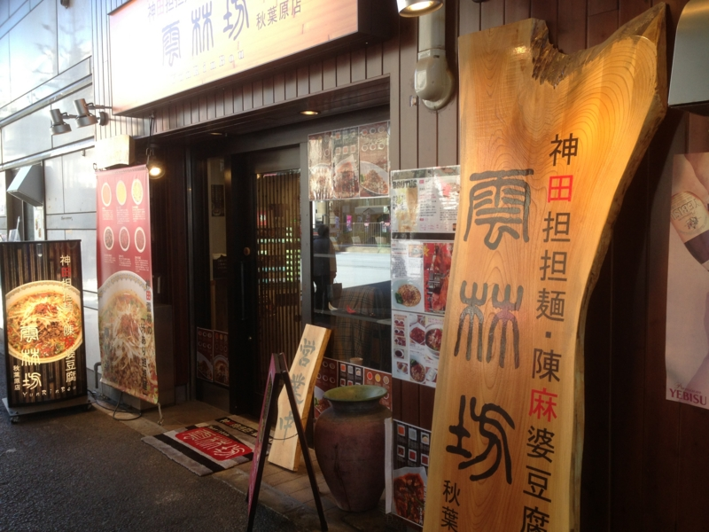
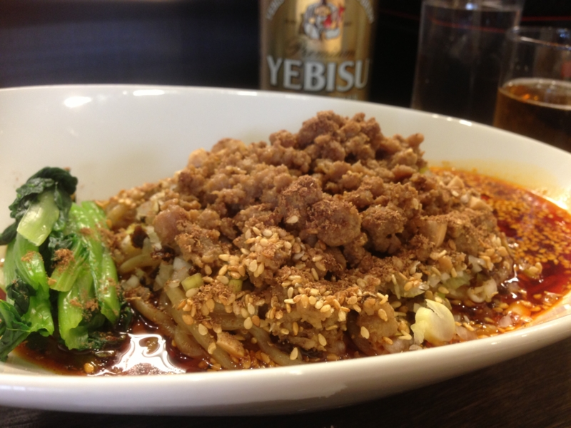
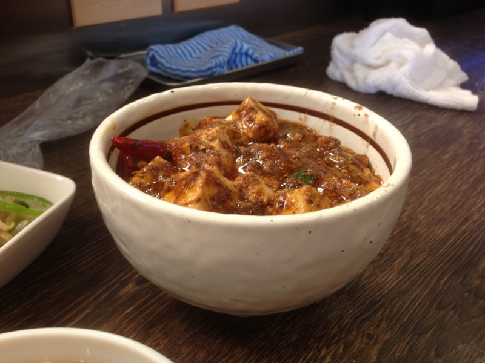
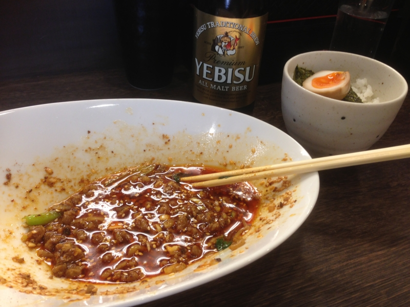
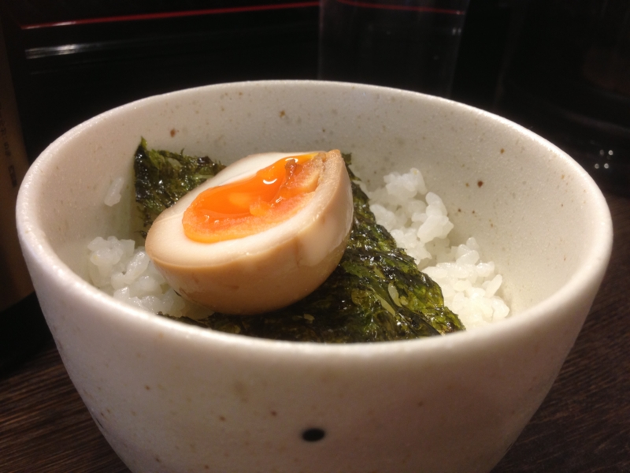

<a href="https://blog.daruyanagi.jp/entry/2013/02/24/004752">&#x300E;&#x30C0;&#x30A4;&#x30FB;&#x30CF;&#x30FC;&#x30C9;/&#x30E9;&#x30B9;&#x30C8;&#x30FB;&#x30C7;&#x30A4;&#x300F; - &#x3060;&#x308B;&#x308D;&#x3050;</a> を観た後に突撃。事前に @shibayan が偵察した情報によると、結構おいしいらしい。

<ul>
<li><a href="http://akiba-pc.watch.impress.co.jp/docs/column/chobi/20130219_588302.html">&#x3061;&#x3087;&#x3073;&#xFF06;&#x59C9;&#x3061;&#x3083;&#x3093;&#x306E;&#x300E;&#x30A2;&#x30AD;&#x30D0;&#x3067;&#x3054;&#x306F;&#x3093;&#x98DF;&#x3079;&#x305F;&#x3044;&#x306A;&#x3002;&#x300F; - AKIBA PC Hotline!</a></li>
</ul>

まずは汁なし担々麺、激辛で一丁！　お味のほうはかなり本格派。山椒がバリバリ効いて、舌がビリビリする。これはかなりイケると思う。

隣で @subsfn が食ってたマーボー丼もイイ感じ。これはサイドメニュー扱いだけど、これだけガッツリ食べたい気もする。まぁ、ラーメン屋に要求すべきことではないけど。

完食！　でも、少し残った具が勿体ない……。そこで、

ご飯（中）を追加注文し……（味玉と韓国ノリはサービスでついてくる）

ぶっかけて食ったった！　ちょっと邪道な感じ<a href="#f-ba4f0ba8" name="fn-ba4f0ba8" title="お店推奨の食べ方らしいんだけど">*1</a>だけれど、これはこれで旨い。@subsfn なんかはマーボー丼とこの食べ方で、ご飯を二杯も食ってた。

ごちそうさまでした！

<a href="#fn-ba4f0ba8" name="f-ba4f0ba8" class="footnote-number">*1</a>:お店推奨の食べ方らしいんだけど

