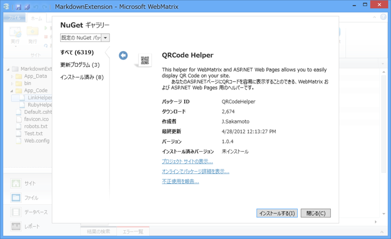

Markdown は覚えやすくて書きやすいのだけれど、とても非力に感じる。一応 HTML タグの埋め込みも可能なので、原理的にはなんでも書けるのだけれど、たとえばルビを振りたい場合、

<pre class="code lang-html" data-lang="html" data-unlink>国民の&lt;ruby&gt;税金&lt;rp&gt;(&lt;/rp&gt;&lt;rt&gt;ぜいきん&lt;/rt&gt;&lt;rp&gt;)&lt;/rp&gt;&lt;/ruby&gt;を２億円使うなんて
</pre>
などといちいち書くのは、読みにくいし第一めんどくさい。もっと簡単に、たとえば、

<pre class="code lang-html" data-lang="html" data-unlink>国民の[[ruby|税金|ぜいきん]]を２億円使うなんて
</pre>
などのような、<code>[[コマンド|引数1|引数2...]] </code>といった記法で書ければどうだろう。なるべく規約ベースとし、Hoge コマンドは Hoge / HogeHelper ヘルパーの GetHtml() メソッドを呼び出すようにする。

<pre class="code lang-cs" data-lang="cs" data-unlink># App_Code/RubyHelper.cshtml

@helper GetHtml(string text, string ruby){
&lt;ruby&gt;@text&lt;rp&gt;(&lt;/rp&gt;&lt;rt&gt;@ruby&lt;/rt&gt;&lt;rp&gt;)&lt;/rp&gt;&lt;/ruby&gt;
}
</pre>
これならば、Markdown の拡張だけでなく、普通の cshtml でも利用できてよいと思う。

<pre class="code lang-html" data-lang="html" data-unlink>国民の@RubyHelper.GetHtml(&quot;税金&quot;, &quot;ぜいきん&quot;)を２億円使うなんて
</pre>

<h3>実装</h3>

とりあえずこんな感じにしてみた。

<pre class="code lang-cs" data-lang="cs" data-unlink>@using System.IO
@using System.Reflection
@using System.Text.RegularExpressions

@functions {
private string Camelize(string input)
{
if (input.Length == 0) return input;

var chars = input.ToArray();
chars[0] = char.ToUpper(chars[0]);
return string.Join(string.Empty, chars);
}
}

@{
// テストテキストをロード
var text = File.ReadAllText(Server.MapPath(&quot;~/Test.txt&quot;));

// HtmlHelper の子孫を列挙して型名-型ディクショナリを作成
var type_table = AppDomain.CurrentDomain
.GetAssemblies()
.SelectMany(_ =&gt; _.GetTypes())
.Where(_ =&gt; _.IsSubclassOf(typeof(HelperPage)))
.ToDictionary(_ =&gt; _.ToString(), _ =&gt; _);

// [[...]] 構文を置換
var regex = new Regex(@&quot;\[\[(?&lt;params&gt;[^\[\]\r\n]*)\]\]&quot;);
text = regex.Replace(text, (MatchEvaluator)((match) =&gt;
{
// [[...]]構文の書式
// - [[コマンド|引数1|引数2|...]]
// - [[引数1|引数2|引数3...]] : Link コマンドと解釈（規定）
var p = match.Groups[&quot;params&quot;].Value.Split('|');

// コマンド名は Hoge, HogeHelper ... を許容
var helper_table = new string[] {
string.Format(&quot;ASP.{0}&quot;, Camelize(p[0])),
string.Format(&quot;ASP.{0}Helper&quot;, Camelize(p[0])),
};

Type helper = null;
MethodInfo method = null;
string[] args = null;

// 型名-型ディクショナリから、メソッド
// (Type: p[0]).GetHtml(p[1], p[2]...) 
// をもつ HtmlHelper を探す
var result = helper_table.FirstOrDefault(name =&gt;
{
if (type_table.TryGetValue(name, out helper))
{
args = p.Skip(1).ToArray();
method = helper.GetMethod(
&quot;GetHtml&quot;,
args.Select(_ =&gt; _.GetType()).ToArray()
);
}
return method != null;
});

// 見つからなかった場合は、既定の型・メソッドを利用する
if (string.IsNullOrEmpty(result))
{
helper = typeof(LinkHelper);
args = p;
method = helper.GetMethod(
&quot;GetHtml&quot;,
args.Select(_ =&gt; _.GetType()).ToArray()
);
}

// メソッドを実行
return (method.Invoke(helper, args) as HelperResult)
.ToHtmlString().ToString().Trim();
}
));

var m = new MarkdownSharp.Markdown();
text = m.Transform(text);
}

&lt;!DOCTYPE html&gt;

&lt;html lang=&quot;ja&quot;&gt;
&lt;head&gt;
&lt;meta http-equiv=&quot;Content-Type&quot; content=&quot;text/html; charset=utf-8&quot;/&gt;
&lt;meta charset=&quot;utf-8&quot; /&gt;
&lt;title&gt;マイ サイトのタイトル&lt;/title&gt;
&lt;link href=&quot;~/favicon.ico&quot; rel=&quot;shortcut icon&quot; type=&quot;image/x-icon&quot; /&gt;
&lt;/head&gt;
&lt;body&gt;
@Html.Raw(text)
&lt;/body&gt;
&lt;/html&gt;
</pre>
当初、型名->型 を解決するには Type.GetType() でいけると思っていたのだけど、引数として渡す型名には<b>アセンブリ名やバージョンを含めた完全修飾名</b>が必要みたい。つまり

<pre class="code" data-lang="" data-unlink>var _type = Type.GetType(&#34;ASP.RubyHelper&#34;);</pre>
ではだめで、

<pre class="code" data-lang="" data-unlink>var _type = Type.GetType(&#34;ASP.RubyHelper, ***, Version=1.0.0.0, Culture=neutral, PublicKeyToken=****&#34;);</pre>
みたいな感じじゃないとダメらしい。ASP.NET の仕組みはイマイチわかっていないのだけれど、裏でコードをコンパイルして、それを実行してるのだと思う。そのアセンブリ名なんて、実行時にはわかんないよね？

しょうがないので、今回は AppDomain にある HelperPage 派生クラス（ヘルパー）を列挙してディクショナリを用意し、型名->型 を解決する方法をとった。ヘルパーに限定したのは、全部突っ込もうとするとキーとなる型名の衝突があって、ToDictionary() が失敗するから。

コマンドを規約通りに検索してみつからない場合は、LinkHelper というリンク生成のためのヘルパーを既定のヘルパーとして呼んでいる。内容はごく簡単なもの。

<pre class="code lang-cs" data-lang="cs" data-unlink>@helper GetHtml(string url)
{
&lt;a href=&quot;@url&quot;&gt;@url&lt;/a&gt;
}

@helper GetHtml(string url, string title)
{
&lt;a href=&quot;@url&quot; title=&quot;@title&quot;&gt;@title&lt;/a&gt;
}
</pre>
ちなみに、Camelize() は簡易実装なのでみないふりしてほしい（<a href="https://blog.daruyanagi.jp/entry/2012/08/28/081228">&#x5BC4;&#x308A;&#x9053;: string &#x30AF;&#x30E9;&#x30B9;&#x306E;&#x62E1;&#x5F35; - &#x3060;&#x308B;&#x308D;&#x3050;</a>）。あと、エラーチェックがぬるい。たとえば、引数の数をわざと多くするとエラーになる。

<h3>実験</h3>

とりあえず手元ではだいたい動いたので、試しに NuGet から適当なヘルパーを取得して、それを Markdown から呼び出せるかやってみた。

QRCode ヘルパーは、その名もズバリ、QRCode が生成できるヘルパー。このヘルパーは

<pre class="code" data-lang="" data-unlink>@QRCode.Render(&#34;http://daruyanagi.net/&#34;)</pre>
という感じで呼び出すので、残念ながらそのままでは使えない。App_Code/QRCodeHelper.cshtml という補助ヘルパーを別途用意した（NuGet で取得したコードにはあまり手を入れたくないので）。

<pre class="code" data-lang="" data-unlink>@helper GetHtml(string data){
&lt;img src=&#34;@Href(&#34;~/QRCodeImage.cshtml&#34;, new{data, scale = 3})&#34; alt=&#34;@data&#34; /&gt;
}</pre>
あとは、<code>[[QRCode|http://daruyanagi.net/]]</code>という記法を Markdown に埋め込むと……

こんな感じになる。GetHtml() メソッドをもつヘルパーだったら、無加工でそのまま利用できる！

