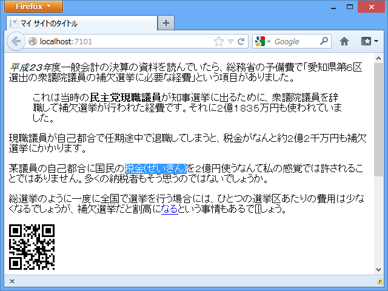
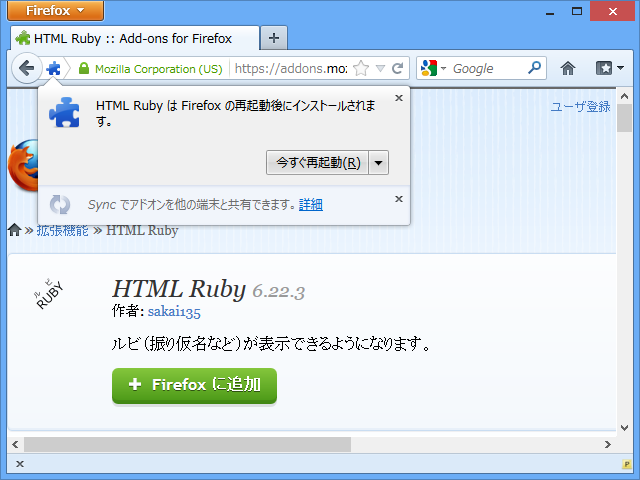
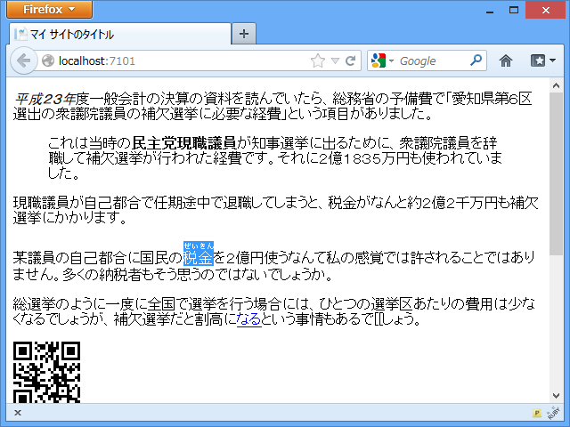

<a href="https://blog.daruyanagi.jp/entry/2013/02/24/154553">WebMatrix 2: Markdown &#x3092;&#x6C4E;&#x7528;&#x7684;&#x306B;&#x62E1;&#x5F35;&#x3059;&#x308B;&#x4ED5;&#x7D44;&#x307F;&#x3092;&#x8003;&#x3048;&#x3066;&#x307F;&#x308B; - &#x3060;&#x308B;&#x308D;&#x3050;</a> で気付いたのだけれど、Firefox っていまだにルビも表示できないんだな……。ちょっと笑ったというか、呆れた。

<a href="https://addons.mozilla.org/ja/firefox/addon/html-ruby/">https://addons.mozilla.org/ja/firefox/addon/html-ruby/</a> を入れれば解決するのだけれど、ブラウザーの再起動が必要だ。

とはいえ、そのうち実装されるんだろうけど。

<ul>
<li><a href="http://www.w3.org/html/wg/drafts/html/master/text-level-semantics.html#the-ruby-element">http://www.w3.org/html/wg/drafts/html/master/text-level-semantics.html#the-ruby-element</a></li>
</ul>