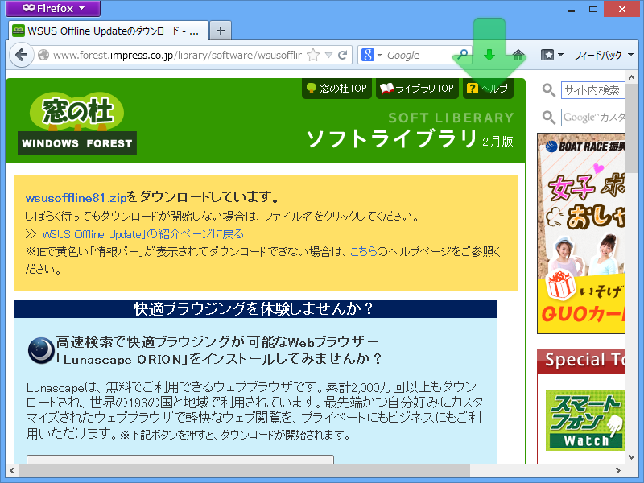
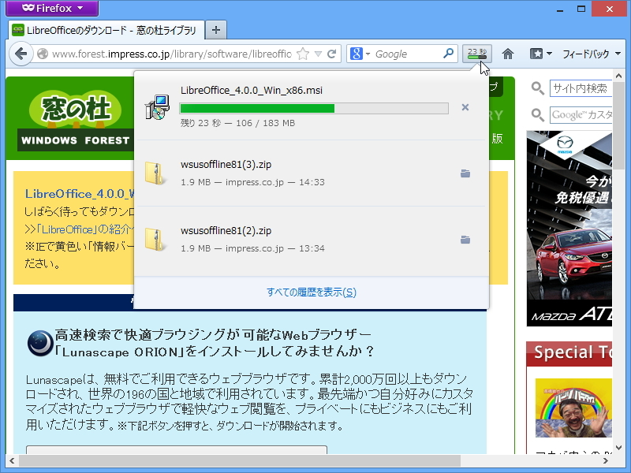
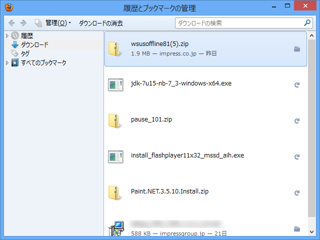
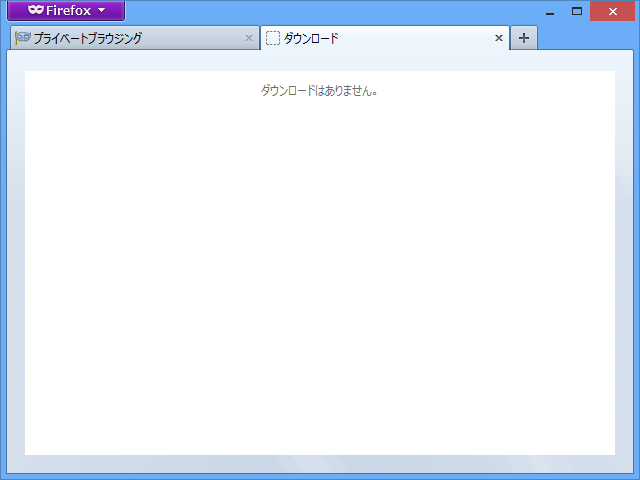
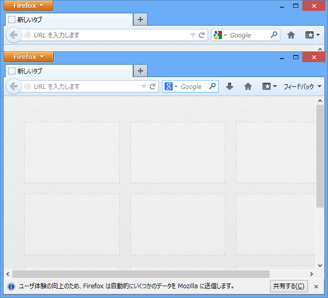

最初気付かなかったのだけど、

通常モードで“すべての履歴を表示”をクリックすると、

ダウンロードマネージャーがウィンドウで開く。これをプライベートブラウジングモードで試すと、

ダウンロードマネージャー（？）がタブで開く。

<ul>
<li><a href="http://www.forest.impress.co.jp/docs/news/20130225_589249.html">&#x300C;Firefox 20&#x300D;&#x304C;&#x30D9;&#x30FC;&#x30BF;&#x7248;&#x306B;&#x3001;&#x30A6;&#x30A3;&#x30F3;&#x30C9;&#x30A6;&#x5358;&#x4F4D;&#x3067;&#x30D7;&#x30E9;&#x30A4;&#x30D9;&#x30FC;&#x30C8;&#x30D6;&#x30E9;&#x30A6;&#x30B8;&#x30F3;&#x30B0;&#x304C;&#x5229;&#x7528;&#x53EF;&#x80FD; - &#x7A93;&#x306E;&#x675C;</a></li>
</ul>
上が Firefox 19 Stable で、下が Firefox 20 Beta。Google 検索のアイコンが新しくなっている。

