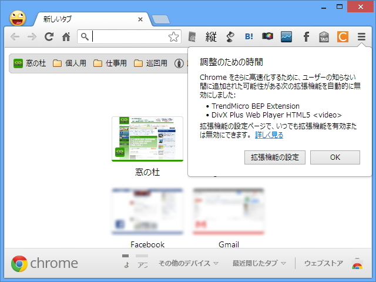
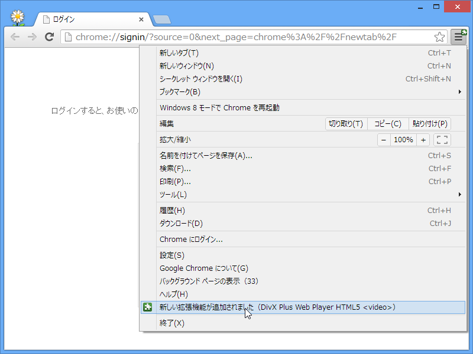
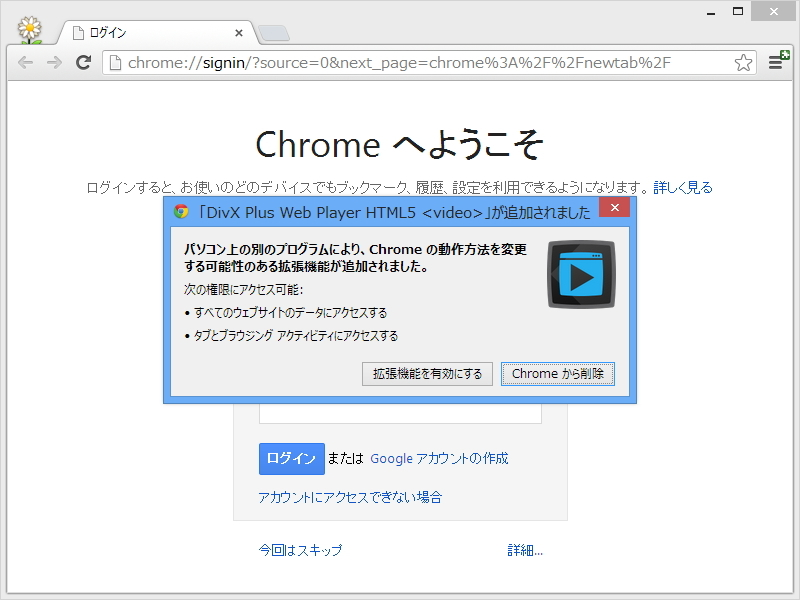
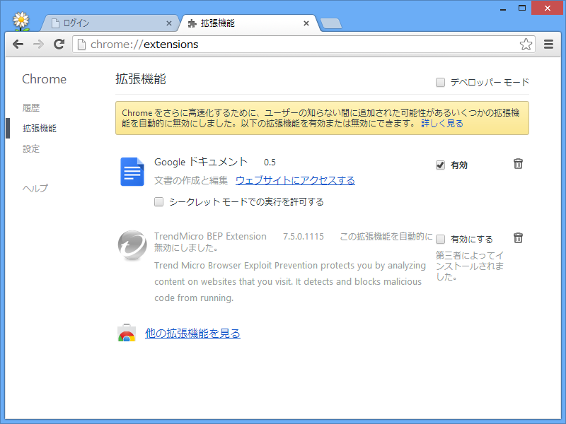

<blockquote cite="http://support.google.com/chrome/bin/answer.py?hl=ja&answer=2811969">

この通知が表示されるのは、サードパーティのプログラムによって Chrome ブラウザにインストールされた拡張機能が 1 つ以上見つかった場合です。これらの拡張機能は知らないうちにインストールされている可能性もあるため、自動的に無効にしています。これにより、Chrome の実行がより高速になります。

拡張機能の一覧を表示し、今後も使用する拡張機能があれば再度有効にすることができます。

<cite><a href="http://support.google.com/chrome/bin/answer.py?hl=ja&answer=2811969">&#x8ABF;&#x6574;&#x306E;&#x305F;&#x3081;&#x306E;&#x6642;&#x9593; - Chrome &#x30D8;&#x30EB;&#x30D7;</a></cite>
</blockquote>

拡張機能の自動無効化が働くと、管理メニューのボタンに小さく拡張機能のアイコン（ジグソーパズルのピースのような緑アイコン）が表示される。管理メニューを開くと、下の方に“新しい拡張機能が追加されました”という項目が追加されているのが分かる。それを選択すると、

ダイアログが現れ、有効にするか、削除するかが選べる。

拡張機能の管理ページでも確認できる。

<ul>
<li><a href="http://www.forest.impress.co.jp/docs/news/20130222_588952.html">&#x300C;Google Chrome 25&#x300D;&#x304C;&#x5B89;&#x5B9A;&#x7248;&#x306B;&#x3001;&#x97F3;&#x58F0;&#x8A8D;&#x8B58;&#x3092;&#x5B9F;&#x73FE;&#x3059;&#x308B;&ldquo;Web Speech API&rdquo;&#x306B;&#x5BFE;&#x5FDC; - &#x7A93;&#x306E;&#x675C;</a></li>
</ul>