
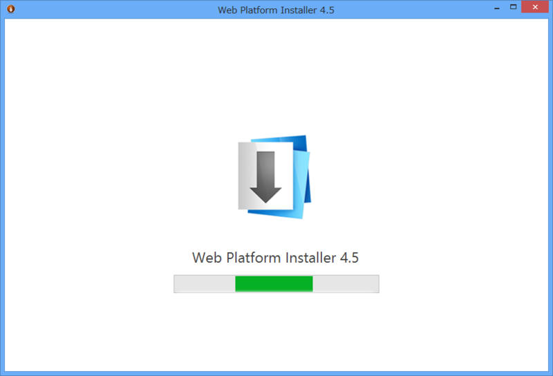

Web Platform Installer 4.5 の変更点はよくわからない<a href="#f1" name="fn1" title="ちゃんと言ってくれればごにょごにょするのにさ">*1</a>。とりあえず WordPress をインストールしてみた。

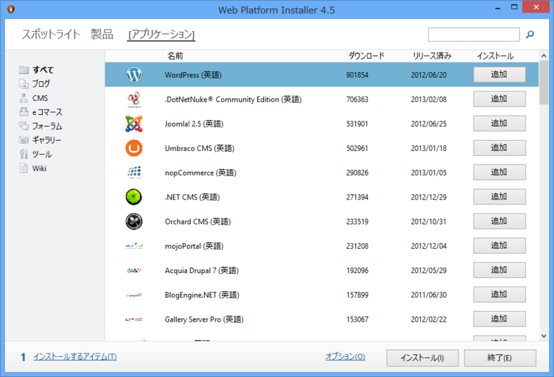

英語版しかないのかな。

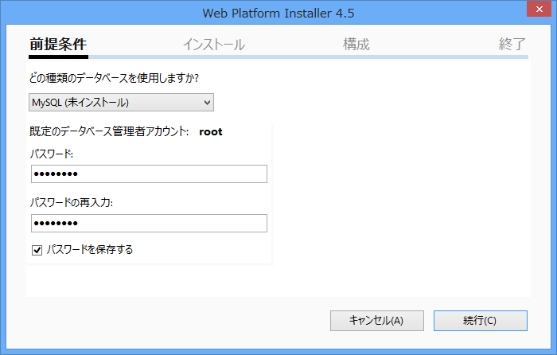

MySQL のインストール。ここでルートパスワードを指定する。

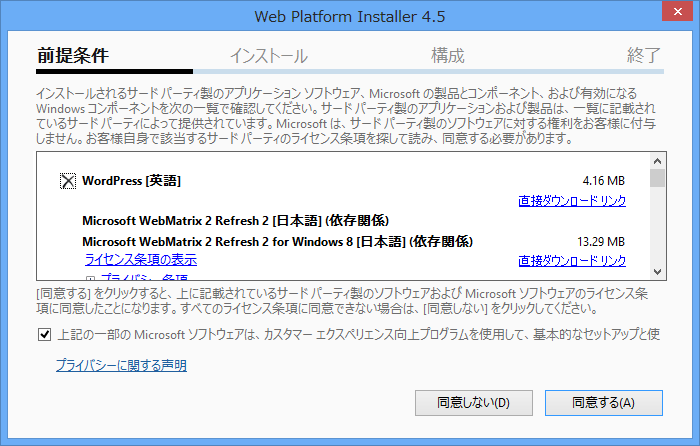

依存関係の確認。

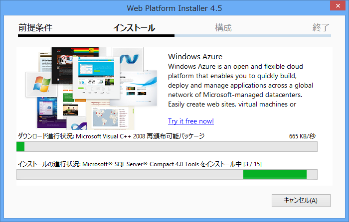

ダウンロードの開始。

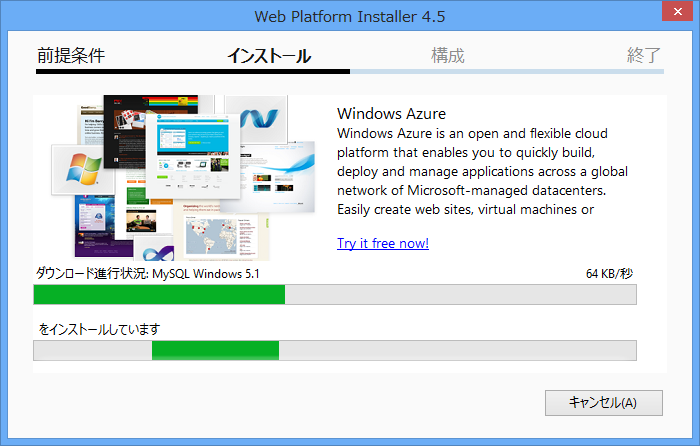

相変わらず MySQL 関連のダウンロードは遅い。たしか SourceForge あたりからダウンロードしてくるのだと記憶しているけれど、できれば Microsoft でホストしてほしいなぁ。

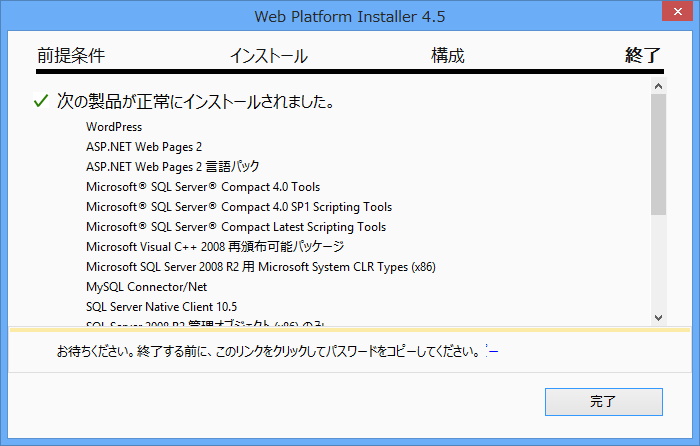

終了。パスワードがコピーできるらしい。こんなフェーズ、あったかしら。

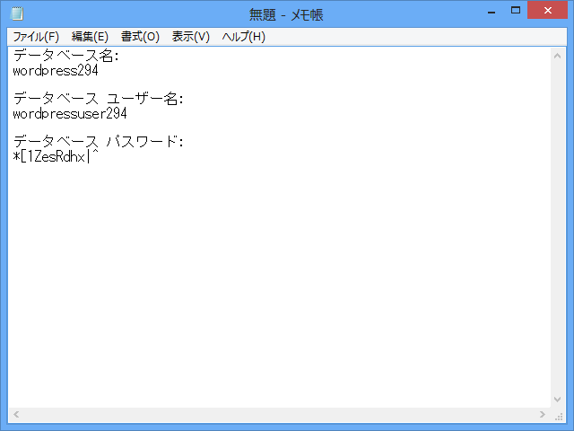

ちなみに、クリップボードの中身はこんな感じ。

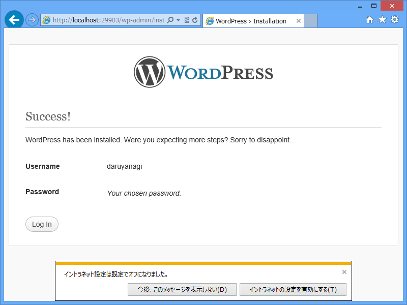

たった！たった！WordPress がたった！

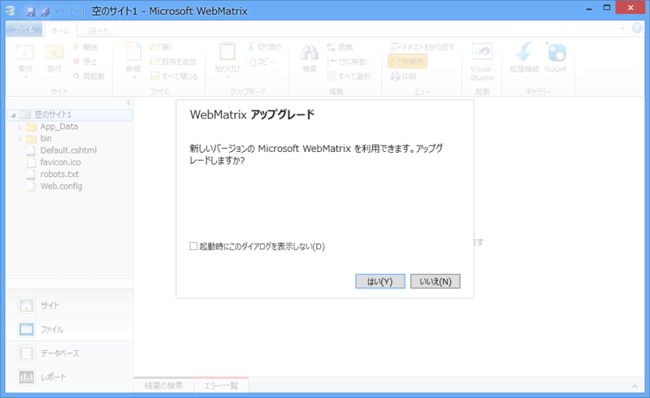

WebMatrix 2 のアップデートループは健在。無視するしかないみたい。

<h3>追記</h3>

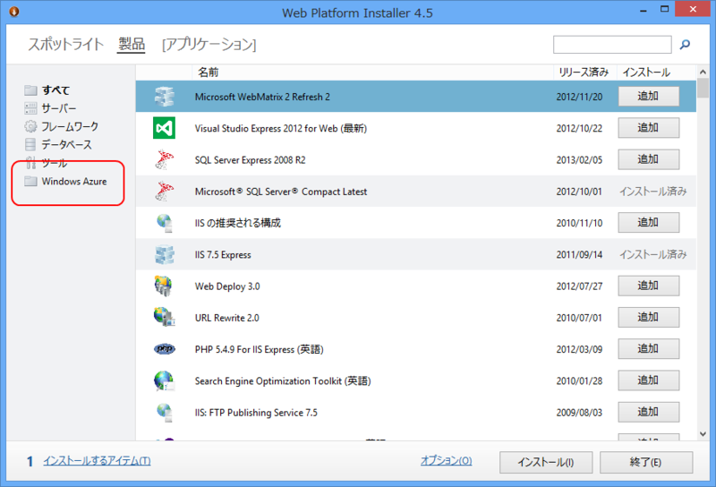

      @<a class="twitter-user-screen-name" href="http://twitter.com/daruyanagi" target="_top">daruyanagi</a> Azure関係のSDKがカテゴリーにまとまっているのは確認しているのですが。それ以外がががｇ

<a href="http://twitter.com/WebMatrixMan/status/306387711563005952" class="twitter-detail-info-permalink">2013-02-26 21:58:17</a> via <a href="http://www.hootsuite.com" rel="nofollow">HootSuite</a> to @<a href="http://twitter.com/daruyanagi/status/306387415373848577"  class="twitter-user-screen-name">daruyanagi</a>

気付かなかった！

<a href="#fn1" name="f1" class="footnote-number">*1</a>:ちゃんと言ってくれればごにょごにょするのにさ

