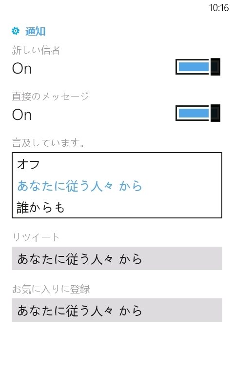
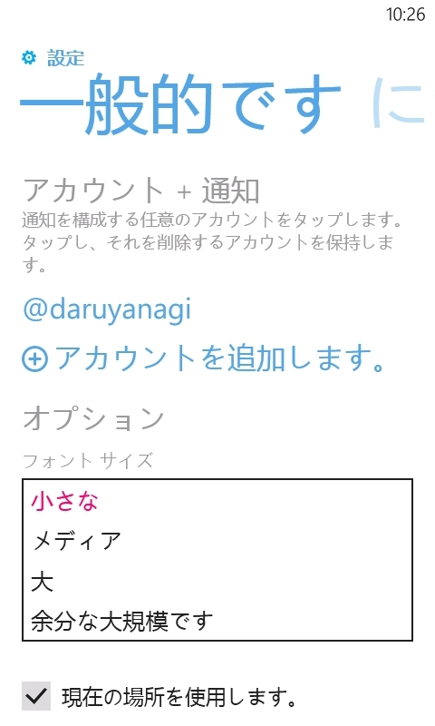

いろいろヒドいのだけど、「新しい信者」で腹筋が崩壊して、文句を言う気も失せた。

<ul>
<li><a href="http://www.forest.impress.co.jp/docs/news/20130227_589680.html">&ldquo;Twitter&rdquo;&#x306E;Windows Phone&#x5411;&#x3051;&#x516C;&#x5F0F;&#x30AF;&#x30E9;&#x30A4;&#x30A2;&#x30F3;&#x30C8;&#x30A2;&#x30D7;&#x30EA;&#x304C;&#x30E1;&#x30B8;&#x30E3;&#x30FC;&#x30D0;&#x30FC;&#x30B8;&#x30E7;&#x30F3;&#x30A2;&#x30C3;&#x30D7; - &#x7A93;&#x306E;&#x675C;</a></li>
</ul>

<h3>追記</h3>

      @<a class="twitter-user-screen-name" href="http://twitter.com/daruyanagi" target="_top">daruyanagi</a> 文字の大きさも秀逸ですよ！ｗ

<a href="http://twitter.com/hatsune_/status/306937612021661696" class="twitter-detail-info-permalink">2013-02-28 10:23:23</a> via web to @<a href="http://twitter.com/daruyanagi/status/306937086534103040"  class="twitter-user-screen-name">daruyanagi</a>

「新しい信者」のインパクトが強すぎて忘れてた。

ちなみに、モノ自体はいいと思う。ヘッダーアイコンの高さが小さくできて、中華フォントじゃなくなれば、ストレスなく常用できるハズ。

