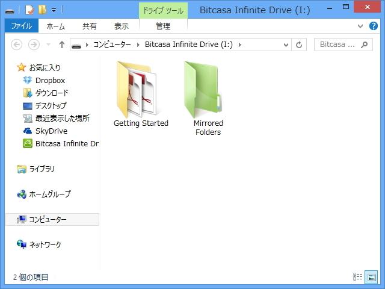
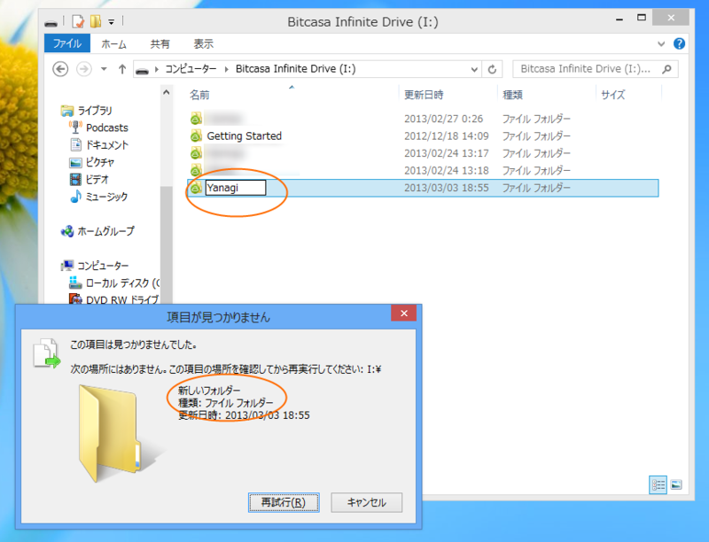
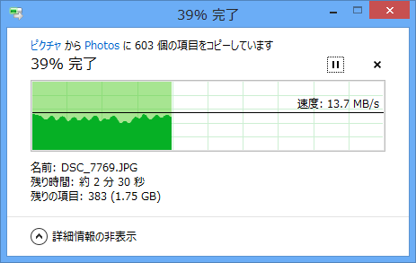

<ul>
<li><a href="http://www.forest.impress.co.jp/docs/news/20130206_586732.html">&#x6708;&#x984D;10&#x30C9;&#x30EB;&#x3067;&#x5BB9;&#x91CF;&#x7121;&#x5236;&#x9650;&#x306E;&#x30AA;&#x30F3;&#x30E9;&#x30A4;&#x30F3;&#x30B9;&#x30C8;&#x30EC;&#x30FC;&#x30B8;&ldquo;Bitcasa&rdquo;&#x304C;&#x6B63;&#x5F0F;&#x30EA;&#x30EA;&#x30FC;&#x30B9; - &#x7A93;&#x306E;&#x675C;</a></li>
</ul>
容量無制限というところに惹かれて、課金してみた。

<h3>安定性</h3>

たまに謎な動作をする（スクリーンショットはリネームに失敗するところ）。エクスプローラーが無限ループに陥るのも怖い。

とくに、あまりにも多くのファイルを一度に転送しようとするのは禁物。あくまでも常識の範囲内で、容量用法を守って。

<h3>速度</h3>

それほど遅くはない感じ。

<h3>気になるところ</h3>

同期されるときに、一瞬ファイルがフォーカスを失うような動作をする。

たとえば、同期対象のフォルダ内に新しいファイルを作成し、［F2］キーを押してリネームを行うと、名前の入力中にそれがキャンセルされる。キーボード操作がメインだとウザいことこのうえないが、英語でフィードバックするのが面倒で困っている（死。

