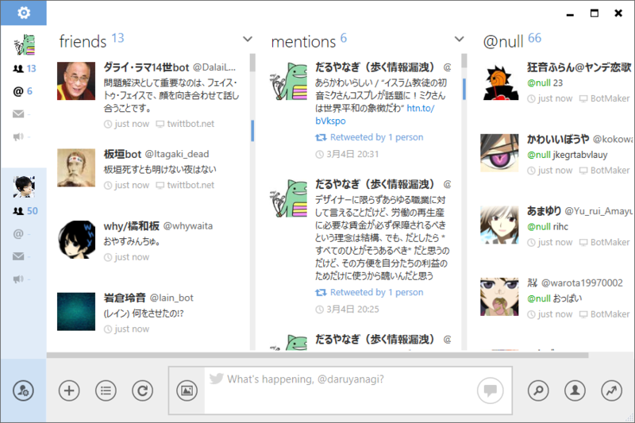

やっとでた！　昨年4月以来（<a href="http://www.forest.impress.co.jp/docs/news/20120409_525212.html">&ldquo;&#x304A;&#x6C17;&#x306B;&#x5165;&#x308A;&rdquo;&#x3078;&#x8FFD;&#x52A0;&#x3059;&#x308B;&#x30B7;&#x30E7;&#x30FC;&#x30C8;&#x30AB;&#x30C3;&#x30C8;&#x30AD;&#x30FC;&#x304C;&#x8FFD;&#x52A0;&#x3055;&#x308C;&#x305F;&#x300C;MetroTwit&#x300D;v1.0.1.0 - &#x7A93;&#x306E;&#x675C;</a>）といのだから、ほぼ一年ぶりというわけか。

リリースノートは以下の通り。目立つところだけピックアップするならば、

<ul>
<li>Twitter API 1.1 対応（Display Guidline にも準拠）</li>
<li>Twitter ネイティブなメディアのプレビューとアップロード</li>
<li>すべての API を SSL 経由で呼び出すように</li>
<li>.NET Framework 4.5 への移行（と Windows XP の切り捨て）</li>
<li>ユーザーインターフェイスの改善</li>
<li>そのた安定性とパフォーマンスの向上</li>
</ul>
<blockquote>

Updated to utilize Twitter API 1.1

<ul>
<li>Added retweet blocking in searches</li>
<li>Refreshed user interface style</li>
<li>Many performance improvements</li>
<li>Fixed crash when displaying some Unicode tweets with usernames, hashtags or links</li>
<li>Changed layout for consistency with Twitter’s new display guidelines</li>
<li>Changed default notifications to only mentions and direct messages</li>
<li>Added native Twitter picture, YouTube, Instagram, SkyDrive previews</li>
<li>Added support for native Twitter Pic upload (existing users must change their Services setting)</li>
<li>Added support for SHIFT+mouse for horizontal scroll</li>
<li>Added support for Microsoft .NET 4.5 – read additional explanation here</li>
<li>Added checkbox option for pressing ENTER to send tweet</li>
<li>Added user avatar to notifications</li>
<li>Added “unsubscribe” to followed lists</li>
<li>Changed all API endpoints to SSL</li>
<li>Removed hover-to-expand shortened URLs</li>
<li>Removed “public tweets” and “retweets by me” columns as they are no longer supported by Twitter</li>
<li>Fixed tweet counter for new URL length</li>
<li>Fixed deleting direct messages</li>
<li>Fixed possible crash when resuming app from extended idle</li>
<li>Fixed issue when typing and pressing ENTER to quickly submitting incomplete tweet</li>
<li>Improved handling of Twitter rate limit and Twitter API errors</li>
<li>Fixed report tweet as spam error</li>
<li>Fixed filtering text in URLs</li>
<li>Fixed showing blocked users in lists</li>
<li>Fixed geotagged Tweet map not displaying correct location</li>
<li>Fixed more clicking unread marker that caused app to crash</li>
<li>Fixed significant performance and memory issues</li>
<li>Removed support for Windows XP</li>
<li>Fixed update changelog not displaying</li>
<li>Fixed not being to add or remove accounts in certain scenarios</li>
<li>Fixed sent DMs show as unread</li>
<li>Fixed Windows 8 Aero coloring</li>
<li>Added window border to Windows 8</li>
<li>Fixed crash if Twitter entities not returning properly</li>
<li>Fixed notifications grouping if notification already showing</li>
<li>Fixed ads not displaying properly</li>
<li>Fixed sometimes clicking links in notifications opening two browser windows</li>
<li>Fixed crashing when scrolling with unread marker or PageUp/PageDown</li>
<li>Fixed “added to list” grammar in activities</li>
<li>Fixed long “my list” names</li>
<li>Fixed “Worldwide” trend to top of trends list dropdown</li>
</ul>
</blockquote>

<ul>
<li><a href="https://blog.daruyanagi.jp/entry/2013/02/21/101420">MetroTwit Loop &#x304C;&#x683C;&#x597D;&#x3088;&#x304F;&#x306A;&#x3063;&#x3066;&#x3044;&#x305F;&#x3002; - &#x3060;&#x308B;&#x308D;&#x3050;</a></li>
</ul>