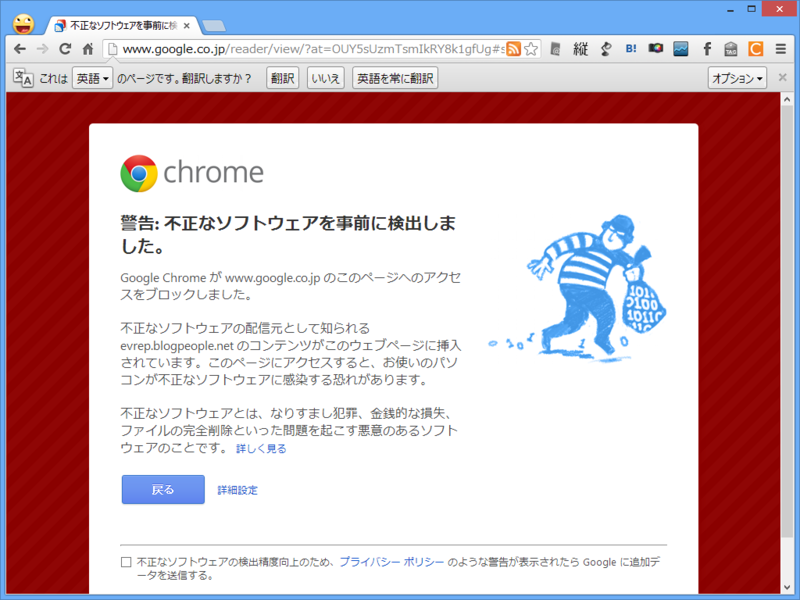
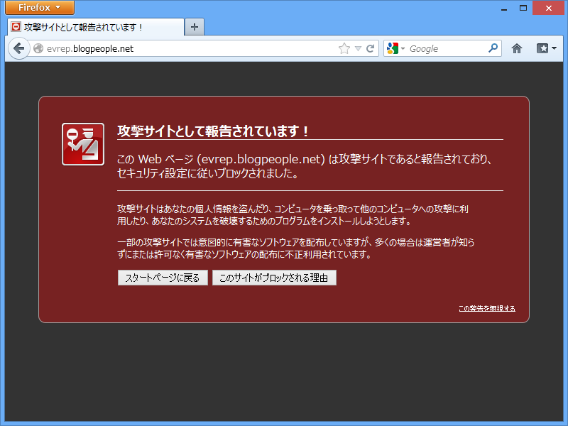
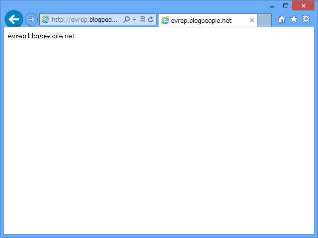

<blockquote cite="http://internet.watch.impress.co.jp/docs/news/20130305_590412.html">

　Google ChromeやFirefoxで、一部のサイトが「不正サイト」としてアクセスできなくなる現象が発生している。

　5日14時現在では、毎日新聞社（mainichi.jp）やマイナビニュース（news.mynavi.jp）にGoogle ChromeとFirefoxでアクセスすると、「ウェブサイトの不正なソフトウェアを事前に検出しました」という警告が表示される。

<cite><a href="http://internet.watch.impress.co.jp/docs/news/20130305_590412.html">Google Chrome&#x3084;Firefox&#x304C;&#x6BCE;&#x65E5;&#x65B0;&#x805E;&#x306A;&#x3069;&#x3092;&#x300C;&#x4E0D;&#x6B63;&#x30B5;&#x30A4;&#x30C8;&#x300D;&#x3068;&#x3057;&#x3066;&#x30D6;&#x30ED;&#x30C3;&#x30AF; -INTERNET Watch</a></cite>
</blockquote>

なかのひとは対応でてんやわんやだと思うけれど<a href="#f1" name="fn1" title="おまんまに直結する！">*1</a>、うちは関係ないしなー……と思っていたら、

Google Reader で RSS 読んでいるときに警告を食らった。

当該ドメインを Mozilla Firefox で表示しても警告が出る。。

ちなみに Internet Explorer では問題がなかった。

こういう事例は今後増えていくと思う。Web サイトの運営者やブラウザーベンダーの対応も重要だけれど、ユーザー側もブラウザーのセキュリティ機能をよく理解して、使いこなす必要があると思う。ブラウザーは警告を出してくれるけれど、それはあくまでも補助機能であり、最終的に判断するのはユーザーであるべきなので。

今日は警告画面のスクリーンショットがたくさん収集できて、とても嬉しい（ぁ

<a href="#fn1" name="f1" class="footnote-number">*1</a>:おまんまに直結する！

