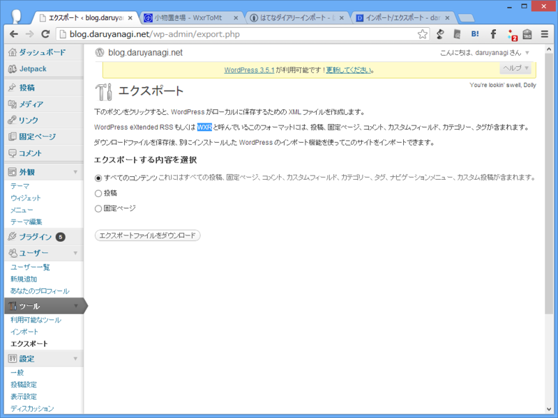
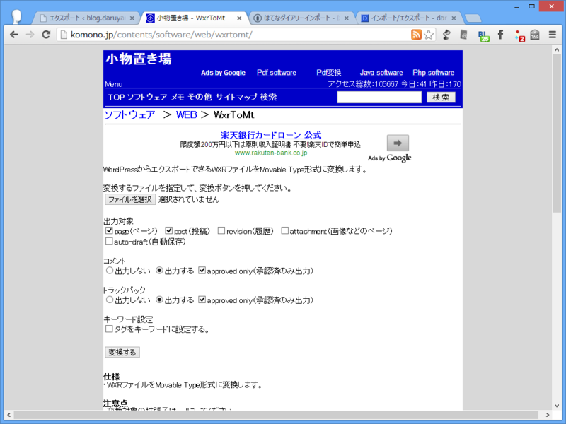
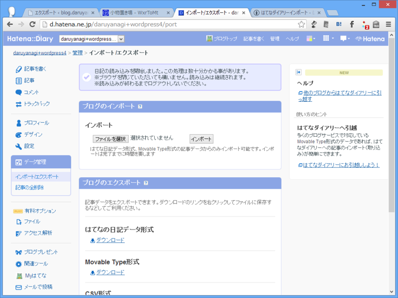
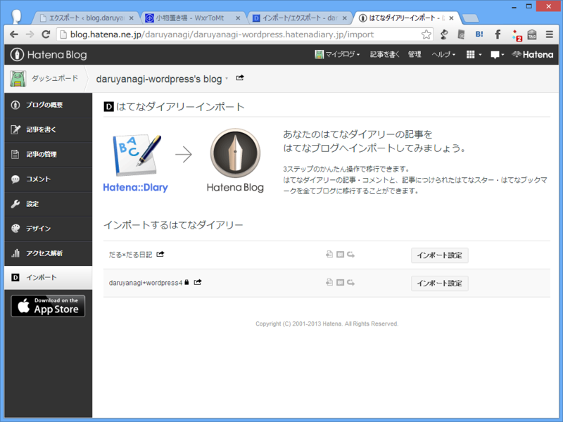

今のところ、WordPress の記事を直接はてなブログへインポートする手段は用意されていないが、工夫次第ではなんとかなりそう。

たとえばこんな感じ。

<ol>
<li>「WordPress」のログを WXR（WordPress eXtended RSS）でエクスポート（*.xml）</li>
<li>エクスポートした XML ファイルを「Movable Type」形式へコンバート（*.txt）</li>
<li>「Movable Type」形式のログを「はてなダイアリー」へインポート</li>
<li>「はてなダイアリー」の記事を「はてなブログ」へインポート</li>
</ol>
結論から言えば、これでうまくいった。

<h3>WordPress → WXR</h3>

［ツール］－［エクスポート］メニューから、記事を XML 形式で出力。

<h3>WXR → Movable Type Format</h3>

<a href="http://komono.jp/contents/software/web/wxrtomt/">&#x5C0F;&#x7269;&#x7F6E;&#x304D;&#x5834; - WxrToMt</a> が利用できる。

自分の場合、WordPress の記事を Markdown 記法で記述していたので、ここでテキストエディターを使ってはてな記法へ置換。ちょちょいとマクロを作って大雑把に置換し、あとは諦めるなり、修正を入れるなりして頑張った。

<h3>Movable Type Format → はてなダイアリー</h3>

はてなダイアリーで新規ダイアリーを作成し、そこへ Movable Type 形式のログをインポートする。

ここでちゃんとデータがインポートされたかをしっかりチェック。

とくに、WordPress の記事でレベルの高い見出し（h1, h2...）を使っている場合、それがダイアリーで単体の記事と扱われてしまうので注意（要するに、記事が増殖する！）。場合によってはレベルを下げる処理を行う必要がある。

はてなでは、過去に取得・放棄した URL を再び取得することはできない。つまり、インポートに失敗して、ダイアリーやブログを一旦削除すれば、その URL は二度と使えなくなる。そのため、ダイアリーの段階で入念にインポートのテストを行った方がいいと思う。

自分の場合、はてなダイアリーを4つ作るハメになった。

<h3>はてなダイアリー → はてなブログ</h3>

はてなダイアリーからはてなブログへインポートすれば作業は完了。インポート先は新規ブログでも、既存のブログでも OK。

このブログに、はてなブログのサービスが始まる前の日付で記事が追加されているのが分かるかな？

