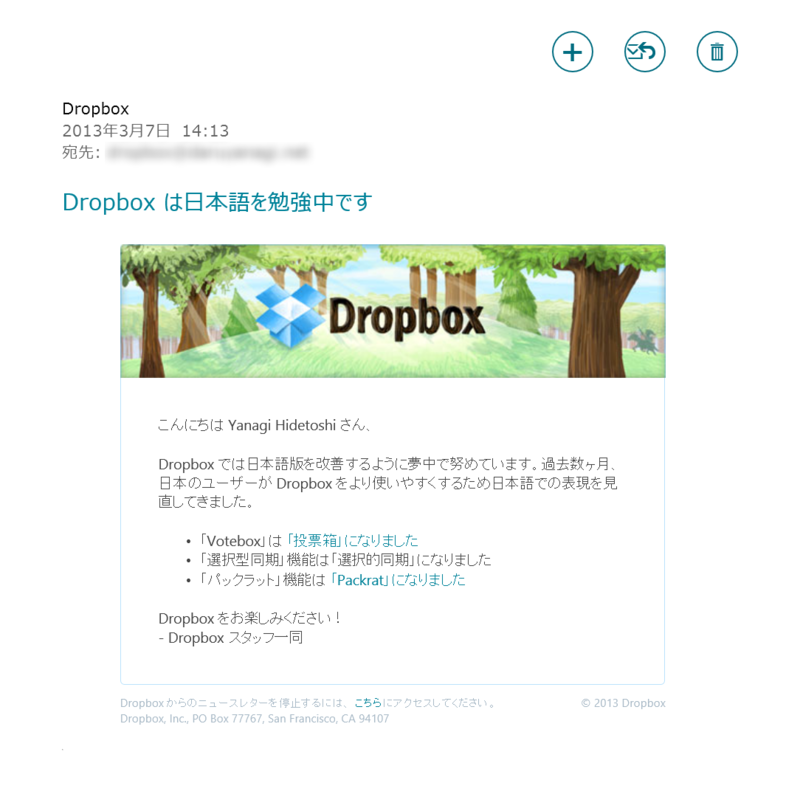

日本語を勉強している割には、一部表記が英語に戻ってるけど気にしないでおこう。もっとも、そんな機能があるだなんて知らなかったのだけど。

<blockquote cite="https://www.dropbox.com/help/113/en">

Packrat is a Dropbox Pro add-on feature that saves your file history indefinitely.

Dropbox saves a history of all deleted and earlier versions of files for 30 days for all Dropbox accounts by default. If you have the Packrat add-on, Dropbox saves those files for as long as you have the Packrat add-on. With Packrat, you never have to worry about losing an old version of a file.

Packrat is available to all Dropbox Pro accounts.

<cite><a href="https://www.dropbox.com/help/113/en">Dropbox - What is Packrat? - Simplify your life</a></cite>
</blockquote>

Packrat というのは Dropbox のアドオン（有償アカウント向け）で、標準で30日までに制限されている履歴の保存期間を延ばしてくれるものらしい。

<blockquote cite="http://ejje.weblio.jp/content/pack+rat">

<h4>pack rat</h4>

アクセント páck ràt 
【名詞】【可算名詞】 
【動物, 動物学】 モリネズミ 《北米産のネズミの一種; 巣の中にものを蓄える習性がある》.

<cite><a href="http://ejje.weblio.jp/content/pack+rat">pack rat&#x306E;&#x610F;&#x5473; - &#x82F1;&#x548C;&#x8F9E;&#x5178; Weblio&#x8F9E;&#x66F8;</a></cite>
</blockquote>

素敵なネーミングだと思った。

