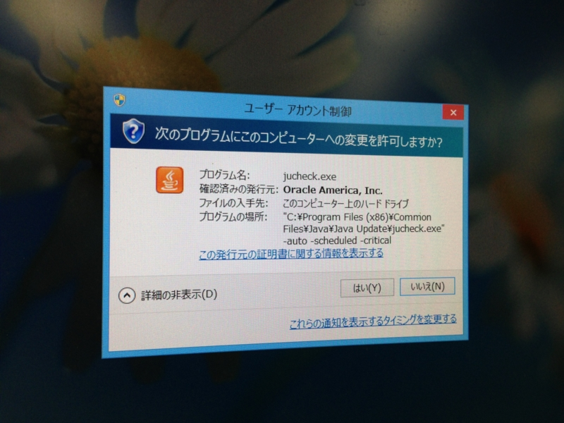
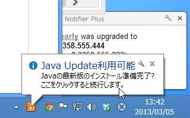

別に今に始まったことじゃないのだけれど。

Java Runtime にアップデートがあると、Windows の起動時に UAC が表示される（Windows Vista 以降）。普通、これを許可するとアップデート処理が始まると思うじゃない？

ところがどっこい、タスクトレイに通知を出すだけなんだ。<i>「Java の最新版のインストール準備完了？」</i>「？」じゃねーよクソが。Windows Vista が出たのは2006年11月だ。それから6年以上なにもしていないわけだ。ビックリだよな。下手したらこいつらの開発環境、いまだに Windows XP だぜ。

セキュリティ更新プログラムをリリースしても、実際に適用されなかったら意味ないわけで。ほかのベンダーがいかに一般のユーザーにパッチを適用してもらうかに腐心してきたのに、まったくのマイペースで恐れ入る。

とはいえ、最近はさすがにゼロデイ脆弱性がボロボロ出てきて、セキュリティへの姿勢が問われる場面が増えてきた。そのうち改善されるんだろうって期待しているのだけれど。

