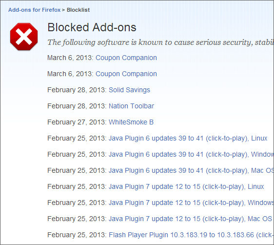

いささか旧聞に付すけれど、<a href="http://www.forest.impress.co.jp/docs/news/20130130_585708.html">Mozilla&#x3001;&#x300C;Adobe Flash Player&#x300D;&#x306E;&#x65E7;&#x30D0;&#x30FC;&#x30B8;&#x30E7;&#x30F3;&#x3092;&ldquo;Click-to-Play&rdquo;&#x306E;&#x5BFE;&#x8C61;&#x306B; - &#x7A93;&#x306E;&#x675C;</a> の対象が拡大している。こういう機能が積極的に活用されるのはとてもよいことだと思う。

<blockquote cite="https://addons.mozilla.org/en-US/firefox/blocked/">

<ul>
<li>February 25, 2013: Java Plugin 6 updates 39 to 41 (click-to-play), Linux</li>
<li>February 25, 2013: Java Plugin 6 updates 39 to 41 (click-to-play), Windows</li>
<li>February 25, 2013: Java Plugin 6 updates 39 to 41 (click-to-play), Mac OS X</li>
<li>February 25, 2013: Java Plugin 7 update 12 to 15 (click-to-play), Linux</li>
<li>February 25, 2013: Java Plugin 7 update 12 to 15 (click-to-play), Windows</li>
<li>February 25, 2013: Java Plugin 7 update 12 to 15 (click-to-play), Mac OS X</li>
<li>February 25, 2013: Flash Player Plugin 10.3.183.19 to 10.3.183.66 (click-to-play)</li>
</ul>
： 
：

<ul>
<li>January 29, 2013: Flash Player Plugin 10.2.* and lower (click-to-play)</li>
</ul>
<cite><a href="https://addons.mozilla.org/en-US/firefox/blocked/">Blocked Add-ons :: Add-ons for Firefox</a></cite>
</blockquote>

かつては Silverlight がブロック対象になっていたりもしたなぁ。

