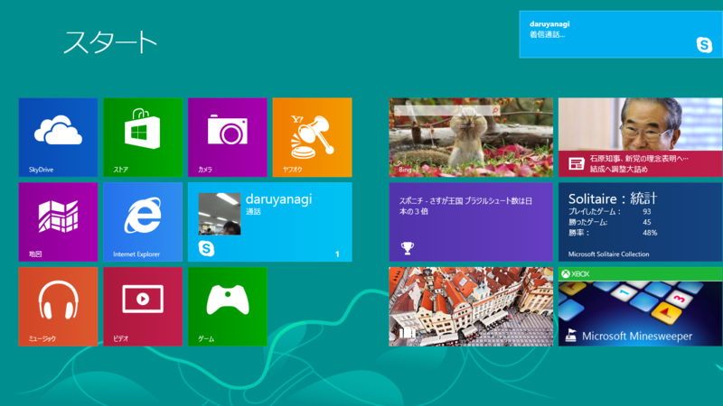

「Windows 8 イラネ！」の大合唱に悲しくなる今日この頃ですが、皆様いかがお過ごしでしょうか。まぁ、知ってて「要らねぇ」と言っているのだったら、かなりたいしたものだと思うのですけど。

たとえばセキュリティ機能だけみても、Windows 7 から Windows 8 へアップデートする意味はあると思うのですよ。

<ul>
<li>Visual C++ コンパイラの改良（enhanced /GS）</li>
<li>ASLR の強化（実行時ランダム化）</li>
<li>ヒープ保護の強化</li>
<li>カーネル内部の強化</li>
</ul>
マルウェアによる攻撃手法と OS による防御機能は共進化している。OS への出費をケチっても、結局おカネを出してサードパーティ製ソフトを導入するか、自分で保護と注意を徹底するか（できるものならな）、長年の怠慢の対価を支払うか、でしかないわけで。

ちなみに、セキュリティ機能を Windows XP 以降と比較。実に多くの機能が追加されているのがわかる。

<table>
<tr>
<td></td>
<td>Win XP</td>
<td>XP SP2</td>
<td>Vista, 7</td>
<td>Win 8</td>
</tr>
<tr>
<td>DEP（ソフトウェア）</td>
<td>×</td>
<td>○</td>
<td>○</td>
<td>○</td>
</tr>
<tr>
<td>DEP（ハードウェア）</td>
<td>×</td>
<td>○</td>
<td>○</td>
<td>○</td>
</tr>
<tr>
<td>ASLR（スタック）</td>
<td>×</td>
<td>×</td>
<td>○</td>
<td>◎</td>
</tr>
<tr>
<td>ASLR（モジュール）</td>
<td>×</td>
<td>×</td>
<td>○</td>
<td>◎</td>
</tr>
<tr>
<td>ASLR（ヒープ）</td>
<td>×</td>
<td>×</td>
<td>×</td>
<td>○</td>
</tr>
<tr>
<td>ヒープ保護</td>
<td>×</td>
<td>×</td>
<td>△</td>
<td>○</td>
</tr>
<tr>
<td>カーネル保護（ASLR）</td>
<td>×</td>
<td>×</td>
<td>△</td>
<td>○</td>
</tr>
<tr>
<td>カーネル保護（DEP）</td>
<td>×</td>
<td>×</td>
<td>△</td>
<td>○</td>
</tr>
<tr>
<td>カーネル保護（NULL dereferences）</td>
<td>×</td>
<td>×</td>
<td>×</td>
<td>○</td>
</tr>
<tr>
<td>カーネル保護（SMEP/PXN）</td>
<td>×</td>
<td>×</td>
<td>×</td>
<td>○</td>
</tr>
</table>
あと、32bit よりも 64bit の方が強化された ASLR の恩恵が大きい。

ただし、いかにシステムを強化しようと

<ul>
<li>メンテナンスされていない古いプログラムを狙う</li>
<li>セキュリティの甘い“人間”を狙う</li>
</ul>
といった攻撃は依然有効。緩和することはできるけれどネ。

以下は参考資料。とくにひとつ目の PDF が日本語でありがたい。

<ul>
<li><a href="http://www.fourteenforty.jp/assets/files/monthly_research/MR201209_Windows8_Exploit_Mitigation.pdf">http://www.fourteenforty.jp/assets/files/monthly_research/MR201209_Windows8_Exploit_Mitigation.pdf</a></li>
<li><a href="http://ensiwiki.ensimag.fr/images/e/e8/GreHack-2012-talk-Kostya_Kortchinsky_Crypt0ad_-10_years_later_which_in_memory_vulnerabilities_still_matter.pdf">http://ensiwiki.ensimag.fr/images/e/e8/GreHack-2012-talk-Kostya_Kortchinsky_Crypt0ad_-10_years_later_which_in_memory_vulnerabilities_still_matter.pdf</a></li>
<li><a href="http://media.blackhat.com/bh-us-12/Briefings/M_Miller/BH_US_12_Miller_Exploit_Mitigation_Slides.pdf">http://media.blackhat.com/bh-us-12/Briefings/M_Miller/BH_US_12_Miller_Exploit_Mitigation_Slides.pdf</a></li>
</ul>