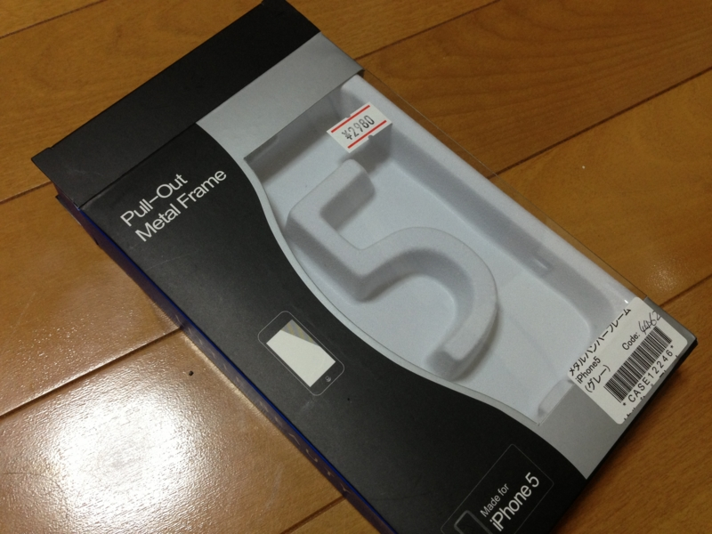
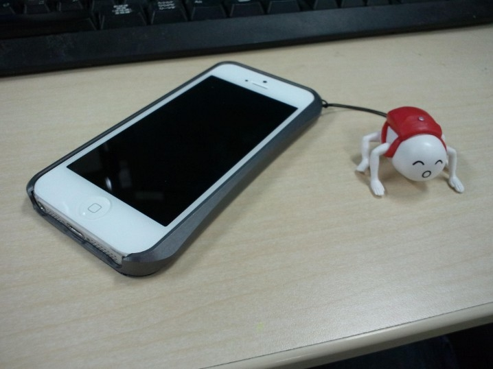
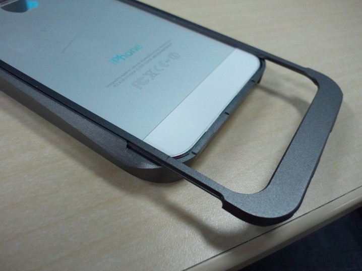

<a href="https://blog.daruyanagi.jp/entry/2013/02/24/004752">&#x300E;&#x30C0;&#x30A4;&#x30FB;&#x30CF;&#x30FC;&#x30C9;/&#x30E9;&#x30B9;&#x30C8;&#x30FB;&#x30C7;&#x30A4;&#x300F; - &#x3060;&#x308B;&#x308D;&#x3050;</a> を観に行った日、帰りしなにアキバのイケショップで iPhone 5 のケースを買った。イケショップは、移転して広くなってたんだな。なんか中央通り沿いのビルの3階だか4階だかにあった。途中の階にある怪しげな店が、イカす。なんだろう、エロDVD屋なのかな。

それはともかく。

前回は革のブックタイプをチョイスしたのだけど、あんまり使い勝手がよくなかったので、今回は枠をガードするタイプを選んでみた。しかも、メタルやで。ドラクエの武器屋で“てつのよろい”を買ったような気分やな。

ストラップが着けられたので <a href="https://blog.daruyanagi.jp/entry/2012/11/18/202001">&#x300C;&#x30DB;&#x30E2;&#x30A9;&#x300D;&#x306E;&#x30B9;&#x30C8;&#x30E9;&#x30C3;&#x30D7;&#x3092;&#x30B2;&#x30C3;&#x30C8;&#x3057;&#x305F; - &#x3060;&#x308B;&#x308D;&#x3050;</a> を装着。……すまん……これしかなかったんや……。総武線でこのストラップをぶら下げて iPhone をイジっていると、たまに女性の視線を感じるけれど、たぶん、そのひと腐ってるんだと思う。

装着はスライド式で、ネジで止めたりはしないタイプ。すぐに外れないかちょっと不安だったけれど、今のところズレたりしたことはない。一回り大きくなるのでホールドが少し大変だけれど（手が小さいタイプだし）、それも許容範囲かな。スタイリングは……付けてみるとイマイチな気がしないでもない。

