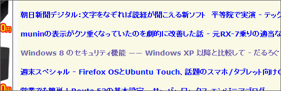
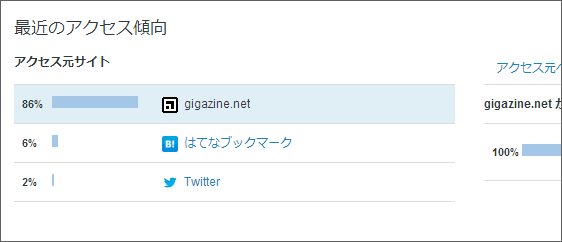

このブログの投稿数は、開設一年余りですでに714もあるのだけれど<a href="#f-b36a59f2" name="fn-b36a59f2" title="一日二本ペースやな、ひまやな">*1</a>、あんまりたいしたことを書いていないのと、Google 先生に嫌われて検索に引っかからないこともあり、いつも過疎っている。けれど、昨日の記事（<a href="https://blog.daruyanagi.jp/entry/2013/03/08/123936">Windows 8 &#x306E;&#x30BB;&#x30AD;&#x30E5;&#x30EA;&#x30C6;&#x30A3;&#x6A5F;&#x80FD; &#x2015;&#x2015; Windows XP &#x4EE5;&#x964D;&#x3068;&#x6BD4;&#x8F03;&#x3057;&#x3066; - &#x3060;&#x308B;&#x308D;&#x3050;</a>）は久しぶりに2,000ぐらい PV があった。少しビビって、<i>なにがはじまるんです？ </i>と思っていたのだけど、どうやら Gigazine のヘッドラインに載せてもらっていたらしい。ありがとさんやでぇ。

はてなブログの40倍の強さやな。さすがやな。AdSense もたくさん踏んでもらって、5円か10円ぐらい儲かった（ぁ

<a href="#fn-b36a59f2" name="f-b36a59f2" class="footnote-number">*1</a>:一日二本ペースやな、ひまやな

