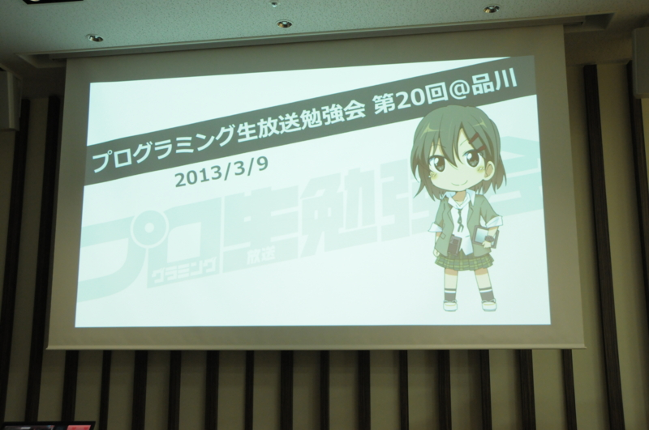
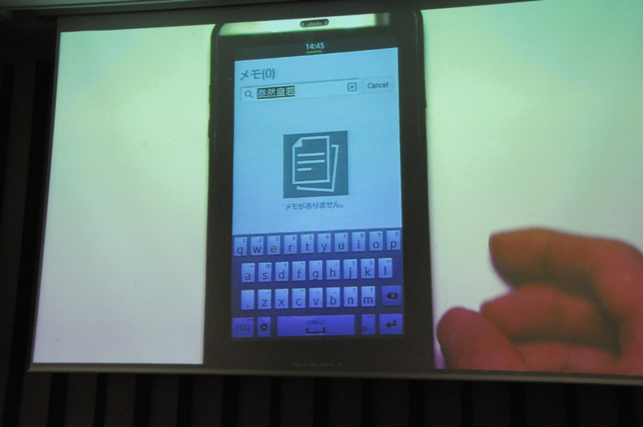
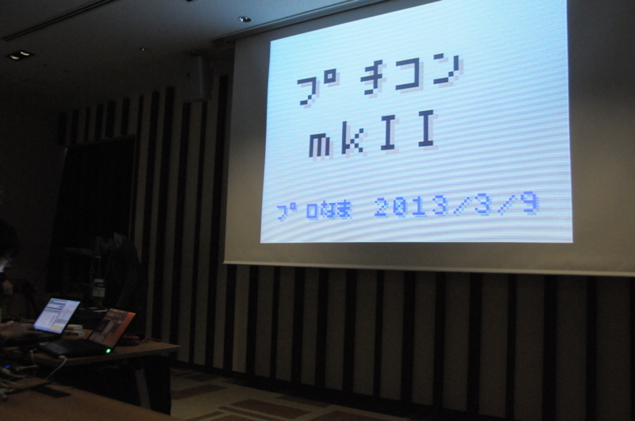
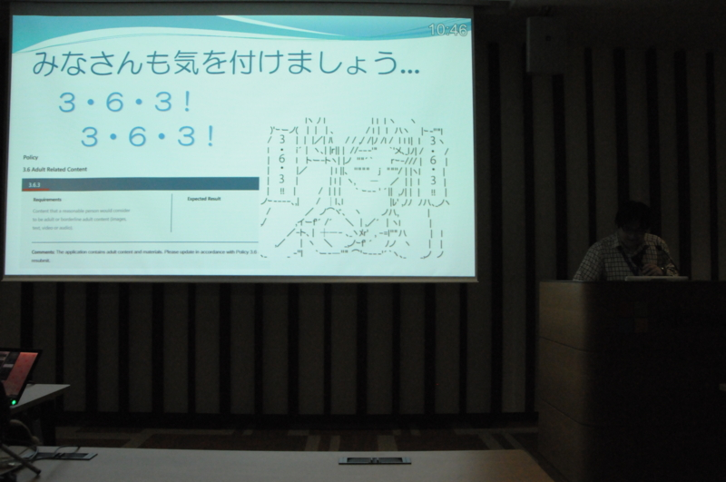
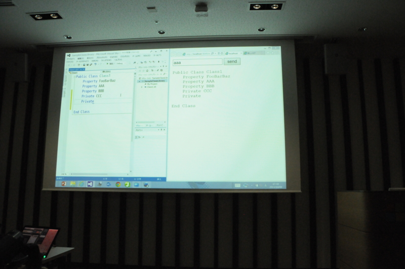

<a href="http://atnd.org/events/36822">&#x30D7;&#x30ED;&#x30B0;&#x30E9;&#x30DF;&#x30F3;&#x30B0;&#x751F;&#x653E;&#x9001;&#x52C9;&#x5F37;&#x4F1A; &#x7B2C;20&#x56DE;&#xFF20;&#x54C1;&#x5DDD; #pronama : ATND</a> に参加してきました。花粉症でドタキャンする人が少し多かったのが残念だけれど、だいぶ盛り上がったんじゃないかな？　内容的にも今年第1回目を飾るにふさわしいものだったと思う。

<h3>TypeScript ファーストステップ (Rev.2) ～ Any browser. Any host. Any OS. Open Source. ～</h3>

@chack411 さんによる TypeScript の紹介。さすがの安定感やな。ダイナミックに動き回るので、写真が撮りづらかった……（それだけよいプレゼンだったってことです！）。内容は、スライドが公開されていますのでそちらで（<a href="http://www.slideshare.net/chack411/typescript-rev2-any-browser-any-host-any-os-open-source">TypeScript &#x30D5;&#x30A1;&#x30FC;&#x30B9;&#x30C8;&#x30B9;&#x30C6;&#x30C3;&#x30D7; (Rev.2) &#xFF5E; Any browser. Any host. Any OS. Open ...</a>）。

JavaScript ってニョロニョロしていて、あんまりカッチリ書けない感じがあまり好きじゃないのですけれど、その点 TypeScript なら大丈夫そう。Java みたいにガチガチじゃない、ちょうどいい柔らかさを狙っているところに期待がもてます。C# はガチガチからヤワヤワへ進化してきましたが、TypeScript は JavaScript のヤワヤワをちょっと矯めて、ガチガチのいい部分だけを取り込んだ進化系って感じですね。

0.9.0 がリリースされて Generics が使えるようになったらちゃんとお勉強したいです。

<h3>「Tizenってなに？」から「Tizenで動作するアプリを作ろう！」まで</h3>

お昼ご飯が消化されて、会場もほどよく暖かく。そんなこんなで、このセッションはちょっとだけ寝ちゃいました（@kumadasu さん、ごめんなさい！）。でも、肝心な部分はちゃんと聞いていたと思います。Tizen って名前ぐらいしか聞いたことなく、Web アプリが動くことすら知らなかったです。

このセッションはなんといっても Tizen の実機がみれたのが収穫かな？　スペースキーをフリックして入力言語を切り替えるのはちょっと新しい感じ。

<h3>Windows Azure Media Service で作成する割と普通な動画サイト</h3>

@normalian のセッションだったけど、自分にとっては割と悪夢。あまり思い出したくない（震え声

ただ、Windows Azure Media Service は割と簡単なんだな。なんだかんだで試したことなかった。用法・用量を守って、正しく使ってほしいです。

スライドはこちら！ → <a href="http://www.slideshare.net/normalian/windows-azure-media-service-17064430">Windows Azure Media Service&#x3067;&#x4F5C;&#x6210;&#x3059;&#x308B;&#x5272;&#x3068;&#x666E;&#x901A;&#x306A;&#x52D5;&#x753B;&#x30B5;&#x30A4;&#x30C8;</a>

<h3>プチコン mkII</h3>

@Ogu3rd さんの<b>プチコンを使った</b>セッション。プチコンでスライド作ってくるなんて！　個人的には一番印象に残るセッションでした。

これだけのために携帯ゲーム機買おうかなって気にさせられる。

<h3>さて、Windows 8 が発売されて4ヶ月になるわけだが</h3>

@shinji_japan さんよ、ネタ盛りすぎやろｗ　たぶんこの日で一番ウケたセッションだったんじゃないかな？　今度 <a href="http://atnd.org/events/37393">&#x30D7;&#x30ED;&#x30B0;&#x30E9;&#x30DF;&#x30F3;&#x30B0;&#x751F;&#x653E;&#x9001;&#x52C9;&#x5F37;&#x4F1A; &#x7B2C;22&#x56DE;&#xFF20;&#x677E;&#x5C71; #pronama : ATND</a> でセッションを受け持つ予定なのだけれど、ちょっといろいろ盗ませてもらうわ。

<h3>Windows Phone 7.5～8関連</h3>

@icchu さんがエロアプリ作ってリジェクトされた話（違

ちなみに、Microsoft のアプリ審査 vs エロアプリ作者の熱い戦いについては、@daisuke_nomura が懇親会で詳しく語ってくれました。こいつら、ておくれだと思った。

<h3>プログラミング生放送</h3>

@jz5 が SignalR で「プログラミングを生放送するためのシステム」を作りましたっていう話。Visual Studio 拡張機能でコード画面の情報とって、それを SignalR で一斉配信しちゃうっていう発想、結構すごいと思う。いろいろ応用できそう。

<h3>おつかれさま！</h3>

LT やってくれた人もお疲れ様！　会場のゴミは、2次会の居酒屋さんと交渉して、お店の方で捨ててもらいました。

