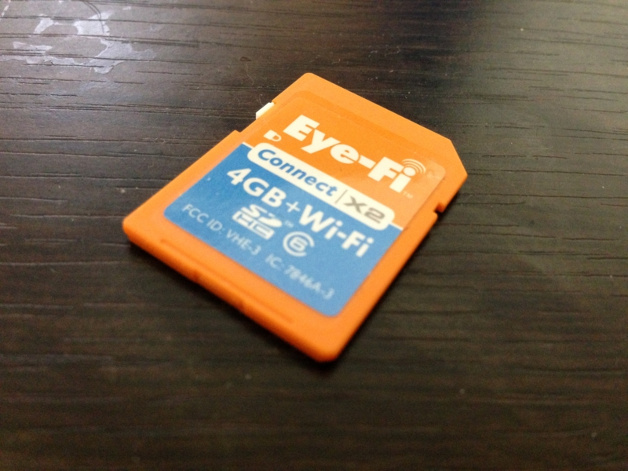
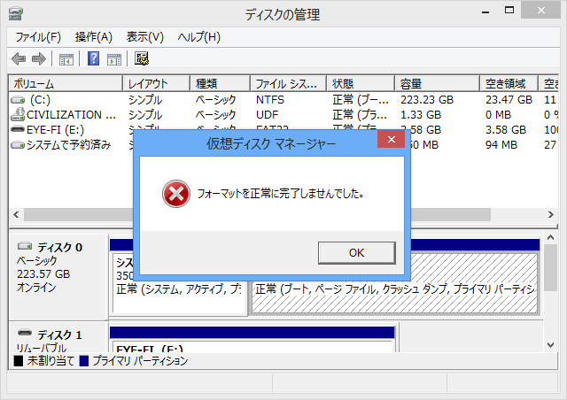
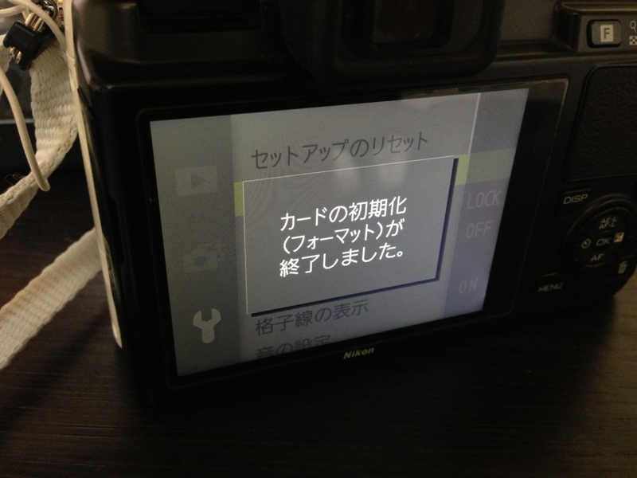
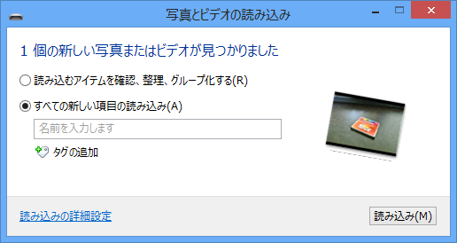

<a href="https://blog.daruyanagi.jp/entry/2013/03/10/132836">&#x30D7;&#x30ED;&#x30B0;&#x30E9;&#x30DF;&#x30F3;&#x30B0;&#x751F;&#x653E;&#x9001;&#x52C9;&#x5F37;&#x4F1A; &#x7B2C;20&#x56DE;&#xFF20;&#x54C1;&#x5DDD;&#x306B;&#x53C2;&#x52A0;&#x3057;&#x3066;&#x304D;&#x307E;&#x3057;&#x305F; #pronama - &#x3060;&#x308B;&#x308D;&#x3050;</a> で撮った写真の一部が、パソコンに取り込めなくなった。困った。メモリカードは Eye-Fi だったのだけれど、なんだか調子悪いみたい。無線での転送もダメ。去年買ったばかりなのに（<a href="https://blog.daruyanagi.jp/entry/2012/10/12/031840">&#x307F;&#x3093;&#x306A;&#x3082;&#x3059;&#x306A;&#x308B; Eye-Fi &#x3068;&#x3044;&#x3075;&#x3082;&#x306E;&#x3092;&#x3001;&#x308F;&#x3057;&#x3082;&#x3057;&#x3066;&#x307F;&#x3093;&#x3068;&#x3066;&#x3001;&#x3059;&#x308B;&#x306A;&#x308A; - &#x3060;&#x308B;&#x308D;&#x3050;</a>）、もうダメになったのかなぁ。

でも、幸いなことに Nikon D300s では読めるようで、データの救出はできそう。実際、カメラで SD カードスロット → CF カードスロットのコピーを行い、CF カードからパソコンへファイルをインポートすることができた。

しかし、この Eye-Fi カードどうしよう。

<blockquote cite="http://eyefi.co.jp/support/faq/how_to_format_card/">

<b>Q. Eye-Fi カードをフォーマットしても問題ありませんか？</b>

A. Eye-Fiカードは通常のSDカード同様、フォーマットしても問題ございません。

Eye-Fiカードの無線LAN機能、ご登録アカウント情報にも一切影響ございません。

フォーマットにより、アプリケーションのインストールプログラム等は削除されますが、 
必要な場合はこちらからEye-Fi Centerをダウンロードできます。

※通常のSDカード同様、フォーマットにより内部データはクリアされます。 
フォーマットをされる際は、必要なお写真は必ずバックアップをとっていただきますよう、お願いいたします。

<cite><a href="http://eyefi.co.jp/support/faq/how_to_format_card/">http://eyefi.co.jp/support/faq/how_to_format_card/</a></cite>
</blockquote>

調べてみると、こいつはそのままフォーマットしてもいいみたい。とりあえず初期化してみますかね。

ありゃ？

Nikon 1 V1 ではフォーマットできた。

となると、カードリーダーがおかしいのかな？　でも、この前までは正常に読めたし、ほかの SD カードは今でも普通に読める。

<h3>追記</h3>

無事、またカードリーダーで読めるようになった！　無線でのファイル転送にも成功。

